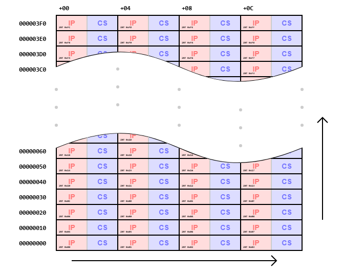

# 🖥️ Apunts de Sistemes Operatius - TEMA 5

## 📋 Índex
- [Tema5 - Introducció](#setmana-5---introducció)
- [Exemples Pràctics](#exemples-pràctics)
- [Dubtes i Preguntes](#dubtes-i-preguntes)
- [Reflexions Personals](#reflexions-personals)

---

## 🎯 TEMA 5 - Interbloqueig

### Introducció

* Per començar, hem de saber que en qualsevol sistema real hi ha recursos que:
    * No poden ser utilitzats simultaniament
    * No es poden duplicar fàcilment
* Situació 1: escrivint a la impressora → El resultat seria un text sense sentit.
* Com a SO hem d'encarregar-nos de gestionar aquests recursos i garantir que no hi hagi conflictes entre els procs.
* Exemple: Creació d'un fitxer:
    * El procés A necessita accedir a la taula del sistema de fitxers per crear una nova entrada per al nou fitxer. Aquesta entrada conté informació sobre el fitxer, com ara el seu nom, la seva mida i els permisos d’accés.
    * El procés A necessita accés exclusiu a la ranura per al nou fitxer per poder crear l’entrada correcta.
    * Si un procés B intentés crear un fitxer amb el mateix nom al mateix temps, el sistema operatiu bloquejaria el procés B fins que el procés A finalitzi la creació del nou fitxer.
* No obstant, ens podem trobar amb la següent situació:
    * El procés A demana permís per utilitzar l’escaner i se li concedeix.
    * El procés B demana permís per utilitzar la memòria USB i se li concedeix.
    * El procés A demana permís per utilitzar la memòria USB, però la petició queda suspesa fins que el procés B alliberi la memòria USB.
    * Desafortunadament,en lloc d’alliberar la memòria USB, el procés B demana permís per utilitzar l’escàner.
    * En aquest punt, els dos processos estan bloquejats i ho seguiran per sempre.
### Interbloqueig
* Hem arribat a la definició de deadlock per definició.
### Problema dels filosofs menjant
* Siguin 5 fílosofs menjant al voltant d'una taula circular. Tenim que si el fílosof vol menjar, llavors ha d'agafar els dos coberts que té al costat.
* Si tots els filòsofs agafen el cobert de la dreta alhora, es produeix un interbloqueig.

### Apropiativitat
* Apropiatiu: el SO pot retirar-lo temporalment d’un procés sense comprometre’n la coherència.
* No apropiatiu: un cop el procés l’ha adquirit, no es pot retirar fins que l’allibera.

* Memòria:
    * Apropiativa en sistemes amb swapping o paginació → el SO pot copiar pàgines al disc i recuperar-les després.
    * No apropiativa en sistemes sense swapping(android) → no es pot retirar memòria d’un procés de manera segura → pot causar pèrdua d’estat.
* Dispositius d’E/S:
    * No apropiatius: Impressores, discos durs → no es pot interrompre una operació d’escriptura sense perdre dades.
    * Apropiatius: Dispositius amb búfers → el SO pot desar dades en un búfer i continuar més tard.

* Polling: Tècnica que consisteix en un bucle de petició de recurs, dormir, nova petició de recurs, dormir, etc.

* Cada SO controla de manera diferent la solicitud de recursos:
    * Crida a sistema de petició
    * Crida open.
### Condicions de CoffMan
Si es compleixen totes les condicions -> Interbloqueig. Altrament no.
* 1 Condició d'exclusió mútua: Almenys un procés no pot ser compartit simultàniament. (Problema dels 5 filòsofs)
* 2 Hold and wait: Un procés reté almeny un recurs mentre espera un altre que esta en mans d'un altre procés. (Exemple: Escàner).
* IMPORTANT: Perquè el conjunt D estigui bloquejat, cada procés Pi reté almenys un recurs i espera al menys un recurs addicional; així s’està complint mantenir i esperar.
* 3 No apropiació: Un recurs no pot ser retirar a la força d'un procés. Han de ser alliberats pel procés que els té. (SO no pot dir et trec l'esáner encara que no haguis terminat)
* 4 Cadena Circular: Basicament veure si hi ha transitivitat en els processos
    * A espera B
    * B espera C
    * C espera A

### 

## Exemples pràctics

## Dubtes i preguntes

## Reflexions personals