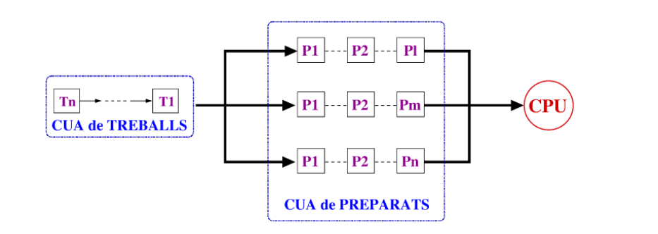
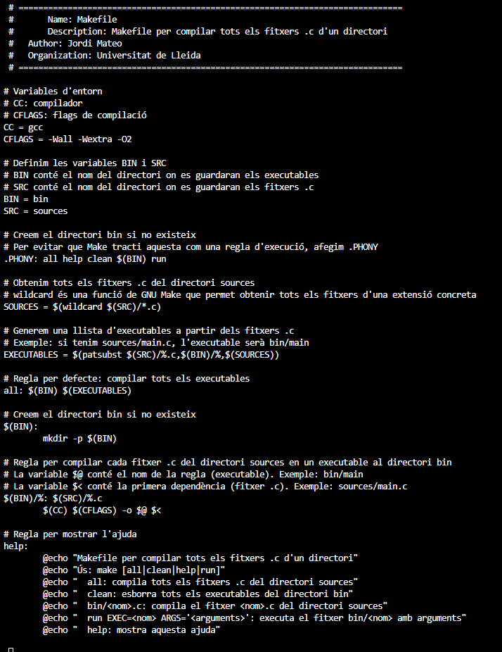
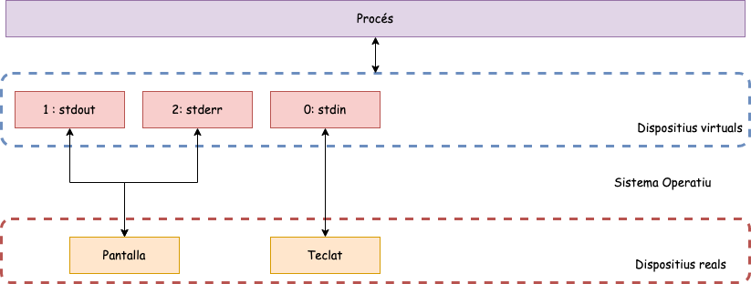

# 🖥️ Apunts de Sistemes Operatius - Setmana 1

## 📋 Índex
- [Setmana 1 - Introducció](#setmana-1---introducció)
- [Exemples Pràctics](#exemples-pràctics)
- [Dubtes i Preguntes](#dubtes-i-preguntes)
- [Reflexions Personals](#reflexions-personals)

---

## 🎯 Setmana 1 - Introducció

### 🔍 Què és un Sistema Operatiu?
El **Sistema Operatiu (SO)** és el programa fonamental que actua com a intermediari entre el maquinari i les aplicacions, gestionant tots els recursos del sistema.

### 🏗️ Sistema Informàtic

Un sistema informàtic és la **interconnexió d’elements de maquinari**, i es pot representar amb el següent esquema:

  
*Figura 1. Representació del funcionament d’un sistema informàtic*

👉 Per tant, **un sistema informàtic és diferent d’un SO**.

---

### 🔹 Bucles infinits i processos

Un bucle infinit pot ser utilitzat per **crear processos infinitament**.  

**Exemple:**
```c
int main() {
    while (1) {
        fork(); //Per sort no l'he executat al meu ordinador
    }
}
```
### 🔹 Màquina Virtual i rols del SO

**Màquina Virtual**: Il·lusió dels programes secundaris; se’ls fa creure que tenen accés exclusiu a tot l’espai d’adreces de memòria del processador.  

**Rols del Sistema Operatiu (SO):**
- **Il·lusionista** → ofereix una interfície simple.  
- **Àrbitre** → responsable de distribuir els recursos disponibles entre usuaris i aplicacions de manera eficient i justa.  
- **Pega** → proporciona serveis i funcionalitats comunes que poden ser compartits i reutilitzats.  

## 🎯 Setmana 1 - Introducció a la programació de Sistema (I) (C)

## Procés de compilació
1. **Preprocessador** → resol `#include`, `#define`, macros → genera `.i`
2. **Compilador** → tradueix a assemblador → genera `.s`
3. **Assemblador** → converteix a codi objecte → genera `.o`
4. **Enllaçador** → combina `.o` + biblioteques → executable final

## Arguments d'entrada

Es deixa l'estructura:
```c
int main(void)
{
    ...
}
```

Per passar a l'estructura:
```c
int 
main(int argc, 
     char *argv[]) 
{...}
```
On:

Argc: Es la longitud del vector d'argument de la terminal

Argv: Matriu de punters de caràcters

## Declaracions externes

Una **declaració externa** en C es aquella que anunica la existencia de una varaiable o funció definida en **un altre fitxer font** o en una altra part del mateix programa, sense reservar memòria adicional.

## Sintaxis
```c
extern int a;
```

Exemple 1:

```c
// fichero1.c
int contador = 0;   

// fichero2.c
extern int contador; 
void incrementar() {
    contador++;
}
```

Exemple 2:

```c
// fichero1.c
int sumar(int a, int b) {
    return a + b;
}

// fichero2.c
extern int sumar(int, int);  // declaración externa
int main() {
    return sumar(2, 3);
}
```

## Codi de les comandes de Linux

Es poden fer les comandes que posem per la terminal amb el llenguatge de c. 

Com a exemple tenim:

```c
#include <stdio.h>

int main(int argc, char *argv[]) {
  int i;
  if (argc < 2) {
    fprintf(stderr, "Usage: %s <string>\n", argv[0]);
    return -1;
  }
  for (i = 1; i < argc; i++) {
    printf("%s ", argv[i]);
  }
  printf("\n");
  return 0;
}
```
```c
#include <stdio.h>  // Per fprintf() i perror()
#include <unistd.h> // Per chdir()

int main(int argc, char *argv[]) {
    if (argc < 2) {
        fprintf(stderr, "Usage: %s <directory>\n", argv[0]);
        return 1;
    }
    if (chdir(argv[1]) == -1) {
        perror("chdir");
        return 1;  
    }
    return 0;  
}
```
Que corresponen, respectivament a les comandes, echo i cd.

M'he proposat "retarme" dient-li a la IA que em faci programar funcions semblants als exemples que se'ns ha donat.

## Makefile

Fitxer de text que conté un conjunt de regles utilitzades per construir un programa.

Exemple de MakeFile:



On dins d'aquest MakeFile trobem que:

 * CC és el compilador a utlitzar
 * CFLAGS són els flags de compilació
 * -O2 singinfica optimització de nivell 2
 * BIN és el directori per a executables
 * Src és el directori per al codi font
 * SOURCES busca tots els *.c en sources/
 * EXECUTABLES sources/programa.c --> bin/programa
 * All compila tots els executables
 * Bin: Crea directori si el bin no existeix 
 * $@ = Nombre de l'objectiu (ex: bin/main)
 * $< = Primera dependencia (ex: sources/main.c)

## Fitxers

Posaré , directament una interprteació de la teoria.  

---


**Pregunta**:En quin descriptor de fitxer aniría el fitxer file.txt?

**Resposta**:Com que els descriptors de fitxers: 0, 1, 2 dins d'una adreça qualsevol de memòria estan preassigantas, especificament, el descriptor 0 está assignat a stdin, 1 a stdout i el 2 a stderr. Per tant, es crearia un descriptor de fitxer número 3 on hi hauria el fitxer file.txt i successivament pels següents fitxers.

(Pendent de corregir)

**Codi per obrir un fitxer**:

```c
#include < sys/types.h> 
#include < sys/stat.h> 
#include < fcntl.h> 

int open ( const char *path, 
  int flags [, mode_t mode ]);
int creat (const char *path, 
  mode_t mode);
  ```
 On dins dels codi trobem:
 * Linies 1 - 3: Declaració de llibreries:

    * #include < sys/types.h> 
    * #include < sys/stat.h> 
    * #include < fcntl.h> 

    Dins d'aquestes llibreries, es produeixen les següents crides a sistema:
    * open()	sys_open	Abre archivo en el kernel
    * creat()	sys_open	Crear archivo (especialización de open)
    * close()	sys_close	Cierra descriptor de archivo
    * fopen()	sys_open + buffering	Abre con buffer (stdio.h)
    * fclose()	sys_close	Cierra archivo con buffer
    * printf()	sys_write	Escribe a stdout (a través de buffer)
    * scanf()	sys_read	Lee de stdin (a través de buffer)
    * malloc()	sys_brk / sys_mmap	Asigna memoria del heap
    * free()	sys_brk / sys_munmap	Libera memoria del heap


## Exemples pràctics

M’he creat aquests exercicis amb IA. La idea és **deduir què fa cada programa pas a pas** i relacionar-ho amb la teoria vista a classe. (Com estic repassant el tema 1 en la setmana 3, m'he doant la llibertat de posar conceptes encara no vistos)

#### Exercici 1
```c
#include <stdio.h>
#include <stdlib.h>
#include <unistd.h>

int main(void) {
    int *p = malloc(sizeof(int));
    printf("Memòria assignada a: %p\n", (void*)p);
    
    for(int i = 1; i <= 5; i++) {
        *p = i;  
        printf("[PID: %d] Valor: %d\n", getpid(), *p);
        fflush(stdout);  
        sleep(1);      
    }
    
    free(p);  
    return 0;
}
````
Amb la següent execució: ./prog1 & ./prog1

Raonament, sense correcció prèvia:
Amb el void dedueixo que es vol entrar dins del contingut de la adreça del punter, pero al posar %p, simplement s'impremeix l'adreça de memòria.
Després s'imprimiria el que hi ha dins del bucle for,el pid que faria referència al procès que s'esta executant i 1, 2, 3, 4, amb pauses d'un segon ja que tenim l'sleep.

Per tant els dos processos utlitzaran la mateixa adreça de memòria i com que el processador escolleix els processos de forma alternada, primerament les adreçes de memòria i després el número de procés amb el valor que hi ha dins del punter.

Si hi ha alguna discrepancia,tant per la meva part m'ho podries notificar?

Correcció per part de la IA:
malloc reserva memòria al heap i p té l’adreça retornada.

Imprimeix aquesta adreça i després, 5 vegades, escriu *p = i i imprimeix [PID: X] Valor: i amb sleep(1) entre iteracions.

Finalment free(p) i el procés acaba.

El primer ./prog1 & llança el primer procés en background i torna el prompt al shell.(Realment no se que vol dir això, ja que havia vist que: Les adreçes virtuals protegeixen els processosos entre ells i permeten que tots dos processos puguin fer servir la mateixa adreça sense afectar-se.

Immediatament després, el shell executa ./prog1 en primer pla (foreground). Així tens dos processos del mateix programa corrent concurrentment: un en background i un en foreground.

Ambdós s’executen simultàniament: el scheduler del SO alternarà l’execució entre ells. Per tant les línies que imprimeixen s’intercalaran de manera no determinista

Exemple de output:
```c
Memòria assignada a: 0x55a1f3b26010
Memòria assignada a: 0x55a1f3b26010
[PID: 2345] Valor: 1
[PID: 1234] Valor: 1
[PID: 2345] Valor: 2
[PID: 1234] Valor: 2
[PID: 1234] Valor: 3
[PID: 2345] Valor: 3
...
```
#### Exercici 2

```c
#include <stdio.h>
#include <unistd.h>

int main() {
    for (int i=0;i<5;i++){
        printf("line %d ", i);    // note: no '\n'
        fflush(NULL);             // (optional—remove to see difference)
        sleep(1);
    }
    return 0;
}
```
Amb les comandes: 

A) ./prog2

B) ./prog2 | cat

C) ./prog2 > out.txt (y mira cat out.txt mientras se ejecuta)

¿Qué diferencias verás entre A, B y C y por qué?

Raonament per a arribar a la solució:
En l'opció a se'ns dona una compilació normal (és a dir del arxiu), per tant, l'output serà: 0,1,2,3,4.

En l'opció b se'ns dona una compilació amb | cat , sabem que la instrucció cat concatena i mostra un arxiu. Després dedueixo que | deu ser algún tipus de , dirigeixte aquí per concatenarte, per tant seria 01234.

En l'opció c se'ns dona una compilació on amb la fletxa es redirigeix al fitxer out.txt, per tant s'escriurà 01234 dins del fietxer out.txt 

Solució:

a line 0 line 1 line 2 line 3 line 4

b line 0 line 1 line 2 line 3 line 4  (el mateix que a l'apartat a)

c Line 0 line 1 line 2 line 3 line 4 dins del fitxer output.txt


#### Exercici 3
#include <stdio.h>
```c
int main(int argc, char *argv[]) {
    printf("argc=%d\n", argc);
    if (argc > 1) printf("argv[1]=%s\n", argv[1]);
    printf("argv[argc] is %p\n", (void*)argv[argc]);
    return 0;
}
```
Amb la comanda:

A) ./optional2

Raonament per a arribar a la solució:

En el primer printf es passen el nombre d'arguments que es reben per terminal, en aquest cas només és un. Després en el condicional if, no compleix la condició així que no es "printeja" res. Ultimament es printeja l'adreça de memoria on apunta argv[]

Solució:

argc=1

argv[argc] is (nil)


