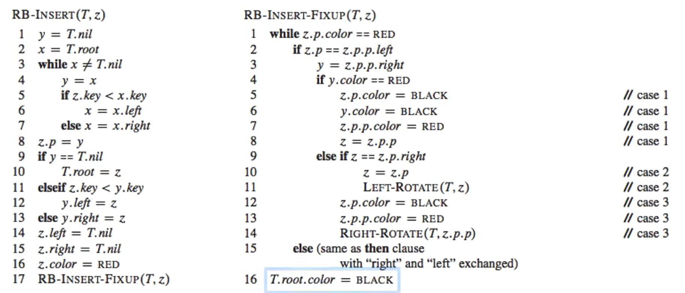

# 🖥️ Apunts de Sistemes Operatius - TEMA 2

## 📋 Índex
- [Setmana 2 - Kernel de Linux i Crides a Sistema](#setmana-2---Kernel de Linux i Crides a Sistema)
- [Exemples Pràctics](#exemples-pràctics)
- [Dubtes i Preguntes](#dubtes-i-preguntes)
- [Reflexions Personals](#reflexions-personals)

---

## 🎯 TEMA 2 - Kernel de Linux i Crides a Sistema

### 🔍 Dualitat

En aquesta imatge se'ns ensenya la dualitat entre usuari i kernel. Primerament, l'usuari disposa d'uns certs permissos que el kernel no té, per exemple l'accès a la shell o al navegador.
Per una altra part el kernel és el que gestiona la part de alt nivell i la que dosifica la memòria virtual.

### Estructures de kernels.

Li he demanat a la IA que em relacionai la teoria amb gossos( soc molt dolent d'enrecordarme de la teoria). Així que aquest exemple m'anirà bé.

##### Estructura Simple:

🏢 Kernel Simple - Perro "Viejo"

Ha perdut facultats, per tant, no está ben definit.

Podem dir-li al gos que faci totes les tasques sense limitació, però és díficil fer-li aprendre una nova comanda, está saturat.

És díficil saber que li passa en certs moments (depuració)

##### Estructura Monolítica:

🏢 Kernel Monolítico - Perro Guardián Grande

* Todo en uno: Como un Gran Danés que hace guardia, ataca, protege

* Linux: Todos los controladores en el kernel

* Ventaja: Rápido (comunicación directa)

* Desventaja: Si falla un driver (componente de software que permite que el sistema operativo y un dispositivo se comuniquen) → todo el sistema cae

Que extrec? 

* És un gran programa amb molts mòduls (controladors, gestió de memoria, etc) que es comuniquen entre si directament dintre del nucli del kernel.

    Avantatges:
 * Molt ràpid (tot està en el mateix espai de memòria).

-Desventatges:
* Si un mòdul falla, pot afectar a tot el sistema; difícil d'actualizar o separar errors.

##### Estructura Per Capes:

🥞 Kernel por Capas - Perro con Arnés

* Capas como un arnés: Cada capa solo habla con la de arriba/abajo

* Teoría bonita, poco usada en práctica

* Como ponerle arnés, correa, bozal al perro

Qué s'extreu?

* Divideix el sistema operatiu en nivells jeràrquics, on cada capa només pot comunicarse amb la de dalt o la de sota.

* Aventatges: Més ordenat, fàcil de depurar i mantenir.

* Desaventatges: Menor rendimient por el temps de comunicació entre capes.

##### Estructura MicroKernel:

🧩 Microkernel - Perro Pequeño + Adiestrador

* Kernel mínimo: Solo lo esencial (como un Chihuahua)

* Servicios separados: Drivers como procesos separados

* Ventaja: Si falla un driver, solo se reinicia ese proceso

* Ejemplo: QNX, Minix

Extracció

* Manté al nucli només les funcions essencials (comunicació, planificació, interrupcions). Tota la resta (arxius, drivers, etc.) s'executen com a processos d'usuari.

* Aventatges: Molt modular, més segur i estable (els errors en serveis no afecten el nucli).

* Desaventatges: Més lent per la comunicació entre processos (més “missatgeria”).

##### Estructura híbrida
Combinen elements de nuclis monolítics i microkernel.

Pel que fa a tot això del 'nucli híbrid', només és màrqueting. És oh, aquests micronuclis tenien una bona relació qualitat-preu, com podem intentar obtenir una bona relació qualitat-preu per al nostre nucli funcional? Ah, ja ho sé, fem servir un nom interessant i intentem insinuar que té tots els avantatges de relació qualitat-preu que té aquest altre sistema'» - Linus Torvalds

## Kernel Modular

“Modular” quiere decir que el cervell està fet de peces que es poden posar o deixar sense tenir que canviar tot el sistema.
Cada mòdul és com un petit bloc que fa una tasca concreta:

Un mòdul per al rató 🖱️

Otro per al so 🔊

Otro para la red 🌐

### Pralab7 Espiant el kernel

**Strace és una eina que permet monitoritzar i fer un seguiment de les crides al sistema que realitza un programa.**

Quines crides a sistema utilitza el procés?

Quins fitxers esta utilitzant l’aplicació?

Quins arguments es passen a les crides a sistema?

Quines crides a sistema estan fallant, i per què?

Fem **strace cat /dev/null** per veure la seva sortida i analitzar-la.

Després intentaré deduir la seva sortida, es á dir, el perqué aquest exemple mostra totes les crides a sistema realitzades pel programa cat.

 * Strace mostra totes les crides a sistema que executa un programa
 * Cat  /dev/null, la comanda cat (per xemple si fessim cat a.txt), ens mostraria el seu contingut per terminal, per es fan dues operacions, una de lectura al fitxer i una d'escriptura a la terminal. Però l'arxiu /dev/null no sé que significa, per tant li he preguntat a la IA. 
* /dev/ es un directorio especial en Linux que contiene archivos de dispositivo. Estos no son archivos normales, sino interfaces hacia dispositivos del sistema.??
* Directament se m'ha dit /dev/null → Es un dispositivo que siempre devuelve EOF 
* Per té sentit que es mostrin totes les crides a sistema realitzades pel programa cat.

**strace -e trace=close cat /dev/null**

En aquest cas, només veurem les crides close que fa el programa cat.

Perquè? Respecte a la comanda anterior el que ha canviat és que hem afegit la opció -e, fent strace -h , trobem que -e fa una mena de "Tampering", finalemnt si fem trace = close, només mostrarem les crides que fa close:

**strace -e trace=/get* ls**

Mostra totes les crides que comencin per get que fa el programa ls.

**strace -o strace.log -e trace=open,close ls**

Escriu en el fitxer strace.log totes les crides a sistema que siguin open o close.

Exlcoure una crida a sistema en particular:

**strace -o strace.log -e trace!=gettimeofday ls** 

Excloure una crida a sistema en particular, com gettimeofday.

**strace -o strace.log -e trace=%{X} ls.**

On {X} representa la categoria que t’interessa.

Els filtres a strace es poden classificar en diverses categories per facilitar la depuració i l’anàlisi:

## Exemples pràctics
### P1 Un kernel pot desactivar les interrupcions en algún moment? Perquè?

Sí. Perquè en el moment que es tracti una interrupció durant la rutina d'aquesta podria ser interrumpuda per una latra interrupció i així creant un bucle infinit. Per tant, necessitem l'acció del kernel en algún moment.

### P2.En aquesta imatge, quines diferencies observes entre el microkernel i el monólitic?

En aquesta imatge podem veure com en la estructura microkernel,té dins de l'espai de l'usuari tant L'unix/Linux com els drivers, és a dir, un component de software que permet que tot el SO i el dispositiu se comuniquen, el kernel té accés a la memòria virtual i demés coses que l'usuari no pot.Per això, podem dir que el microkernel té una mida més reduida. Per una altra part, podem veure que en el kernel monolític, és simplement tot en un, és a dir, que no hi ha un espai d'usuari a part de l'apliació, és a dir, tant les crides a sistema, el sistema de fitxers, ..., fins al driver són espai del Kernel. Però tenim que la comuniació és més rápida en el kernel monolític que en el microkernel.

#### Correccions:

En el monolític SÍ hi ha espai d'usuari per a les aplicacions:

Has dit: "en el kernel monolític, és simplement tot en un, és a dir, que no hi ha un espai d'usuari a part de l'aplicació". Això no és del tot exacte.

Correcció: En un sistema monolític, les aplicacions sí que s'executen en espai d'usuari, però els serveis del sistema operatiu (com drivers, sistema de fitxers, etc.) estan integrades dins del nucli. És a dir, la separació entre "espai de nucli" i "espai d'usuari" segueix existint, però els components del SO estan tots al nucli. La imatge ho reflecteix: veiem "Application" fora del nucli, i la resta dins.

Has assenyalat que la comunicació és més ràpida en el monolític, però és important especificar per què.

Matís: En el microkernel, la comunicació entre serveis (ex: entre una aplicació i el servidor de fitxers) requereix passos de missatgeria a través del nucli, el qual implica canvis de context (canvi d'espai d'usuari a nucli i viceversa). Això afeggeix overhead. En canvi, en el monolític, la comunicació es fa mitjançant simples crides a funcions dins del mateix espai de memòria del nucli.

### P3. Preguntes d'exàmen.

Cert o fals.

**"L’arquitectura monolítica integra totes les funcionalitats de sistema, inclosos serveis i controladors, en un espai d’adreçament compartit."**

Resposta:Cert. (M'he fixat en la iamtge dels meus apunts però no sé com explicar-ho).

Perquè és cert?

En un kernel monolítico, todos los servicios del sistema operativo (gestión de memoria, planificación, sistema de archivos, controladores de dispositivos, etc.) se ejecutan en el mismo espacio de direcciones del kernel. Esto implica que no hay separación entre módulos y el kernel opera como un único programa en modo privilegiado.

**"Els sistemes de microkernel ofereixen generalment un rendiment més elevat que els sistemes monolítics perquè distribueixen els serveis en espai d’usuari."**

Resposta:Fals, s'ha justificat en l'exercici anterior tot just.

**"Un Microkernel pot millorar la resiliència d’un sistema contra errors en el sistema operatiu."**

Resposta: Cert. Perquè, perque abans en la teoria hem dit, si falla driver, només es reinicia aquell procés, per tant, només  es afectat per aquell driver i es pot detectar l'error facilment. Així millorant la resiliència. (Bona paraula la veritat sigui dita)

Fetes per IA:

**"L'adopció de mòduls carregables en temps d'execució en nuclis moderns com Linux invalida la classificació clàssica de 'monolític', transformant-lo de facto en una arquitectura de micronucli, ja que la funcionalitat no essencial resideix en espais de memòria separats i pot ser manejada de manera independent."**

Fals

**"La capacitat dels nuclis moderns com Linux de carregar mòduls dinàmicament (com drivers) els converteix en micronuclis, ja que aquests mòduls es poden carregar i descarregar sense reiniciar el sistema."**

Fals, abans hem justificat que Linux es una estructura monolítica. De fet el que diu l'enunciat és uan característica de l'estructura monolítica.

**"Un micronucli sempre serà més lent que un nucli monolític perquè la comunicació entre serveis passa obligatòriament pel nucli, afegint una sobrecarga de canvis de context."**

Cert

**"Els nuclis híbrids, com Windows NT o XNU (macOS), són en realitat micronuclis purs als quals s'hi han afegit algunes optimitzacions de rendiment, sense incorporar característiques dels nuclis monolítics."**

Fals, sí que incorporen elements dels nuclis monolitics per definció d'estructura híbrida.

**"En una arquitectura monolítica, si un controlador de dispositiu (driver) falla, el sistema operatiu sencer es bloquejarà i es reiniciarà obligatòriament, ja que tot s'executa en el mateix espai.**

Cert, hem dit que si Si un mòdul falla, pot afectar a tot el sistema.

**"En un micronucli, si el servidor del sistema de fitxers falla, les aplicacions que no estiguin accedint a disc en aquell moment no es veuran afectades en absolut."**

Cert, entenc que en el micronucli cada cosa va per separat.

LES HE ENCERTAT TOTES :))

## Dubtes i Preguntes
Que és el directori /dev/? Perquè amb l'expliació de la IA no ho acabo d'entendre.

## Reflexions personals
-Treballar més.

