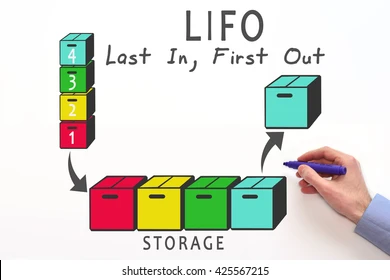
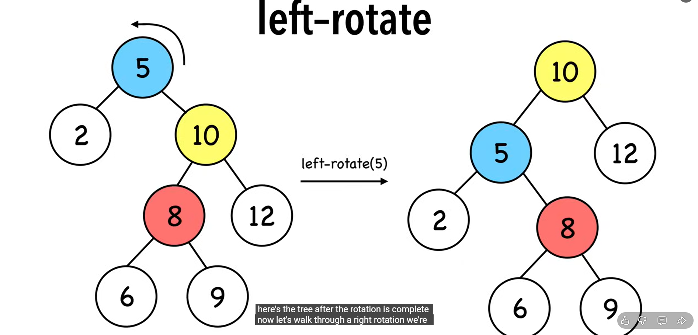
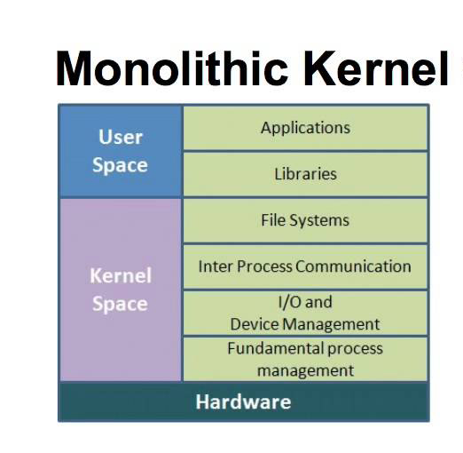
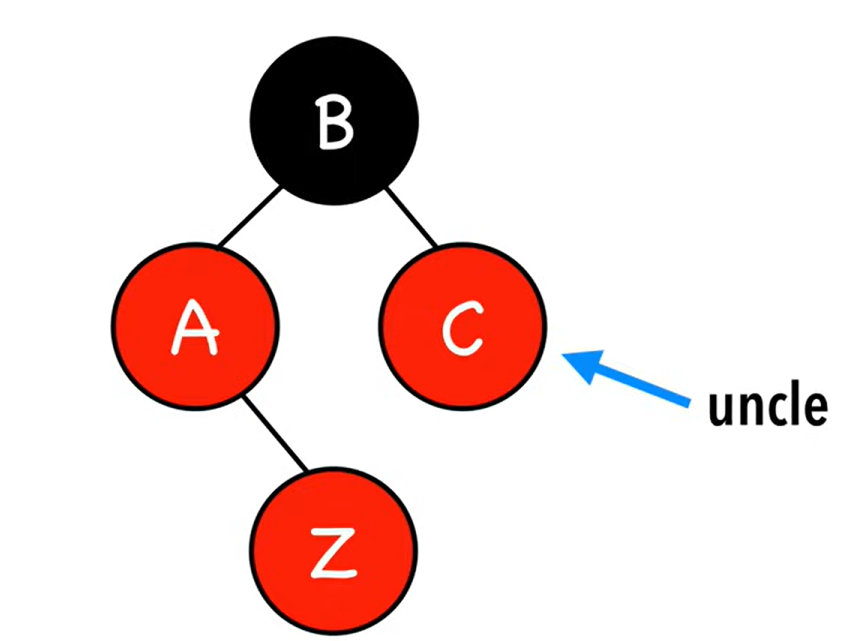

# 🖥️ Apunts de Sistemes Operatius - TEMA 2

## 📋 Índex
- [Setmana 2 - Kernel de Linux i Crides a Sistema](#setmana-2---Kernel de Linux i Crides a Sistema)
- [Exemples Pràctics](#exemples-pràctics)
- [Dubtes i Preguntes](#dubtes-i-preguntes)
- [Reflexions Personals](#reflexions-personals)

---

## 🎯 TEMA 2 - Kernel de Linux i Crides a Sistema

### 🔍 Dualitat

En aquesta imatge se'ns ensenya la dualitat entre usuari i kernel. Primerament, l'usuari disposa d'uns certs permissos que el kernel no té, per exemple l'accès a la shell o al navegador.
Per una altra part el kernel és el que gestiona la part de alt nivell i la que dosifica la memòria virtual.

### Estructures de kernels.

Li he demanat a la IA que em relacionai la teoria amb gossos( soc molt dolent d'enrecordarme de la teoria). Així que aquest exemple m'anirà bé.

##### Estructura Simple:

🏢 Kernel Simple - Perro "Viejo"

Ha perdut facultats, per tant, no está ben definit.

Podem dir-li al gos que faci totes les tasques sense limitació, però és díficil fer-li aprendre una nova comanda, está saturat.

És díficil saber que li passa en certs moments (depuració)

##### Estructura Monolítica:

🏢 Kernel Monolítico - Perro Guardián Grande

* Todo en uno: Como un Gran Danés que hace guardia, ataca, protege

* Linux: Todos los controladores en el kernel

* Ventaja: Rápido (comunicación directa)

* Desventaja: Si falla un driver (componente de software que permite que el sistema operativo y un dispositivo se comuniquen) → todo el sistema cae

Que extrec? 

* És un gran programa amb molts mòduls (controladors, gestió de memoria, etc) que es comuniquen entre si directament dintre del nucli del kernel.

    Avantatges:
 * Molt ràpid (tot està en el mateix espai de memòria).

-Desventatges:
* Si un mòdul falla, pot afectar a tot el sistema; difícil d'actualizar o separar errors.

##### Estructura Per Capes:

🥞 Kernel por Capas - Perro con Arnés

* Capas como un arnés: Cada capa solo habla con la de arriba/abajo

* Teoría bonita, poco usada en práctica

* Como ponerle arnés, correa, bozal al perro

Qué s'extreu?

* Divideix el sistema operatiu en nivells jeràrquics, on cada capa només pot comunicarse amb la de dalt o la de sota.

* Aventatges: Més ordenat, fàcil de depurar i mantenir.

* Desaventatges: Menor rendimient por el temps de comunicació entre capes.

##### Estructura MicroKernel:

🧩 Microkernel - Perro Pequeño + Adiestrador

* Kernel mínimo: Solo lo esencial (como un Chihuahua)

* Servicios separados: Drivers como procesos separados

* Ventaja: Si falla un driver, solo se reinicia ese proceso

* Ejemplo: QNX, Minix

Extracció

* Manté al nucli només les funcions essencials (comunicació, planificació, interrupcions). Tota la resta (arxius, drivers, etc.) s'executen com a processos d'usuari.

* Aventatges: Molt modular, més segur i estable (els errors en serveis no afecten el nucli).

* Desaventatges: Més lent per la comunicació entre processos (més “missatgeria”).

##### Estructura híbrida
Combinen elements de nuclis monolítics i microkernel.

Pel que fa a tot això del 'nucli híbrid', només és màrqueting. És oh, aquests micronuclis tenien una bona relació qualitat-preu, com podem intentar obtenir una bona relació qualitat-preu per al nostre nucli funcional? Ah, ja ho sé, fem servir un nom interessant i intentem insinuar que té tots els avantatges de relació qualitat-preu que té aquest altre sistema'» - Linus Torvalds

## Kernel Modular

“Modular” quiere decir que el cervell està fet de peces que es poden posar o deixar sense tenir que canviar tot el sistema.
Cada mòdul és com un petit bloc que fa una tasca concreta:

Un mòdul per al rató 🖱️

Otro per al so 🔊

Otro para la red 🌐

## Exemples pràctics
### P1 Un kernel pot desactivar les interrupcions en algún moment? Perquè?

Sí. Perquè en el moment que es tracti una interrupció durant la rutina d'aquesta podria ser interrumpuda per una latra interrupció i així creant un bucle infinit. Per tant, necessitem l'acció del kernel en algún moment.

### P2.En aquesta imatge, quines diferencies observes entre el microkernel i el monólitic?

En aquesta imatge podem veure com 

## Dubtes i Preguntes

## Reflexions personals
-Treballar més.