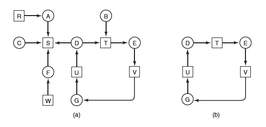
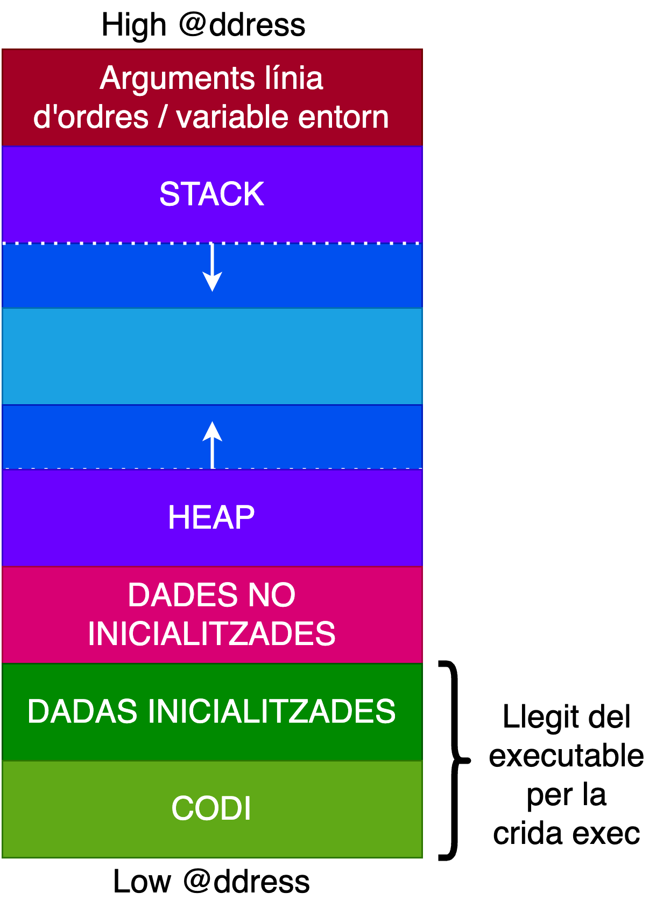
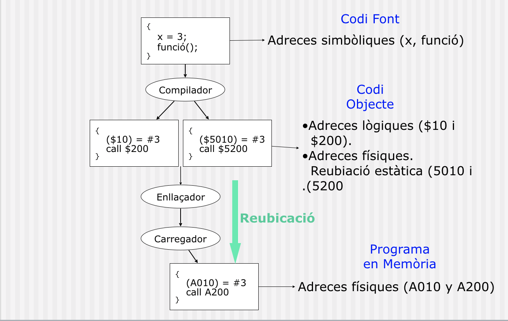

# 🖥️ Apunts de Sistemes Operatius - TEMA 2

## 📋 Índex
- [Setmana 2 - Kernel de Linux i Crides a Sistema](#setmana-2---Kernel de Linux i Crides a Sistema)
- [Exemples Pràctics](#exemples-pràctics)
- [Dubtes i Preguntes](#dubtes-i-preguntes)
- [Reflexions Personals](#reflexions-personals)

---

## 🎯 TEMA 2 - Kernel de Linux i Crides a Sistema

### 🔍 Dualitat


En aquesta imatge se'ns ensenya la dualitat entre usuari i kernel. Primerament, l'usuari disposa d'uns certs permissos que el kernel no té, per exemple l'accès a la shell o al navegador.
Per una altra part el kernel és el que gestiona la part de alt nivell i la que dosifica la memòria virtual.

### Estructures de kernels.

Li he demanat a la IA que em relacionai la teoria amb gossos( soc molt dolent d'enrecordarme de la teoria). Així que aquest exemple m'anirà bé.

##### Estructura Simple:


🏢 Kernel Simple - Perro "Viejo"

Ha perdut facultats, per tant, no está ben definit.

Podem dir-li al gos que faci totes les tasques sense limitació, però és díficil fer-li aprendre una nova comanda, está saturat.

És díficil saber que li passa en certs moments (depuració)


##### Estructura Monolítica:


🏢 Kernel Monolítico - Perro Guardián Grande

* Todo en uno: Como un Gran Danés que hace guardia, ataca, protege

* Linux: Todos los controladores en el kernel

* Ventaja: Rápido (comunicación directa)

* Desventaja: Si falla un driver (componente de software que permite que el sistema operativo y un dispositivo se comuniquen) → todo el sistema cae

Que extrec? 

* És un gran programa amb molts mòduls (controladors, gestió de memoria, etc) que es comuniquen entre si directament dintre del nucli del kernel.

    Avantatges:
 * Molt ràpid (tot està en el mateix espai de memòria).

-Desventatges:
* Si un mòdul falla, pot afectar a tot el sistema; difícil d'actualizar o separar errors.


##### Estructura Per Capes:


🥞 Kernel por Capas - Perro con Arnés

* Capas como un arnés: Cada capa solo habla con la de arriba/abajo

* Teoría bonita, poco usada en práctica

* Como ponerle arnés, correa, bozal al perro

Qué s'extreu?

* Divideix el sistema operatiu en nivells jeràrquics, on cada capa només pot comunicarse amb la de dalt o la de sota.

* Aventatges: Més ordenat, fàcil de depurar i mantenir.

* Desaventatges: Menor rendimient por el temps de comunicació entre capes.


##### Estructura MicroKernel:

🧩 Microkernel - Perro Pequeño + Adiestrador

* Kernel mínimo: Solo lo esencial (como un Chihuahua)

* Servicios separados: Drivers como procesos separados

* Ventaja: Si falla un driver, solo se reinicia ese proceso

* Ejemplo: QNX, Minix

Extracció

* Manté al nucli només les funcions essencials (comunicació, planificació, interrupcions). Tota la resta (arxius, drivers, etc.) s'executen com a processos d'usuari.

* Aventatges: Molt modular, més segur i estable (els errors en serveis no afecten el nucli).

* Desaventatges: Més lent per la comunicació entre processos (més “missatgeria”).

##### Estructura híbrida
Combinen elements de nuclis monolítics i microkernel.

Pel que fa a tot això del 'nucli híbrid', només és màrqueting. És oh, aquests micronuclis tenien una bona relació qualitat-preu, com podem intentar obtenir una bona relació qualitat-preu per al nostre nucli funcional? Ah, ja ho sé, fem servir un nom interessant i intentem insinuar que té tots els avantatges de relació qualitat-preu que té aquest altre sistema'» - Linus Torvalds

### Kernel Modular

“Modular” quiere decir que el cervell està fet de peces que es poden posar o deixar sense tenir que canviar tot el sistema.
Cada mòdul és com un petit bloc que fa una tasca concreta:

Un mòdul per al rató 🖱️

Otro per al so 🔊

Otro para la red 🌐

### Pralab7 Espiant el kernel

**Strace és una eina que permet monitoritzar i fer un seguiment de les crides al sistema que realitza un programa.**

Quines crides a sistema utilitza el procés?

Quins fitxers esta utilitzant l’aplicació?

Quins arguments es passen a les crides a sistema?

Quines crides a sistema estan fallant, i per què?

Fem **strace cat /dev/null** per veure la seva sortida i analitzar-la.

Després intentaré deduir la seva sortida, es á dir, el perqué aquest exemple mostra totes les crides a sistema realitzades pel programa cat.

 * Strace mostra totes les crides a sistema que executa un programa
 * Cat  /dev/null, la comanda cat (per xemple si fessim cat a.txt), ens mostraria el seu contingut per terminal, per es fan dues operacions, una de lectura al fitxer i una d'escriptura a la terminal. Però l'arxiu /dev/null no sé que significa, per tant li he preguntat a la IA. 
* /dev/ es un directorio especial en Linux que contiene archivos de dispositivo. Estos no son archivos normales, sino interfaces hacia dispositivos del sistema.??
* Directament se m'ha dit /dev/null → Es un dispositivo que siempre devuelve EOF 
* Per té sentit que es mostrin totes les crides a sistema realitzades pel programa cat.

**strace -e trace=close cat /dev/null**

En aquest cas, només veurem les crides close que fa el programa cat.

Perquè? Respecte a la comanda anterior el que ha canviat és que hem afegit la opció -e, fent strace -h , trobem que -e fa una mena de "Tampering", finalemnt si fem trace = close, només mostrarem les crides que fa close:

**strace -e trace=/get* ls**

Mostra totes les crides que comencin per get que fa el programa ls.

**strace -o strace.log -e trace=open,close ls**

Escriu en el fitxer strace.log totes les crides a sistema que siguin open o close.

Exlcoure una crida a sistema en particular:

**strace -o strace.log -e trace!=gettimeofday ls** 

Excloure una crida a sistema en particular, com gettimeofday.

**strace -o strace.log -e trace=%{X} ls.**

On {X} representa la categoria que t’interessa.

### Crides a sistema

Concepte: És un telefon intern que els programes utilitzen per a demanar serveis al SO.


En aquesta imatge podem veure la portecció de la CPU(unitat central de processament) en múltiples nivells de seguretat.

En el Ring 0, desde el punt de vista del Kernel podem dir que  el ring 0 és on té més llibertat i l'anell 3 és on es troben els serveis de l'usuari, per exemple on es troben els meus programes.

Per tant, té sentit que el kernel s'executi en mode priveligiat (ring 0) amb accés complet al maquinari. Els serveis del mode usuari demanen permís al kernel. Aquests s'executen en l'anell 3 que és el més restringit, de manera segura.

Com pot un procés en mode usuari notificar al kernel que necessita fer alguna cosa? Si no tenim cap instrucció que ho permeti?

"Com pot un procés, que està tancat en una presó (mode usuari), demanar ajuda al guarda (kernel) si no li està permès obrir la porta?"

Resposta: No pot obrir la porta... però pot fer soroll fins que el guarda vingui a veure què passa.

A partir d'aquesta pregunta podem deduir el concepte d'interrupció.

### FUNCIONAMENT DEL PROCESSADOR

Tenim la següent tabla dins del funcionament de la ram:

| Adreça| Opcode | Operand |
|------------|------------|------------|
| 0 | Fila 1, C2 | Fila 1, C3 |
| 1 | Fila 2, C2 | Fila 2, C3 |

| Adreça| Valor|
------------|------------|
|30| Fila 1, C2 | Fila 1, C3 |
| 31 | Fila 2, C2 | Fila 2, C3 |

Que és cada cosa?

* Adreça : Adreçes de memòria dins de la RAM

* Opcode, operand : Instruccions en sí que la CPU vol fer. Per altra part. l'operand és la direcció de memòria. (Do this ---> to this)

* Valors: Valors amb els que la CPU pot treballar

Suposem que tenim el següent programa a executar 
```c

int main(int argc, char * argv[])
int a = atoi(argv[1]);
int b = atoi(argv[2]);

return a + b;
```
Suposant que l'usuari ha passat com a paramètres el 5 i el 7, tenim, dins de la segona taula:

| Adreça| Valor|
------------|------------|
|30| 5| 
| 31 | 7|

Dins de la primera taula, tenim( hi ha instrccions que m'enrecordo de EDC II), la relació entre aquestes dos taules s'anomena **pipelining**:

| Adreça| Opcode | Operand |
|------------|------------|------------|
| 0 | LOAD | 30 |
| 1 | ADD | 31|
| 2 | STORE | 32|

La CPU té un rellotge intern, un tick d'aquest, señala el començaent d'un nou fetch.

Es pot dir que es segueix el següent procés:

Fetch → Decode → Execute → Memory → Writeback.

### Interrupcions

Tenim que un dispostiu de E/S com podria ser un teclat, té menys velocitat que la CPU o la RAM. 

Tipus d'interrupció:

Hardware:

* Polling: Esperem fins que el dispositiu no estigui ocupat. Si no està ocupat, fem una operació E/S

* Hardware: Prenem una tecla del teclat (ctrl c) a la terminal. (Es fa un sleep i desprésuna subrutina)

Software:

* Int 0, 6, 7.Senyals que s'han fet a teoria.

### Taules d'interrupció

.

És una estructura de dades que asocia una llista de drivers d'interrupcions. Cadascuna de les entrades en la taula de vectors d'interrupcions, és la direcció d'un driver d'interrupció.

Si rebo una instrucció serà el propi kernel el que em dirà quina adreça apunta la ISR corresponent. 

Per tant, té sentit que la CPU no sapigui quin codi executis si es produis això. 

```c
static __init void
idt_setup_from_table(gate_desc *idt, const struct idt_data *t, int size, bool sys)
{
	gate_desc desc;

	for (; size > 0; t++, size--) {
		idt_init_desc(&desc, t);
		write_idt_entry(idt, t->vector, &desc);
		if (sys)
			set_bit(t->vector, system_vectors);
	}
}
```
### Excepcions

Concepte: Evento que se produce cuando se ejecuta el programa de forma que interrumpe el flujo normal de instrucciones.

Hi ha més tipus d'excepcions però prefereixo tractar-ho als exercicis.

### Trap
Intentaré, amb les meves paraules, explicar com s'origina el concepte de trap a partir d'aquesta imatge.

En aquesta imatge podem veure la dualitat entre el mode usuari i el mode kernel. Tenint el mode usuari, qualsevol programa que generi una excepció o una interrupció. Llavors les ha de tractar el kernel. Per això s'origina el concepte de trap que és la interrupció software que li demana permís al kernel.
El kernel accepta la trap, gestiona la interrupció o la excepció i torna a mode usuari.

Es pot explicar amb la següent imatge:


En aquest cas, tenim que en l'espai d'usuari s'ha escrit en programa en C amb la funció int open(const char * ruta , int oflag , ...); tal que cridi al kernel mitjançant una syscall (trap en el kernel). La CPU canvia a mode supervisor i salta a la rutina del kernel indicada a la IDT. En l'espai del Kernel, es comproven els descriptors i els permissos. I s'executa la rutina de tractament de open() llegint les dades del dispositiu E/S. Es retorna un nombre positiu o -1 en cas d'error.El mode kernel torna a l'espai usuari i retorna el valor.
```c
//Executem a user space
mov edx,4;// message length
mov ecx,msg;//message to write
mov ebx,1;//file descriptor (stdout)
mov eax,4;//system call number (sys_write)
int 0x80;//interrupt! Number 128 (0x80 in hex)
```

❌ Puntos que Necesitan Corrección:

1. Confusión entre open y write

Dices:

"función int open(const char * ruta , int oflag , ...)"

Pero el código muestra:

asm

mov eax,4  ; system call number (sys_write)

Corrección:

Estás explicando open() pero el código es para write()

eax=4 corresponde a sys_write, no a open

open sería eax=5 en muchas arquitecturas x86

2. Descripción Incorrecta de la Ejecución en Kernel

Dices:

"llegint les dades del dispositiu E/S"

Esto es incorrecto para esta syscall específica:

write (código mostrado): Envía datos al dispositivo, no los lee

open (que mencionas): Abre un archivo, no necesariamente lee datos del dispositivo

3. Falta Especificar los Registros Correctos

Para write() los registros son:

eax=4 - número de syscall

ebx - file descriptor (1 = stdout)

ecx - buffer de datos a escribir

edx - longitud de datos

🎯 Explicación Corregida y Mejorada:

Para el Código Mostrado (write):

c

// En espacio usuario - programa en C

write(1, msg, 4);  // Equivalente en C

Flujo Corregido:

Usuario ejecuta int 0x80 con parámetros en registros

CPU cambia a modo kernel y busca en IDT[0x80]

Kernel ejecuta do_int80_syscall_32()

Kernel verifica eax=4 → ejecuta sys_write()

Validaciones:

¿Existe el file descriptor 1?

¿Tiene permisos de escritura?

¿El buffer está en espacio usuario válido?

Copia datos de espacio usuario a kernel (copy_from_user())

Envía datos al dispositivo (consola/tty)

Retorna número de bytes escritos o -1 en error

Vuelve a modo usuario

### Punters i seguretat (I)

Tots els punters que provenen de l’usuari han de ser validads abans de ser utilitzats pel kernel.

Funcions com __chk_user_ptr(ptr) comproven si el punter apunta a espai usuari vàlid.

Taula d’excepcions: el kernel registra quines instruccions poden accedir a l’espai usuari

### Virtual Dynamic Shared Object (VDSO)

Objectiu:
Evitar la transició completa a mode kernel, reduint latència i cost de syscalls repetitives.

Exemples:
* gettimeofday()
* time()
* getpid()

### Canvi de context



El concepte de canvi de context ( de la CPU) s'utilitza per a denotar una acció en que el SO treu el procés que s'estava executant en la CPU (bé perquè ha acabat, ha expirat el seu temps de CPU, o perquè espera per un recurs o succés) i n'hi posa un altre. Per dur a terme aquesta tasca, el SO guarda els "registres de la CPU" del procés sortint en el seu corresponent PCB, i restaura els registres de la CPU del procés entrant també en el seu PCB. Aquest darrer procés pot iniciar la seva execució, o continuar el que estava fent com si res hagués passat. (Cooiat del llibre de SO de Lleida)


### MECANISMES D'EXECUCIÓ

Flux d'una syscall:

Preparació: Programa posa arguments en registres

Trap: Instrucció syscall/int 0x80 (interrupció software)

Canvi a mode kernel: CPU salta a rutina del kernel via IDT

Execució: Kernel valida i executa la funció corresponent

Retorn: Resultat torna via registres + torna a mode usuari.

## Exemples pràctics
### P1 Un kernel pot desactivar les interrupcions en algún moment? Perquè?

Sí. Perquè en el moment que es tracti una interrupció durant la rutina d'aquesta podria ser interrumpuda per una latra interrupció i així creant un bucle infinit. Per tant, necessitem l'acció del kernel en algún moment.

### P2.En aquesta imatge, quines diferencies observes entre el microkernel i el monólitic?


En aquesta imatge podem veure com en la estructura microkernel,té dins de l'espai de l'usuari tant L'unix/Linux com els drivers, és a dir, un component de software que permet que tot el SO i el dispositiu se comuniquen, el kernel té accés a la memòria virtual i demés coses que l'usuari no pot.Per això, podem dir que el microkernel té una mida més reduida. Per una altra part, podem veure que en el kernel monolític, és simplement tot en un, és a dir, que no hi ha un espai d'usuari a part de l'apliació, és a dir, tant les crides a sistema, el sistema de fitxers, ..., fins al driver són espai del Kernel. Però tenim que la comuniació és més rápida en el kernel monolític que en el microkernel.

#### Correccions:

En el monolític SÍ hi ha espai d'usuari per a les aplicacions:

Has dit: "en el kernel monolític, és simplement tot en un, és a dir, que no hi ha un espai d'usuari a part de l'aplicació". Això no és del tot exacte.

Correcció: En un sistema monolític, les aplicacions sí que s'executen en espai d'usuari, però els serveis del sistema operatiu (com drivers, sistema de fitxers, etc.) estan integrades dins del nucli. És a dir, la separació entre "espai de nucli" i "espai d'usuari" segueix existint, però els components del SO estan tots al nucli. La imatge ho reflecteix: veiem "Application" fora del nucli, i la resta dins.

Has assenyalat que la comunicació és més ràpida en el monolític, però és important especificar per què.

Matís: En el microkernel, la comunicació entre serveis (ex: entre una aplicació i el servidor de fitxers) requereix passos de missatgeria a través del nucli, el qual implica canvis de context (canvi d'espai d'usuari a nucli i viceversa). Això afeggeix overhead. En canvi, en el monolític, la comunicació es fa mitjançant simples crides a funcions dins del mateix espai de memòria del nucli.

### P3. Preguntes d'exàmen.

Cert o fals.

**"L’arquitectura monolítica integra totes les funcionalitats de sistema, inclosos serveis i controladors, en un espai d’adreçament compartit."**

Resposta:Cert. (M'he fixat en la iamtge dels meus apunts però no sé com explicar-ho).

Perquè és cert?

En un kernel monolítico, todos los servicios del sistema operativo (gestión de memoria, planificación, sistema de archivos, controladores de dispositivos, etc.) se ejecutan en el mismo espacio de direcciones del kernel. Esto implica que no hay separación entre módulos y el kernel opera como un único programa en modo privilegiado.

**"Els sistemes de microkernel ofereixen generalment un rendiment més elevat que els sistemes monolítics perquè distribueixen els serveis en espai d’usuari."**

Resposta:Fals, s'ha justificat en l'exercici anterior tot just.

**"Un Microkernel pot millorar la resiliència d’un sistema contra errors en el sistema operatiu."**

Resposta: Cert. Perquè, perque abans en la teoria hem dit, si falla driver, només es reinicia aquell procés, per tant, només  es afectat per aquell driver i es pot detectar l'error facilment. Així millorant la resiliència. (Bona paraula la veritat sigui dita)


Fetes per IA:

**"L'adopció de mòduls carregables en temps d'execució en nuclis moderns com Linux invalida la classificació clàssica de 'monolític', transformant-lo de facto en una arquitectura de micronucli, ja que la funcionalitat no essencial resideix en espais de memòria separats i pot ser manejada de manera independent."**

Fals

**"La capacitat dels nuclis moderns com Linux de carregar mòduls dinàmicament (com drivers) els converteix en micronuclis, ja que aquests mòduls es poden carregar i descarregar sense reiniciar el sistema."**

Fals, abans hem justificat que Linux es una estructura monolítica. De fet el que diu l'enunciat és uan característica de l'estructura monolítica.

**"Un micronucli sempre serà més lent que un nucli monolític perquè la comunicació entre serveis passa obligatòriament pel nucli, afegint una sobrecarga de canvis de context."**

Cert

**"Els nuclis híbrids, com Windows NT o XNU (macOS), són en realitat micronuclis purs als quals s'hi han afegit algunes optimitzacions de rendiment, sense incorporar característiques dels nuclis monolítics."**

Fals, sí que incorporen elements dels nuclis monolitics per definció d'estructura híbrida.

**"En una arquitectura monolítica, si un controlador de dispositiu (driver) falla, el sistema operatiu sencer es bloquejarà i es reiniciarà obligatòriament, ja que tot s'executa en el mateix espai.**

Cert, hem dit que si Si un mòdul falla, pot afectar a tot el sistema.

**"En un micronucli, si el servidor del sistema de fitxers falla, les aplicacions que no estiguin accedint a disc en aquell moment no es veuran afectades en absolut."**

Cert, entenc que en el micronucli cada cosa va per separat.

LES HE ENCERTAT TOTES :))

### P4 Digues que fa aquest codi en relació a les syscalls.
```c
__visible noinstr bool do_syscall_64(struct pt_regs *regs, int nr)
{
    nr = syscall_enter_from_user_mode(regs, nr); 
    if (!do_syscall_x64(regs, nr) && !do_syscall_x32(regs, nr) && nr != -1) {
        regs->ax = __x64_sys_ni_syscall(regs);
    }
    syscall_exit_to_user_mode(regs);
    return true;

	/* syscall_enter_from_user_mode(regs, nr)
Canvia a mode kernel.
Realitza validacions de seguretat i prepara els registres (RAX, RDI, RSI, etc.).
*/
/*
syscall_exit_to_user_mode(regs)
Prepara els registres per tornar a mode usuari.
*/
}
```
Podem veure que en aquesta funció és passen dos arguments d'entrada, un que és una classe de punter cap als registes i un enter que indica el mode en el qual s'accedeix a ells.
Després es canvia a mode kernel tal com diuen els comentaris, es retorna un enter que hauria d'indicar el mode de lectura. En el cas que no es pugui fer la syscall ni el RAX ni en el EAX ni tampoc tinguem permissos de lectura o escriptura. La propietat ax dels registres es inicialitzada a uns nous registres. Finalment tornem a mode usuari i com que s'ha fet bé la crida retornem true.

Correccions per part de la IA:


❌ Lo que necesita corrección:
"un enter que indica el mode en el qual s'accedeix a ells"

❌ Incorrecto: nr no es un "modo de acceso" - es el número de syscall que el usuario quiere ejecutar (ej: 1 = exit, 2 = fork, 3 = read, etc.)

"es retorna un enter que hauria d'indicar el mode de lectura"

❌ Incorrecto: syscall_enter_from_user_mode() retorna un número de syscall posiblemente modificado, no un "modo de lectura".

"En el caso que no es pugui fer la syscall ni el RAX ni en el EAX"

❌ Confuso: RAX y EAX son el mismo registro (RAX en 64-bit, EAX en 32-bit). No se trata de "no poder hacerla en RAX ni EAX".

"ni tampoc tinguem permissos de lectura o escriptura"

❌ Parcialmente correcto: La condición verifica si la syscall no existe o no está implementada, no específicamente permisos.

"La propietat ax dels registres es inicialitzada a uns nous registres"

❌ Incorrecto: regs->ax = __x64_sys_ni_syscall(regs) establece el registro AX (donde va el valor de retorno) a lo que retorne la función "not implemented", no a "nuevos registros".

### Ex5 Digues que fa el següent codi en relació al temari de les syscalls.

```c
static __always_inline bool do_syscall_x64(struct pt_regs *regs, int nr)
{
    unsigned int unr = nr;
    if (likely(unr < NR_syscalls)) {
        unr = array_index_nospec(unr, NR_syscalls);
        regs->ax = x64_sys_call(regs, unr);
        return true;
    }
    return false;
}
```

Ara podem dir que el codi,Podem veure que en aquesta funció és passen dos arguments d'entrada, un que és una classe de punter cap als registes i un enter que indica la crida a sistema en el qual s'accedeix a ells.

En el cas de que hi hagi un nombre de syscalls major que el nombre total de syscalls suportades, simplement retornem fals, perquè llavors no podem fer la crida. Altrament mirem que l'index del número de la syscall, (suposnat que d'això s'encarrega una estructura de dades.), modiquem el registre ax per tal de guardar la syscall dins del sistema.
Fimalment retornem true.

Correcció:


```c
static __always_inline bool do_syscall_x64(struct pt_regs *regs, int nr)
{
    unsigned int unr = nr;
    
    // 1. COMPROVACIÓ DE RANG: Verifica que el número de syscall existeix
    if (likely(unr < NR_syscalls)) {
        
        // 2. PROTECCIÓ CONTRA ATACS: Evita accessos fora de rang per especulació
        unr = array_index_nospec(unr, NR_syscalls);
        
        // 3. EXECUCIÓ DE LA SYSCALL:
        //    - x64_sys_call accedeix a la TAULA de syscalls (sys_call_table[unr])
        //    - Executa la funció de kernel corresponent
        //    - El resultat es guarda a regs->ax (valor de retorn per l'usuari)
        regs->ax = x64_sys_call(regs, unr);
        
        return true;  // Syscall executada amb èxit
    }
    return false;  // Número de syscall invàlid
}
```

### Ex6 Analitza el funcionament de la funció get_user(x, ptr)

```c

#define get_user(x, ptr)                    
({                              
    const void __user *__p = (ptr);             
    might_fault();                      
    access_ok(__p, sizeof(*ptr)) ?      
        __get_user((x), (__typeof__(*(ptr)) __user *)__p) :
        ((x) = (__typeof__(*(ptr)))0,-EFAULT);      
})
```

Definim la funció get_user amb dos paràmetres d'entrada. Declarem el punter de l'usuari dintre del kernel,Seguidament fem might_fault() perquè el codi següent pot generar un page fault. Finalment es comprova si l'accés al punter a sigut exitós amb la funció access_ok, es llegeix l'adreça de memòria corresponent a l'usuari.

#define get_user(x, ptr)
x: Variable donde se guardará el valor leído

ptr: Puntero en espacio usuario que queremos leer

2. Declaración del puntero:

c
const void __user *__p = (ptr);

__user → Atributo que indica que es un puntero al espacio de usuario

No es solo una declaración - es una anotación para el compilador que ayuda en análisis estático

3. might_fault():

No solo "podría generar" - es una anotación para el scheduler

Indica al kernel que esta región puede dormir (sleep) si hay un page fault

Permite que otros procesos se ejecuten durante la posible espera

4. access_ok(__p, sizeof(*ptr)):

Verifica DOS cosas:

Que __p está en espacio usuario (no en kernel)

Que el rango [__p, __p + sizeof(*ptr)) es accesible

No garantiza que la página esté mapeada - solo verifica direcciones válidas

5. Rama TRUE - __get_user():

Realiza la lectura REAL desde espacio usuario

Maneja page faults si ocurren durante la lectura

Copia el dato desde ptr hasta x

6. Rama FALSE - Error:

```c
((x) = (__typeof__(*(ptr)))0, -EFAULT)
```
Asigna 0 a la variable x (por seguridad)

Retorna -EFAULT (Bad Address) como resultado de la macro

### Ex 7 Respón

Quina és la diferència de temps entre una crida a sistema i una crida a procediment?

Quina és la complexitat d’una crida a sistema?  

Per què una crida es més costosa que l’altre?

Resposta a tot:

El nombre d’instruccions que s’han d’executar en aquesta transició pot variar segons diversos factors, com ara la implementació concreta del sistema operatiu i la naturalesa de la crida al sistema. En general, aquesta transició implica un canvi de context, mentre que una crida a funció normal s’executa dins del mateix mode i, per tant, comporta menys sobrecàrrega i és més ràpida en temps d’execució. En termes generals, una crida a funció serà menys complexa que una crida a sistema. Però, sempre dependrà de les accions a realitzar en cada cas. (Copiat d'un mail teu)

### EX8 Preguntes d'exàmen.

1. Anomena el mecanisme d’accés al kernel en les sitacions següents: (0,75 punt)

• El planificador de processos decideix que un altre procés s’executi ja que el temps de CPU
ha acabat.

Canvi de context. (Incorrecte: Interrupció de rellotge)

• Un procés intenta accedir a una regió de memòria prohibida.

Llavors es llença una excepció.(Correcte:Segmentation fault)

• Un programa executa la funció write().

Trap. Correcte.

Quina és la importancia de tenir una taula de crides a sistema indexada per un número de
crida a sistema en lloc de permetre a l’usuari especificar una adreça de funció per ser cridada
pel nucli un cop es faci el canvi de context? (0,75 punts)

Ens evitem bugs dintre del kernel. Si l'usuari pogués especificar l'adreça hi hauria possibilitat d'error i que en compte d'esperar una crida a sistema com podria ser fork(), en retornes una altra com podria ser write(). (A mitjes)

Correcció:

La importància rau en la seguretat i el control. Si es permetés a l'usuari especificar una adreça de funció arbitrària, es podrien executar funcions no autoritzades del kernel, leading a vulnerabilitats greus com:

Elevació de privilegis: L'usuari podria cridar funcions internes del kernel per obtenir accés no autoritzat.

Corrupció de memòria: Es podrien modificar estructures de dades crítiques del kernel.

Inestabilitat del sistema: Executar codi no validat podria causar panics del kernel.

Imagina que el nostre sistema operatiu té la següent crida a sistema. Indica quin és el seu
propòsit i quins perillos pot comportar: (0,5 punts)
```c
1 void my_syscall(unsigned long *addr, const char *msg) {
2 copy_to_user(addr, msg);
3 }
```

Doncs, tal com hem dit abans, aquesta funció rep dos paràmtres d'entrada, un en el qual sd li apssa l'adreça de memòria i el missatge que vol que l'usuari rebi. Però si deixem especificar l'adreça de meòria hi ha possibiltat d'error de que s'indexi una crida a sistema com podria ser fork(), i ens retornes una altra com podria ser write().

Correcció: 

Em retornarà qualsevol adreça de memòria i passar-lo a usuari. Per fer-lo no vulnerable podriem comprovar si addr és espai d'usuari i si no mostem un missatge. En general volem consultar el contigut d'una de memòria. Ho sabía però no he sabut transmetre.


Fet per IA:

### Ex9 En un sistema Linux, un driver de tarjeta gráfica falla frecuentemente.

```c
// Comportamiento observado con strace
openat(AT_FDCWD, "/dev/gpu0", O_RDWR) = 3
ioctl(3, DRM_IOCTL_MODE_SET, 0x7ffe3f4a3d20) = -1 EFAULT
close(3) = 0
```

a) ¿En qué arquitectura de kernel (monolítico vs microkernel) sería más crítico este fallo y por qué?

En la arquitecta monolítica, porqué en la arquitectura monolítica si falla un driver, es más díficil localizar el error. Por otra parte en la microkernel es más fácil ya que cada módulo es diferente.

IA upgrade:

* Monolítico: El driver corre en espacio kernel → un fallo crashea todo el sistema

* Microkernel: El driver corre en espacio usuario → solo falla ese componente

b) Si este driver se ejecutara en un microkernel, ¿cómo se recuperaría el sistema del fallo?

Simplemente sacando el módulo donde falle el driver, ver el error, solucionar-lo y volverlo a poner.

// En microkernel:

1. El fallo del driver → genera señal/exception

2. Kernel detecta proceso driver muerto

3. Mata procesos dependientes o los reconnecta

4. Carga nueva instancia del driver

5. Reestablece comunicaciones

c) Propón un mecanismo que permita detectar y reiniciar automáticamente el driver sin afectar a las aplicaciones gráficas.

Una syscall?

* Supervisor de drivers que monitorea heartbeats

* Restart automático al detectar fallo

* Preservar estado de aplicaciones durante recovery

* Timeouts para reconexión transparente
### Ex10 Necesitas crear una syscall process_monitor que permita monitorizar el uso de recursos de otros procesos.
```c
long process_monitor(pid_t target_pid, struct monitor_stats __user *stats);
```

Preguntas:

a) Identifica un riesgo de seguridad en esta syscall y cómo mitigarlos.

En este syscall se pide el pid del proceso y una clase de supongo de sus propiedades que es un puntero. Este sistema és vulnarable ya que el usuario puede pasar el stats del proceso con características no correctas y provocar errores en el Kernel. Deberíamos comprovar si el pid debería comprvar si el pid és válido dento del espacio del usuario o directamente tal vez no exista.

// Riesgos específicos:
1. PID spoofing: usuario monitorea procesos de otros
2. Buffer overflow: stats con tamaño malicioso  
3. Kernel pointer leak: stats contiene direcciones kernel

b) ¿Qué validaciones debería hacer el kernel antes de acceder a target_pid?

Debería comprovar si el punteero stats existe o no y en el caso que exista que sea en el espacio de usuario.

1. if (!pid_valid(target_pid)) return -ESRCH;
2. if (current_uid() != target_process_uid) return -EPERM;
3. if (!access_ok(VERIFY_WRITE, stats, sizeof(*stats))) return -EFAULT;
4. if (target_pid == 1 && !capable(CAP_SYS_ADMIN)) return -EPERM; // init protectio


### Ex11 Análisis de Performance Comparado
Escenario: Tienes estos datos de benchmark:


|Operación |Kernel Monolítico|Microkernel| Híbrido|
|----------|------------| ------------| -------|
open() + close()| 1.2µs| 3.8µs |1.5µs |
Context Switch|	0.8µs| 1.5µs | 0.9µs|
Driver Failure Recovery| 120ms |15ms |45ms|

a) Para un servidor web que hace 10,000 operaciones de archivo por segundo, ¿qué kernel elegirías?

Escogería como primera opción el Kernel Monolítico, ya que se nos dice que en general las operaciones de ficheros (como podria ser opne() + close()) son de 1.2 us , que es más rápido que todos los demás tipos de Kernel.

b) Para un sistema médico crítico, ¿cuál preferirías y por qué?

El MicroKernel. Porque solo tarda 15ms en saber si un dirver ha fallado o no.

Sistema médico: FIABILIDAD > RENDIMIENTO

Microkernel: Aísla fallos → un driver defectuoso no mata el sistema

15ms recovery vs 120ms (monolítico) → 8x más rápido recuperándose

Elección correcta: ✅ Microkernel

### Ex12 El Misterio del File Descriptor Perdido
```c
c
int vulnerable_open(const char __user *filename) {
    int fd;
    char kernel_buffer[256];
    
    // Copiamos el nombre del archivo
    if (copy_from_user(kernel_buffer, filename, 256)) {
        return -EFAULT;
    }
    
    // Abrimos el archivo
    fd = filp_open(kernel_buffer, O_RDONLY, 0);
    
    return fd;
}
```
a) Identifica 2 vulnerabilidades graves en este código

Que directamente, el códgo no contempla la posibilidad de error en el filp_open, puede que el fichero con nombre Filename no exista (el que se pasa como parametro de entrada).

Que no se comprueba el nombre de usuario, de alguna manera, puede que el nombre de usuario sea root o sea cualquier persona ajena a root.

Parcialmente incorrecto:

¿Por qué es grave?

No hay validación de la ruta del archivo

El kernel abre cualquier archivo que exista

Puede leer archivos sensibles del sistema

Buffer Overflow / Desbordamiento

b) ¿Cómo podría un atacante usar esta syscall para leer archivos del sistema?

Pasandóle un filename donde el kernel le de acceso a nuestros datos.

M'ha donar exemples de quins serien els filenames:
```c
vulnerable_open("/etc/shadow");        // Hash de contraseñas
vulnerable_open("/proc/kallsyms");     // Símbolos del kernel
vulnerable_open("/dev/mem");           // Memoria física completa

// 2. ESCALADA DE PRIVILEGIOS
vulnerable_open("/root/.ssh/authorized_keys"); // Añadir claves SSH
vulnerable_open("/etc/sudoers");               // Modificar privilegios

// 3. DENEGACIÓN DE SERVICIO  
vulnerable_open("/dev/sda1");          // Bloquear disco completo
vulnerable_open("/proc/1/mem");        // Manipular proceso init
```

## Dubtes i Preguntes
Que és el directori /dev/? Perquè amb l'expliació de la IA no ho acabo d'entendre.

## Reflexions personals
- Treballar més perquè sino no arribaré a cobrir el temari.


