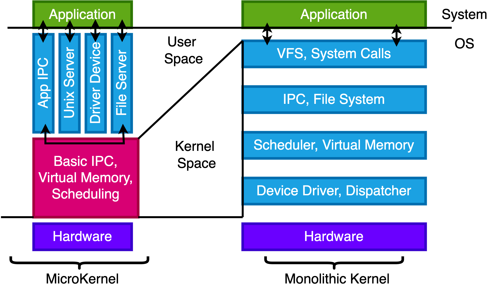
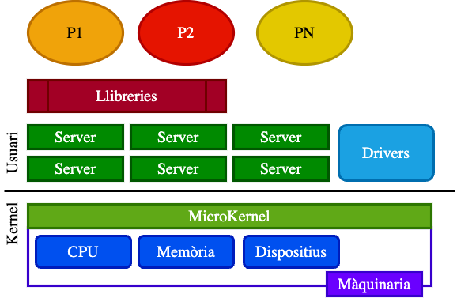

# 🖥️ Apunts de Sistemes Operatius - TEMA 2

## 📋 Índex
- [Setmana 2 - Kernel de Linux i Crides a Sistema](#setmana-2---Kernel de Linux i Crides a Sistema)
- [Exemples Pràctics](#exemples-pràctics)
- [Dubtes i Preguntes](#dubtes-i-preguntes)
- [Reflexions Personals](#reflexions-personals)

---

## 🎯 TEMA 2 - Kernel de Linux i Crides a Sistema

### 🔍 Dualitat

En aquesta imatge se'ns ensenya la dualitat entre usuari i kernel. Primerament, l'usuari disposa d'uns certs permissos que el kernel no té, per exemple la shell, el navegador.
Per una altra part el kernel és el que gestiona la part de alt nivell i la que dosifica la memòria virtual.

### Estructures de kernels.

##### Estructura Simple:

És un únic bloc de codi que fa de tot, gestiona el hardware , processos, arxius, etc...
##### Estructura Monolítica:

És un gran programa amb molts mòduls (controladors, gestió de memoria, etc) que es comuniquen entre si directament dintre del nucli del kernel.

-Avantatges:
Molt ràpid (tot està en el mateix espai de memòria).

-Desventatges:
Si un mòdul falla, pot afectar a tot el sistema; difícil d'actualizar o separar errors.

##### Estructura Per Capes:

Divideix el sistema operatiu en nivells jeràrquics, on cada capa només pot comunicarse amb la de dalt o la de sota.

Aventatges: Més ordenat, fàcil de depurar i mantenir.

Desaventatges: Menor rendimiento por el paso de llamadas entre capas.

##### Estructura MicroKernel:

Mantenir al nucli només les funcions essencials (comunicació, planificació, interrupcions). Tota la resta (arxius, drivers, etc.) s'executa com a processos d'usuari.

Aventatges:
Molt modular, més segur i estable (els errors en serveis no afecten el nucli).

Desaventatges:
Més lent per la comunicació entre processos (més “missatgeria”).

##### Estructura híbrida
Combinen elements de nuclis monolítics i microkernel.

Pel que fa a tot això del 'nucli híbrid', només és màrqueting. És oh, aquests micronuclis tenien una bona relació qualitat-preu, com podem intentar obtenir una bona relació qualitat-preu per al nostre nucli funcional? Ah, ja ho sé, fem servir un nom interessant i intentem insinuar que té tots els avantatges de relació qualitat-preu que té aquest altre sistema'» - Linus Torvalds

## Kernel Modular

“Modular” quiere decir que el cerebro està fet de peces que es poden posar o deixar sense tenir que canviar tot el sistema.
Cada mòdul és com un petit bloc que fa una tarea concreta:

Un mòdul per al rató 🖱️

Otro per al so 🔊

Otro para la red 🌐

## Exemples pràctics
P1 Un kernel pot desactivar les interrupcions en algún moment? Perquè?
Sí. Perquè en el moment que es tracti una interrupció durant la rutina d'aquesta podria ser interrumpuda per una latra interrupció i així creant un bucle infinit. Per tant, necessitem l'acció del kernel en algún moment.

## Dubtes i Preguntes

## Reflexions personals
-Treballar més.