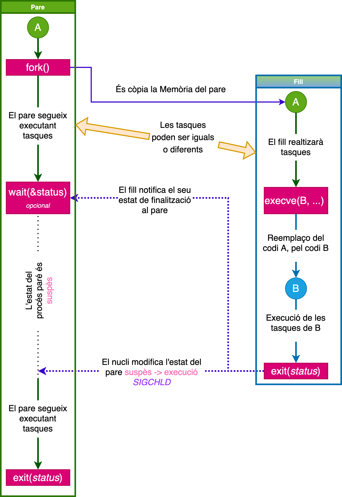
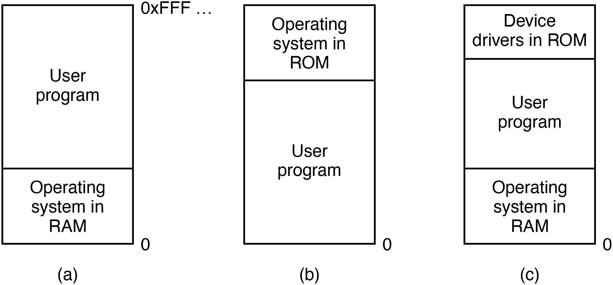
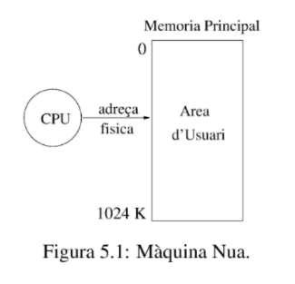

# 🖥️ Apunts de Sistemes Operatius - TEMA 3

## 📋 Índex
- [Setmana 2 - Kernel de Linux i Crides a Sistema](#setmana-2---Kernel de Linux i Crides a Sistema)
- [Exemples Pràctics](#exemples-pràctics)
- [Dubtes i Preguntes](#dubtes-i-preguntes)
- [Reflexions Personals](#reflexions-personals)

---

## 🎯 TEMA 3 - Processos / Creació de Processos / Senyals / Comunicació entre Processos / Pipes

### 🔍 Processos
Concepte:
És un progama que s'està executant.

Exemple:
Fem $ gedit &$ a la terminal de Linux, el SO crea un nou procés per l'usuari que ha executat la comanda. El SO li assigna la memòria al procés on hi copia la imatge del programa executable (en /bin/gedit), i una nova estructura de dades, el PCB.

### PCB


El PCB és una estructura de dades que permet al sistema operatiu supervisar i control un procés.

La informació mínima que conté el PCB és la següent:
* Punters. Necessaris per poder implementar les llistes de tots els PCB’s i els diferents estats en que es pot trobar un procés.
* Estat del procés (explicat en la secció 1.4). P.e. execució, preparat, espera, etc.. •
* Identificadors. P.e. identificador de procés, de grup de processos d’usuari, de grup d’usuaris, etc.
* Informació sobre els recursos que té assignats. P.e., descriptors dels fitxers oberts.
* Registres de la CPU.
* Informació sobre gestió de Memòria. Segons sigui el sistema de gestió de la Memòria (veure Capítol 5) haurà d’emmagatzemar:
  
  – Taules de pàgines.
  
  – Taules de segments.
  
* Informació de comptabilitat. P.e.:
  
   – Temps de CPU utilitzat. Tant de sistema (executant dins de l’espai del sistema operatiu) com d’usuari (executant dins de l’espai d’usuari).
  
  – Temps d’espera.

   – Temps total d’execució, etc. . .
* Informació per la planificació de la CPU. P.e. prioritat del procés, temps de creació, etc.

  

#### Comanda: Ps 
Ens permet veure tots els processos de l'usuari en la terminal actual.

Ps -e per veure tots els del sistema. El procés ps en si també és un procés.

Tots els processos tenen un PID, cada PID és unic, i un identifi- cador de grup de processos (gid), on pid, gid ∈ N+. Poden estar assignats o no a la terminal, i tenen temps de procediment.El kernel s'encarrega de comprovar si el pid ja pertany a una tasca.

Ps -l mostra més informació sobre la llista de procesos.

### Estats dels processos


* NOU: En aquest estat, els processos no tenen PCB. Quan el SO crea un nou procés, li assigna Memòria i un nou PCB, emmagatzemant-hi la informació com podrien ser punters, registres , pids...
El PCB s'insereix en la cua de preparats.
* PREPARAT: els processos en aquest estat tenen tos els recursos que necessiten per la seva execució expecte la CPU.Normalemnt, tots els processos que acaben de ser creats passen per aquest estat.
* INACTIU: Quan un procés acaba l'execució, s'allibera la Memòria i els recursos que tenia assignats. Després s'esborra el seu PCB.
* EXECUCIÓ: El procés té tots els recursos necessaris per la seva execució incloent-hi la CPU. 
* ESPERA: En aquests estat, als processos els hi manca algun recurs a més de la CPU, com pot ser una senyal de sincronització o una operació d'E/S.

PROCESS STATE CODES:
* S (Sleeping) Espera
* R (Runnable) Execució o preparat
* Z (Zombi). Procés que no ha acabat bé. Ha acabat però no s'ha acabat d'esborrar la seva imatge de memòria.(el pare acaba abans que el fill)
* T (sTopped) Parat, per un senyal o perquè està sent tracejat.

### Arbre de processos

* Tots els processos tenen un procés pare, excepte el procés inicial (PID = 1).
* En l’exemple anterior, podeu veure que el procés bash és el pare dels processos sleep i ps. Si esteu connectats per ssh al servidor, el procés bash és fill del procés sshd. I el procés sshd és fill del procés init (PID = 1).
* El kernel és responsable de carregar i iniciar el sistema operatiu.

### Diagrama de transició d'estats


 Tenim que el temps de vida d'un procés X pot ser dividit en un conjunt d'estats:
 
* Començament: El procés o es pot executar en mode usuari o en mode supervisor. Es prepara el procés a memòria principal.El procés es crea amb un fork() (que és una syscall en si)
  
* Planificació i execució:
* 
** INICIAT ---> PREPARAT: Un cop el procés ha estat inicialitzat, el procés pasa a la cua de preparats esperant el seu torn per a executar-se.

** PREPARAT ---> EXECUCIÓ(usuari): El planificar asigna la CPU al procés, que comença a executar el codi en l'espai de l'usuari.

* Canvis de context i mode Kernel: Es fan transicions entre el mode usuari mitjaçant syscalls i interrupcions. 
  
* Bloqueig i espera. Execució (usuari/kernel) → Esperant un esdeveniment. El procés espera donat per:
  
  - Operaciones de E/S
    
  - Sincronización (semáforos, señales)
    
  - Recursos del sistema
    
* Reinici del procés: Esperant un esdeveniment → preparat. El procés passa d'estar suspés a parat. S'envia la senyal SIGCONT per indicar-li la seva preparació, es coloca a la cua de preparats.

*  Finalizació
Execució (usuari/kernel) → exist() → zombie:
** El procés crida a exit() per a terminar.
** Estat zombie: Conserva recursos fins que el pare reculli el seu estat de sortida.
** Intendencia:Neteja final de recursos del procés
### Intercanvi de processos


El kernel gestiona una estructura de taula (diccionari) semblant a la representada en la imatge següent per poder accedir de forma eficient als diferents PCBs. Aquesta estrcutura de dades es coneix com a Taula PCB.

Per trobar la taula de processos necessitem observar la següent ruta: /proc:
```c
sleep 60 &
less /proc/{pid}/stat
less /proc/{pid}/environ
```

### Creació de processos (fork())

```c
#include <sys/types.h> # pid_t
#include <unistd.h>    # fork()
int main() {
    pid_t pid = fork();
    exit(0);
}
```
Fent man fork();

* La función `fork()` crea un nuevo proceso duplicando el proceso que la invoca. Este nuevo proceso se denomina proceso hijo, y el proceso que la invoca se denomina proceso padre.
* El proceso hijo y el proceso padre se ejecutan en espacios de memoria separados. En el momento de la llamada a fork(), ambos espacios de memoria tienen el mismo contenido.
* El ID del proceso padre del hijo es el mismo que el ID del proceso padre.
* El proceso hijo tiene su propio ID de proceso único, y este PID no coincide con el ID de ningún grupo de procesos existente (setpgid(2)) o sesión.

```c
static int i = 11; //.data
int main() {
    int j= 22; // Stack
    int *z = malloc(sizeof(int)); // Heap

    pid_t pid;
    switch (pid=fork())
    {
    case 0:
        i *= 3; 
        j *= 3;
        *z=44;
        break;
    default:
        sleep(3);
        *z=55;
        break;
    }
 
    printf("PID=%ld %s data=%d stack=%d heap=%d\n", 
        (long) getpid(), 
        (pid == 0) ? "(child) " : "(parent)",i,j,*z);
    free(z);
    exit(0);
}
```
(Teoricament havia fet tant la crida wait com fork en més profunditat però no he guardat el document)

```c
int main(int argc, char *argv[]){
pid_t pid, w; int status;
pid = fork();
if (pid == 0) { 
  if (argc == 1) pause(); exit(atoi(argv[1]));
} else {                    
  do {
    w = waitpid(pid, &status, WUNTRACED | WCONTINUED);
    if (w == -1) {
      perror("waitpid"); exit(EXIT_FAILURE);
    }
    if (WIFEXITED(status)) {
      printf("exited, [%d] status=%d\n", 
             pid, WEXITSTATUS(status));
    } else if (WIFSIGNALED(status)) {
      printf("killed by signal, 
        [%d] -> %d\n", pid, WTERMSIG(status));
    } else if (WIFSTOPPED(status)) {
      printf("stopped by signal [%d] 
        -> %d\n", pid, WSTOPSIG(status));
    } else if (WIFCONTINUED(status)) { 
      printf("continued\n"); }
  } while (!WIFEXITED(status) && !WIFSIGNALED(status));
  exit(0);
}
```
### Estat Zombie / Orfes
* Després d’executar exit(), un procés no s’elimina immediatament. En lloc d’això, entra en l’estat zombie fins que el seu procés pare processa la notificació SIGCHLD o crida a wait() o waitpid(). Si el pare no ho fa, el fill roman en aquest estat indefinidament.
* Un procés fill esdevé un orfe si el seu pare mor abans que ell. En aquest cas, el nucli reassigna el fill al procés init (PID 1), que és responsable de netejar els processos orfes.

Conseqüencies:
* Fuga de recursos del kernel
* Esgotament de PIDS
* Impossibiltat de crear nous processos
* Dificultat de gestió, no hi ha manera de comunicar amb el seu pare.

### Exec ()
* Tots els processos (excepte PID 1) tenen un pare i es creen amb clone(). Però com poden bash i ls ser programes separats?



* exec() REEMPLAZA el programa actual por uno NUEVO, pero mantiene el MISMO proceso.

* Exemple:
```c
#include <unistd.h>
#include <stdlib.h>
#include <stdio.h>
#include <sys/wait.h>

int main() {
    pid_t pid = fork();
    
    if (pid == 0) {
        // HIJO: Se transforma en 'ls'
        printf("Hijo [%d] antes de exec\n", getpid());
        
        execl("/bin/ls", "ls", "-l", "-a", NULL);
        
        // ESTA LÍNEA NUNCA SE EJECUTA si exec() tiene éxito
        perror("exec falló");
        exit(1);
    } else {
        // PADRE: Sigue siendo el mismo programa
        wait(NULL);
        printf("Padre [%d] terminó\n", getpid());
    }
    
    return 0;
}
```

Output: 

Hijo [3885] antes de exec

total 380

drwxr-xr-x 3 epl11 epl11  4096 oct 31 18:18 .

drwxr-xr-x 4 epl11 epl11  4096 oct 31 18:09 ..

-rwxr-xr-x 1 epl11 epl11 16216 oct 26 18:15 Ex15

-rw-r--r-- 1 epl11 epl11  1194 oct 26 18:15 Ex15.c

-rwxr-xr-x 1 epl11 epl11 ...
...

Padre [3884] terminó

### Variants de exec()



* 1. execl() - Lista de argumentos
```c
execl("/bin/ls", "ls", "-l", "-a", NULL);
// Ruta, arg0, arg1, arg2, ..., NULL
```
* 2. execv() - Vector de argumentos
```c
char *args[] = {"ls", "-l", "-a", NULL};
execv("/bin/ls", args);
```
3. execle() - Con entorno
```c
char *env[] = {"MY_VAR=hola", "PATH=/bin", NULL};
execle("/bin/ls", "ls", "-l", NULL, env);
```
4. execve() - Vector + entorno
```c
char *args[] = {"ls", "-l", NULL};
char *env[] = {"MY_VAR=hola", NULL};
execve("/bin/ls", args, env);
```
5. execlp() - Busca en PATH
```c
execlp("ls", "ls", "-l", "-a", NULL);
// Busca "ls" en los directorios del PATH
```
6. execvp() - Busca en PATH + vector
```c
char *args[] = {"ls", "-l", "-a", NULL};
execvp("ls", args);
```
ls -la:
* ls = List (listar archivos y directorios)

* -l = Long format (formato largo/detallado)

* -a = All (mostrar TODOS los archivos, incluidos los ocultos)

### Comunicació entre processos


## Exemples pràctics

### P1 Expliques que fa la següent imatge en relació als estats dels processos


### P2 És el mateix un canvi de context que un intercanvi de processos?

NO, són conceptes relacionats però diferents.

|Canvi de Context|	Intercanvi de Processos|
|----------------|--------------------------|
|Canvia la CPU entre processos |	Mou processos entre RAM i disc|
|Operació de CPU/planificador|	Operació de memòria/gestor de memòria|
|Ràpid (microsegons)| Lent (mil·lisegons)|
|Sempre ocorre entre processos |	Ocorre quan falta memòria física|
|Transparent per als processos |	Afecteda el rendiment visiblement|

Exemple: Timer interrupt fa que el kernel passi de Firefox a Chrome.

Exemple: Memòria RAM plena, el kernel mou processos inactius al disc.

### P3 Quantes vegades s'imprimeix OS?
```c
int main(){
    if(execel("bin/ls","ls",NULL) == -1){
    perror("execl");
    }
    printf("OS\n");
    return 0;
}
```
S'executarà un total de dues vegades, ja es fa un recobriemnt que crea dos processos el pare i el fill. No vol dir que estugui dins de l'if que hi hagic as d'error. La execuicó és indeterminista.

TOTALMENT INCORRECTE. ZERAPIO TOPE GORDO.

ACABES DE DIR QUE QUAN S'EXECURA EXEC NOMÉS S'IMPRIMIRÀ EL DE SOTA UNA OSLA VEGADA EN CAS D'ERROR, EXEC NO CREA NOUS PROCESSOS. FATAL.

### P4 Quantes vegades wait(st) retorna -1?
```c
  id = fork();
  wait(st); //1
  if (id==0)
    fork();
  wait(st); //2
  exit();
```
3 cops, el wait s'executa 5 vegades i es creen 3 processos.

### P5 Quantes vegades wait(st) retorna -1?
```c
  id = fork();
  wait(st); //1
  if (id!=0)
    fork();
  wait(st); //2
  exit();
```
3 cops, el wait s'executa 5 vegades i es creen 3 processos. Amb la diferencia de que el pare té dos fills.

### P6 Analitza el següent codi i respon les preguntes:
```c
int main(void) {
    int a = 1;
    pid_t fork_ret = fork();
    if (fork_ret > 0) {
        a++;
        fprintf(stdout, "Parent: int a is %d at %p\n", a, &a);
        } else if (fork_ret == 0) { a++;}
        fprintf(stdout, "Child: int a is %d at %p\n", a, &a);
    return 0;
}
```
* Quin és el valor de a en el procés pare i en el procés fill? a = 2 en els 2 casos
* S’imprimirà la mateixa adreça de memòria per a a en el procés pare i en el procés fill? Sí
* S’imprimirà a la mateixa sortida estàndard (STDOUT) en el procés pare i en el procés fill? Sí

Tot correcte.

### EX7:Analitza el següent codi i justifica quin serà el resultat de la seva execució:
```c
int main(void) {
    int* stuff = malloc(sizeof(int));
    *stuff = 5;
    pid_t fork_ret = fork();
    printf("The last digit of pi is %d\n", *stuff);
    if (fork_ret == 0)
        *stuff = 6;
    return 0;
}
```
Es printaran dos 5 perquè l'executen tant pare com fill, dins del fill al final del codi es quedarà disn de la seva adreça de memòria el 6.

### Ex 8 Quina és la sortida del següent codi?
```c
int main()
{
    switch(fork()){
        case 0: printf("A");
                switch(fork()){
                    case 0: printf("B");exit(0);
                    default: switch(fork()){
                        case 0: printf("C");exit(0);
                        default: wait(&st);wait(&st);exit(0);
                    }            
                wait(&st);
                }
        default: wait(&st); exit(0);
    }
}
```
Dues possibilitats: abc, acb, ja que el programa no és determinista. El pare es queda esperant a un fill que no existeix.

✅ Has encertat: Les possibilitats són ABC o ACB!

### EX8: Indiqueu quin és el resultat de l’execució del següent codi. Nombre de processos creats, parantiu, informació de stdout, procés zombi, etc.
```c
#define N 10
int main()
{
    int pid = getpid();
    for (int x=0; x<N x++)
    {
        switch(fork())
        {
            case 0:
                if ( (pid%2) == 0 )
                    printf("Pid Fill: %d\n", getpid());
                    exit(0); //3
                break;

            default:
                if ( (pid%2) !== 0 )
                    exit(0); //2
                break;
        }
    }
    wait(NULL);
    exit(0); //1
}
```
* Cas pid par: El pare té 10 fills , hi hauria 10 printfs per stdout.
* Cas pid impar: El pare té un fill, seguidament el pare mor, quedant el fill zombi, després el fill té un net, el fill mor i el net queda en estat zombi ... Així fins a 10 vegades, no hi ha res per a stdout.

Correció:
En el cas parell tenim que ens queden 9 zombis, ja que el pare fa wait de qualsevol fill i mor,  recull només acull 1 fill. Init recull als 9 zombis restants.
La resta ok.

### Reflexions Personals



