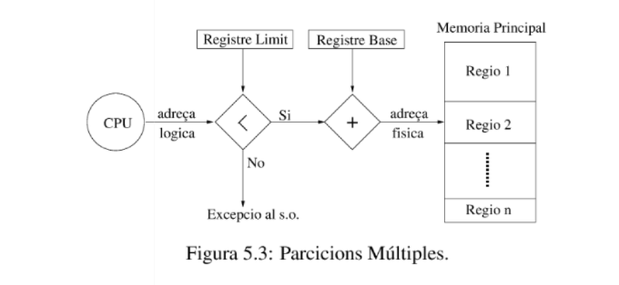
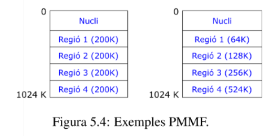
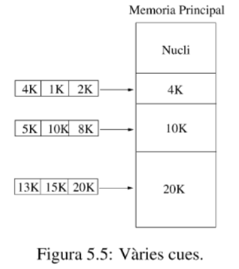
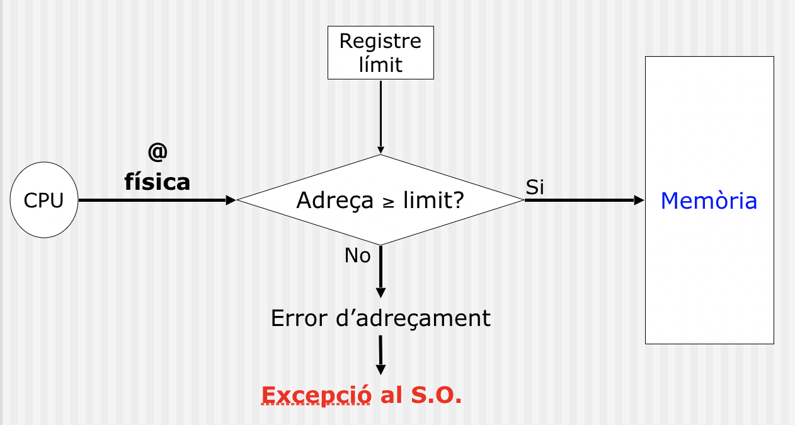

# 🖥️ Apunts de Sistemes Operatius - TEMA 3

## 📋 Índex
- [Setmana 2 - Kernel de Linux i Crides a Sistema](#setmana-2---Kernel de Linux i Crides a Sistema)
- [Exemples Pràctics](#exemples-pràctics)
- [Dubtes i Preguntes](#dubtes-i-preguntes)
- [Reflexions Personals](#reflexions-personals)

---

## 🎯 TEMA 3 - Processos / Creació de Processos / Senyals / Comunicació entre Processos / Pipes

### 🔍 Processos
Concepte:
És un progama que s'està executant.

Exemple:
Fem $ gedit &$ a la terminal de Linux, el SO crea un nou procés per l'usuari que ha executat la comanda. El SO li assigna la memòria al procés on hi copia la imatge del programa executable (en /bin/gedit), i una nova estructura de dades, el PCB.

### PCB


El PCB és una estructura de dades que permet al sistema operatiu supervisar i control un procés.

La informació mínima que conté el PCB és la següent:
* Punters. Necessaris per poder implementar les llistes de tots els PCB’s i els diferents estats en que es pot trobar un procés.
* Estat del procés (explicat en la secció 1.4). P.e. execució, preparat, espera, etc.. •
* Identificadors. P.e. identificador de procés, de grup de processos d’usuari, de grup d’usuaris, etc.
* Informació sobre els recursos que té assignats. P.e., descriptors dels fitxers oberts.
* Registres de la CPU.
* Informació sobre gestió de Memòria. Segons sigui el sistema de gestió de la Memòria (veure Capítol 5) haurà d’emmagatzemar:
  
  – Taules de pàgines.
  
  – Taules de segments.
  
* Informació de comptabilitat. P.e.:
  
   – Temps de CPU utilitzat. Tant de sistema (executant dins de l’espai del sistema operatiu) com d’usuari (executant dins de l’espai d’usuari).
  
  – Temps d’espera.

   – Temps total d’execució, etc. . .
* Informació per la planificació de la CPU. P.e. prioritat del procés, temps de creació, etc.

  

#### Comanda: Ps 
Ens permet veure tots els processos de l'usuari en la terminal actual.

Ps -e per veure tots els del sistema. El procés ps en si també és un procés.

Tots els processos tenen un PID, cada PID és unic, i un identifi- cador de grup de processos (gid), on pid, gid ∈ N+. Poden estar assignats o no a la terminal, i tenen temps de procediment.El kernel s'encarrega de comprovar si el pid ja pertany a una tasca.

Ps -l mostra més informació sobre la llista de procesos.

### Estats dels processos


* NOU: En aquest estat, els processos no tenen PCB. Quan el SO crea un nou procés, li assigna Memòria i un nou PCB, emmagatzemant-hi la informació com podrien ser punters, registres , pids...
El PCB s'insereix en la cua de preparats.
* PREPARAT: els processos en aquest estat tenen tos els recursos que necessiten per la seva execució expecte la CPU.Normalemnt, tots els processos que acaben de ser creats passen per aquest estat.
* INACTIU: Quan un procés acaba l'execució, s'allibera la Memòria i els recursos que tenia assignats. Després s'esborra el seu PCB.
* EXECUCIÓ: El procés té tots els recursos necessaris per la seva execució incloent-hi la CPU. 
* ESPERA: En aquests estat, als processos els hi manca algun recurs a més de la CPU, com pot ser una senyal de sincronització o una operació d'E/S.

PROCESS STATE CODES:
* S (Sleeping) Espera
* R (Runnable) Execució o preparat
* Z (Zombi). Procés que no ha acabat bé. Ha acabat però no s'ha acabat d'esborrar la seva imatge de memòria.(el pare acaba abans que el fill)
* T (sTopped) Parat, per un senyal o perquè està sent tracejat.

### Arbre de processos

* Tots els processos tenen un procés pare, excepte el procés inicial (PID = 1).
* En l’exemple anterior, podeu veure que el procés bash és el pare dels processos sleep i ps. Si esteu connectats per ssh al servidor, el procés bash és fill del procés sshd. I el procés sshd és fill del procés init (PID = 1).
* El kernel és responsable de carregar i iniciar el sistema operatiu.

### Diagrama de transició d'estats


 Tenim que el temps de vida d'un procés X pot ser dividit en un conjunt d'estats:
 
* Començament: El procés o es pot executar en mode usuari o en mode supervisor. Es prepara el procés a memòria principal.El procés es crea amb un fork() (que és una syscall en si)
  
* Planificació i execució:
* 
** INICIAT ---> PREPARAT: Un cop el procés ha estat inicialitzat, el procés pasa a la cua de preparats esperant el seu torn per a executar-se.

** PREPARAT ---> EXECUCIÓ(usuari): El planificar asigna la CPU al procés, que comença a executar el codi en l'espai de l'usuari.

* Canvis de context i mode Kernel: Es fan transicions entre el mode usuari mitjaçant syscalls i interrupcions. 
  
* Bloqueig i espera. Execució (usuari/kernel) → Esperant un esdeveniment. El procés espera donat per:
  
  - Operaciones de E/S
    
  - Sincronización (semáforos, señales)
    
  - Recursos del sistema
    
* Reinici del procés: Esperant un esdeveniment → preparat. El procés passa d'estar suspés a parat. S'envia la senyal SIGCONT per indicar-li la seva preparació, es coloca a la cua de preparats.

*  Finalizació
Execució (usuari/kernel) → exist() → zombie:
** El procés crida a exit() per a terminar.
** Estat zombie: Conserva recursos fins que el pare reculli el seu estat de sortida.
** Intendencia:Neteja final de recursos del procés
### Intercanvi de processos


El kernel gestiona una estructura de taula (diccionari) semblant a la representada en la imatge següent per poder accedir de forma eficient als diferents PCBs. Aquesta estrcutura de dades es coneix com a Taula PCB.

Per trobar la taula de processos necessitem observar la següent ruta: /proc:
```c
sleep 60 &
less /proc/{pid}/stat
less /proc/{pid}/environ
```

### Creació de processos (fork())

```c
#include <sys/types.h> # pid_t
#include <unistd.h>    # fork()
int main() {
    pid_t pid = fork();
    exit(0);
}
```
Fent man fork();

* La función `fork()` crea un nuevo proceso duplicando el proceso que la invoca. Este nuevo proceso se denomina proceso hijo, y el proceso que la invoca se denomina proceso padre.
* El proceso hijo y el proceso padre se ejecutan en espacios de memoria separados. En el momento de la llamada a fork(), ambos espacios de memoria tienen el mismo contenido.
* El ID del proceso padre del hijo es el mismo que el ID del proceso padre.
* El proceso hijo tiene su propio ID de proceso único, y este PID no coincide con el ID de ningún grupo de procesos existente (setpgid(2)) o sesión.

```c
static int i = 11; //.data
int main() {
    int j= 22; // Stack
    int *z = malloc(sizeof(int)); // Heap

    pid_t pid;
    switch (pid=fork())
    {
    case 0:
        i *= 3; 
        j *= 3;
        *z=44;
        break;
    default:
        sleep(3);
        *z=55;
        break;
    }
 
    printf("PID=%ld %s data=%d stack=%d heap=%d\n", 
        (long) getpid(), 
        (pid == 0) ? "(child) " : "(parent)",i,j,*z);
    free(z);
    exit(0);
}
```
(Teoricament havia fet tant la crida wait com fork en més profunditat però no he guardat el document)

```c
int main(int argc, char *argv[]){
pid_t pid, w; int status;
pid = fork();
if (pid == 0) { 
  if (argc == 1) pause(); exit(atoi(argv[1]));
} else {                    
  do {
    w = waitpid(pid, &status, WUNTRACED | WCONTINUED);
    if (w == -1) {
      perror("waitpid"); exit(EXIT_FAILURE);
    }
    if (WIFEXITED(status)) {
      printf("exited, [%d] status=%d\n", 
             pid, WEXITSTATUS(status));
    } else if (WIFSIGNALED(status)) {
      printf("killed by signal, 
        [%d] -> %d\n", pid, WTERMSIG(status));
    } else if (WIFSTOPPED(status)) {
      printf("stopped by signal [%d] 
        -> %d\n", pid, WSTOPSIG(status));
    } else if (WIFCONTINUED(status)) { 
      printf("continued\n"); }
  } while (!WIFEXITED(status) && !WIFSIGNALED(status));
  exit(0);
}
```
### Estat Zombie / Orfes
* Després d’executar exit(), un procés no s’elimina immediatament. En lloc d’això, entra en l’estat zombie fins que el seu procés pare processa la notificació SIGCHLD o crida a wait() o waitpid(). Si el pare no ho fa, el fill roman en aquest estat indefinidament.
* Un procés fill esdevé un orfe si el seu pare mor abans que ell. En aquest cas, el nucli reassigna el fill al procés init (PID 1), que és responsable de netejar els processos orfes.

Conseqüencies:
* Fuga de recursos del kernel
* Esgotament de PIDS
* Impossibiltat de crear nous processos
* Dificultat de gestió, no hi ha manera de comunicar amb el seu pare.

### Exec ()
* Tots els processos (excepte PID 1) tenen un pare i es creen amb clone(). Però com poden bash i ls ser programes separats?


* exec() REEMPLAZA el programa actual por uno NUEVO, pero mantiene el MISMO proceso.

* Exemple:
```c
#include <unistd.h>
#include <stdlib.h>
#include <stdio.h>
#include <sys/wait.h>

int main() {
    pid_t pid = fork();
    
    if (pid == 0) {
        // HIJO: Se transforma en 'ls'
        printf("Hijo [%d] antes de exec\n", getpid());
        
        execl("/bin/ls", "ls", "-l", "-a", NULL);
        
        // ESTA LÍNEA NUNCA SE EJECUTA si exec() tiene éxito
        perror("exec falló");
        exit(1);
    } else {
        // PADRE: Sigue siendo el mismo programa
        wait(NULL);
        printf("Padre [%d] terminó\n", getpid());
    }
    
    return 0;
}
```

Output: 

Hijo [3885] antes de exec

total 380

drwxr-xr-x 3 epl11 epl11  4096 oct 31 18:18 .

drwxr-xr-x 4 epl11 epl11  4096 oct 31 18:09 ..

-rwxr-xr-x 1 epl11 epl11 16216 oct 26 18:15 Ex15

-rw-r--r-- 1 epl11 epl11  1194 oct 26 18:15 Ex15.c

-rwxr-xr-x 1 epl11 epl11 ...
...

Padre [3884] terminó

### Variants de exec()


* 1. execl() - Lista de argumentos
```c
execl("/bin/ls", "ls", "-l", "-a", NULL);
// Ruta, arg0, arg1, arg2, ..., NULL
```
* 2. execv() - Vector de argumentos
```c
char *args[] = {"ls", "-l", "-a", NULL};
execv("/bin/ls", args);
```
3. execle() - Con entorno
```c
char *env[] = {"MY_VAR=hola", "PATH=/bin", NULL};
execle("/bin/ls", "ls", "-l", NULL, env);
```
4. execve() - Vector + entorno
```c
char *args[] = {"ls", "-l", NULL};
char *env[] = {"MY_VAR=hola", NULL};
execve("/bin/ls", args, env);
```
5. execlp() - Busca en PATH
```c
execlp("ls", "ls", "-l", "-a", NULL);
// Busca "ls" en los directorios del PATH
```
6. execvp() - Busca en PATH + vector
```c
char *args[] = {"ls", "-l", "-a", NULL};
execvp("ls", args);
```
ls -la:
* ls = List (listar archivos y directorios)

* -l = Long format (formato largo/detallado)

* -a = All (mostrar TODOS los archivos, incluidos los ocultos)

### Comunicació entre processos
* Diversos processos s’executen concurrentment i sovint necessiten intercanviar dades, sincronitzar accions o compartir recursos.
* Aquest intercanvi s’anomena Inter-Process Communication (IPC).

* Sense IPC, els processos estan aïllats:

  * No poden compartir memòria directament
  * No poden comunicar-se entre si
  * Cada procés té el seu propi espai d'adreces

* Com es poden comunicar els processos?
  * Els processos operen en espais d'adreçes independents.Per tant, no poden accedir a la mateixa informació.

* Com es pot assegurar que dos processos no intentin accedir simultàniament a la mateixa informació? 
  * Imagina’t 2 processos executant una reserva en un avió i els dos processos assignen el mateix seient a dos passatgers diferents.

* Com es poden coordinar els processos dependents entre si? 
  * Imagina’t un procés que genera dades i un altre procés que les processa. El procés que processa les dades necessita esperar a que el procés que les genera les hagi generat totes.

Comunicació/sincronització:

Comunicació: Intercanvi d’informació.
```c
cat missatge.txt | grep "e"
```

Sincronització: Coordinació en l’accés als recursos i en l’ordre d’execució de les tasques. (Operadors lògics)
```c
echo "hola1"; echo "adeu1" && echo "hola2" || echo "adeu2"
```


Desglosament de la imatge segons la IA:
* Proceso principal (F1 - bash): Es el shell de bash que interpreta el comando. Este proceso crea dos procesos hijos:

* Hijo 1 (F1 - cat missatge.txt): Ejecuta el comando cat para leer el archivo missatge.txt y enviar su contenido a stdout.

* Hijo 2 (F2 - grep "e"): Ejecuta el comando grep para filtrar las líneas que contienen la letra "e", leyendo desde stdin.

* File descriptors: Cada proceso tiene tres file descriptors estándar:
  * 0 (stdin): Entrada estándar.
  * 1 (stdout): Salida estándar.
  * 2 (stderr): Salida de error.

* Comunicación mediante pipe: El shell crea una tubería anónima que conecta stdout del Hijo 1 (cat) a stdin del Hijo 2 (grep). Esto significa:

* El Hijo 1 (cat) escribe en su stdout (file descriptor 1), que está redirigido al extremo de escritura del pipe.

* El Hijo 2 (grep) lee desde su stdin (file descriptor 0), que está redirigido al extremo de lectura del pipe.

* Flujo de datos: El contenido de missatge.txt es leído por cat y enviado a través de su stdout al pipe.
* grep recibe este contenido desde su stdin y filtra las líneas que contienen "e", mostrando el resultado en su stdout (que, por defecto, es la terminal).

### Cua d'impressió



* El procés A llegeix la variable in i escriu el valor 7 en una variable local (next_free_slot). 
* El SO interromp el procés A i executa el procés B.
* El procés B llegeix la variable in i escriu el valor 7 en una variable local (next_free_slot).
* El procés B col·loca un fitxer a la cua d’impressió al slot 7 i el servei d’impressió modifica les variables in i out.
* El procés B realitza altres tasques no relacionades amb la cua d’impressió.
* El SO interromp el procés B i executa el procés A. El procés A utilitza la seva variable local (next_free_slot) per a escriure el fitxer a la cua d’impressió. El fitxer s’escriu al slot 7, i també actualitza les variables in i out.

En resum:

* El SO és un policia que ordena qui ha de passar, primer és el procés A que coloquen la var local i després el b, el  no hi fa res i el A escriu dins del fitxer.

Resum millorat per la IA:

* El proceso A lee in = 7 y guarda 7 en su variable local. Antes de que pueda escribir en la cola, el SO lo interrumpe y ejecuta el proceso B. El proceso B también lee in = 7, escribe su trabajo en el slot 7 y actualiza in = 8. Cuando el proceso A continúa, usa su valor local obsoleto (7) y sobrescribe el trabajo de B en el slot 7, corruptiendo la cola."

### Condicions de carrera
* Quan dos o més processos o fils d’execució intenten accedir simultàniament a recursos compartits o a dades sense la deguda sincronització.

Solucions:

* Exclusió Mútua: Utilitzar mecanismes com semàfors, mutex o candaus per a garantir que només un procés pugui accedir als recursos compartits a la vegada.

* Sincronització: Coordinar l’execució dels processos mitjançant sincronització de manera que no interfereixin entre ells quan accedeixen als recursos compartits

#### Com les evitem??

* La secció crítica és la part del codi on s’accedeix a recursos compartits.



* El Procés a i el Procés B no poden estar simultàniament en la secció crítica.
* Cap procés que no estigui en la secció crítica pot bloquejar altres processos.
* Cap procés ha d’esperar per sempre per entrar a la secció crítica.

### Tipus de comunicació

* Pas de missatges
  * Cada proceso vive en su casa propia (espacio de memoria privado)

  * Para comunicarse, se envían cartas certificadas (mensajes)

  * Hay un cartero muy eficiente (el sistema operativo) que lleva las cartas
```c
  // Proceso A envía un mensaje a B
enviar_mensaje(B, "¡Trae chips y salsa!");

// Proceso B recibe el mensaje  
char pedido[100];
recibir_mensaje(A, pedido);
printf("B dice: Ah! A quiere %s\n", pedido);
```
Ventajas:

✅ Seguro: Cada uno en su casa, sin molestarse

✅ Flexible: Pueden estar en la misma ciudad o en países diferentes

✅ Organizado: El cartero se asegura de que todo llegue en orden

Desventajas:

❌ Más lento: Hay que escribir cartas y esperar al cartero

❌ Burocrático: Mucho papeleo por cada mensaje

* Memòria compartida:
  * Varios procesos viven en la misma casa (memoria compartida)

  * Tienen una nevera comunitaria donde todos dejan comida

  * Y una pizarra gigante donde escriben notas

  ¿Cómo funciona la fiesta?

```c
// En la nevera compartida...
int *botellas_de_cerveza = memoria_compartida;

// Proceso A pone cervezas
*botellas_de_cerveza = 10;

// Proceso B lee y toma una
if (*botellas_de_cerveza > 0) {
    (*botellas_de_cerveza)--;
    printf("¡Salud! 🍺");
}
¡PELIGRO! CONDICIÓN DE CARRERA (RACE CONDITION) 😱
```
```c
// A y B ven que hay 1 cerveza
if (*cervezas == 1) {           // A: "Veo 1 cerveza"
                                 // B: "Yo también veo 1 cerveza"
    (*cervezas)--;               // A: "La tomo" → cervezas = 0
    (*cervezas)--;               // B: "La tomo" → cervezas = -1 💥
}
// ¡Ahora tenemos CERVEZAS NEGATIVAS! 🍺➡️🍻
```
La Solución: "El Guardaespaldas de la Nevera" 💂‍♂️

```c
sem_t semaforo_cerveza;  // ¡Solo uno a la vez!

wait(&semaforo_cerveza); // 🔒 "Espero mi turno"
if (*cervezas > 0) {
    (*cervezas)--;
}
signal(&semaforo_cerveza); // 🔓 "Listo, siguiente!"
```

### Característiques de la comunicació
(La IA té el C2 en cunyat)

🔍 IDENTIFICACIÓN: "¿A QUIÉN LE HABLO?"
1. MECANISMES DE NOMS 🏷️
```c
// SIN NOMBRE = "Hola tú, el del sombrero!" 🎩
enviar_mensaje("¡Oye, toma este dato!");  // ¡Al primero que lo coja!

// NOMBRE LOCAL = "Hola Juan de mi ciudad" 🏠
enviar_mensaje(pid_juan, "Hola colega!");

// NOMBRE DE RED = "Hola Juan@Barcelona" 🌐
enviar_mensaje("juan@192.168.1.10", "Hola desde lejos!");
```

2. IDENTIFICADOR DE DESTÍ 📮
```c
// "Hey @ana, mira este meme"
enviar_mensaje(PID_ANA, "🐱 meme gracioso");
// Ana puede elegir:
recibir_mensaje(PID_PEPE);  // "Solo quiero memes de Pepe"
// o
recibir_mensaje(CUALQUIERA);  // "Acepto memes de todos"
```

```c
// "Enviando al grupo 'Amigos'"
enviar_mensaje(BUZON_AMIGOS, "¿Quedamos hoy?");

// Todos en el grupo reciben el mensaje
recibir_mensaje(BUZON_AMIGOS, &mensaje);
```

🔄 FLUX DE DADES: "¿HABLO O ESCUCHO?"

UNIDIRECCIONAL = WALKIE-TALKIE 🎤➡️👂
```c
// Proceso A: Solo habla
while(1) {
    enviar_mensaje("Café listo ☕");
}

// Proceso B: Solo escucha  
while(1) {
    recibir_mensaje(&mensaje);
    printf("¡%s!\n", mensaje);
}
```
BIDIRECCIONAL = LLAMADA TELEFÓNICA 📞💬📞

```c
// Ambos pueden hablar y escuchar
enviar_mensaje(B, "¿Cómo estás?");
recibir_mensaje(B, &respuesta);  // "Bien, ¿y tú?"
```

📦 BUFFERING: "¿DÓNDE DEJO LOS MENSAJES?"
CON BUFFERS = BUZÓN DE CORREO 📬📫

```c
// A envía 10 mensajes rápidos
for(int i = 0; i < 10; i++) {
    enviar_mensaje(B, "Mensaje %d", i);  // ✅ Se guardan en el buzón
}

// B los lee cuando puede (aunque tarde)
for(int i = 0; i < 10; i++) {
    recibir_mensaje(&mensaje);  // ✅ Todos llegan
}
```

SIN BUFFERS = ENTREGA MANO A MANA 🤝➡️🤝

```c
// A intenta enviar
enviar_mensaje(B, "¡Toma esto!");  // ⏳ Espera hasta que B esté listo

// B debe estar esperando para recibir
recibir_mensaje(&mensaje);  // ⏳ Espera hasta que A envíe
```

⏰ SINCRONITZACIÓ: "¿ESPERO RESPUESTA?"

SÍNCRONO = LLAMADA TELEFÓNICA 📞⏳

```c
printf("Llamando a mi amigo...\n");
enviar_mensaje_sincrono(B, "¿Vienes a la fiesta?");
// 🔒 BLOQUEADO hasta que B responda
printf("Por fin respondió: %s\n", respuesta);
// "No puedo, tengo que lavar el gato" 😿
```
ASÍNCRONO = MENSAJE DE TEXTO 💬✅

```c
printf("Enviando WhatsApp...\n");
enviar_mensaje_asincrono(B, "¿Vienes a la fiesta?");
// ✅ INMEDIATAMENTE continúo haciendo otras cosas
printf("Ya envié el mensaje, sigo con mi vida\n");

// Más tarde, si quiero ver si respondió:
if(hay_respuesta()) {
    recibir_mensaje(&respuesta);
}
```


### Tipus de mecanismes

📁 FITXERS: 

Imagina que...

Escribes una carta de amor y la dejas en un lugar acordado (el archivo). Tu crush va después a buscarla.

```c
// Tú escribiendo la carta (Proceso 1)
int carta = open("carta_amor.txt", O_WRONLY);
write(carta, "¿Quieres ser mi Valentín? 💘", 28);
close(carta);  // ✅ Carta entregada en el buzón
```
```c
// Tu crush leyendo la carta (Proceso 2)
int carta = open("carta_amor.txt", O_RDONLY);
char mensaje[100];
read(carta, mensaje, 100);
printf("¡Dice: %s! 😳\n", mensaje);
```
🚨 PROBLEMAS ROMÁNTICOS:

📜 PERSISTENCIA: La carta queda guardada para siempre... ¡y tu mamá la puede encontrar!

⏰ SINCRONIZACIÓN: ¿Y si llegas tarde y tu crush ya se fue? ¿O llega muy pronto y la carta no está?

🐌 LENTITUD: Escribir a mano toma tiempo vs un WhatsApp

🚰 PIPES: EL TELÉFONO DE LATAS 🥫📞

Imagina que...
Tienes un teléfono de latas con tu hermano (solo funciona entre ustedes)

```c
int telefono[2];
pipe(telefono);  // 🥫 Conectamos las dos latas con un hilo

// Papá crea a hermano mayor
pid_t hermano = fork();

if (hermano == 0) {
    // HERMANO MENOR - Solo escucha
    close(telefono[1]);  // 🎤 Tapa su boca (solo escucha)
    char chisme[100];
    read(telefono[0], chisme, 100);
    printf("Mamá dice: %s\n", chisme);
} else {
    // HERMANO MAYOR - Solo habla  
    close(telefono[0]);  // 👂 Tapa su oído (solo habla)
    write(telefono[1], "¡A cenar!", 9);
}
```
🎯 CARACTERÍSTICAS:

🙈 SIN NOMBRE: Solo funciona entre hermanos (procesos relacionados)

🎁 HERENCIA: Papá (proceso padre) les dio el teléfono

➡️ UNIDIRECCIONAL: Solo un hermano habla, el otro escucha

📦 CON BUFFER: Si hablas muy rápido, se acumula en el hilo

🎭 FIFOS: EL TABLÓN DE ANUNCIOS DEL INSTITUTO 📌🏫

Imagina que...
Hay un tablón donde cualquiera puede dejar mensajes para cualquiera

En bash: Creamos el tablón
```c
mkfifo("tablon_amor", 0666);  # 📌 Instalamos el tablón en el pasillo
```
```c
// Tímido que deja nota anónima
int tablon = open("tablon_amor", O_WRONLY);
write(tablon, "Me gustas 💖 - Anónimo", 22);
close(tablon);
```
```c
// Curioso que lee el tablón
int tablon = open("tablon_amor", O_RDONLY);
char confesion[100];
read(tablon, confesion, 100);
printf("¡En el tablón dice: %s! 🤫\n", confesion);

unlink("tablón_amor");
```
🎯 VENTAJAS:

👥 CUALQUIERA PUEDE USARLO: No necesitan ser hermanos

🔒 BLOQUEANTE: Si no hay mensajes, esperas como un romántico

📮 CUA DE MISSATGES: EL SISTEMA DE CASILLEROS 🗄️🔑
Imagina que...
Cada estudiante tiene su propio casillero con llave

```c
struct mensaje_amor {
    long tipo;           // 🔑 Número de casillero
    char contenido[100]; // 💌 El mensaje secreto
};

// Configuramos los casilleros
key_t llave = ftok("instituto", 65);
int casilleros = msgget(llave, 0666 | IPC_CREAT);

// Dejamos un mensaje en el casillero 7
struct mensaje_amor carta;
carta.tipo = 7;  // 🔑 Casillero de María
strcpy(carta.contenido, "¿Quieres ir al baile? 💃");
msgsnd(casilleros, &carta, sizeof(carta), 0);

// María revisa su casillero (tipo 7)
struct mensaje_amor carta;
msgrcv(casilleros, &carta, sizeof(carta), 7, 0);
printf("¡Alguien me invitó al baile! Dice: %s\n", carta.contenido);
```
🎯 CARACTERÍSTICAS:

🏷️ CON NOMBRE LOCAL: Todos en el mismo instituto

📦 CON BUFFER: Los mensajes se guardan hasta que los lees

🎯 SELECTIVO: Puedes elegir leer solo de ciertos "casilleros"

🌐 SOCKETS: LLAMADAS INTERNACIONALES 📞🌍

Imagina que...
Tu novio/a se fue de intercambio y se comunican por videollamada

SERVIDOR (El que espera la llamada):
```c
int telefono = socket(AF_INET, SOCK_STREAM, 0);
// 📞 Configurar mi número telefónico...

// 😴 Esperar que me llamen
int llamada_entrante = accept(telefono, NULL, NULL);

// 🗣️ Recibir el mensaje
char mensaje[100];
recv(llamada_entrante, mensaje, 100, 0);
printf("Mi amor desde lejos dice: %s\n", mensaje);
```
CLIENTE (El que llama):
```c
int mi_telefono = socket(AF_INET, SOCK_STREAM, 0);
// 📞 Marcar el número de mi novio/a...

// 💬 Enviar mensaje
send(mi_telefono, "Te extraño 💔", 13, 0);
```
🎯 CARACTERÍSTICAS:

🌍 LOCAL O REMOTO: Puede ser en la misma casa o en otro país

🔒 CONEXIÓN SEGURA: Como una llamada cifrada

🔄 BIDIRECCIONAL: Ambos pueden hablar y escuchar
## Exemples pràctics

### P1 Expliques que fa la següent imatge en relació als estats dels processos


Basicament, és la definció de PCB, ja que el PCB, configura que tots els processos tinguin un Pid, el seu estat, és a dir, els esta inicialitzant. 

### P2 És el mateix un canvi de context que un intercanvi de processos?

NO, són conceptes relacionats però diferents.

|Canvi de Context|	Intercanvi de Processos|
|----------------|--------------------------|
|Canvia la CPU entre processos |	Mou processos entre RAM i disc|
|Operació de CPU/planificador|	Operació de memòria/gestor de memòria|
|Ràpid (microsegons)| Lent (mil·lisegons)|
|Sempre ocorre entre processos |	Ocorre quan falta memòria física|
|Transparent per als processos |	Afecteda el rendiment visiblement|

Exemple: Timer interrupt fa que el kernel passi de Firefox a Chrome.

Exemple: Memòria RAM plena, el kernel mou processos inactius al disc.

### P3 Quantes vegades s'imprimeix OS?
```c
int main(){
    if(execel("bin/ls","ls",NULL) == -1){
    perror("execl");
    }
    printf("OS\n");
    return 0;
}
```
S'executarà un total de dues vegades, ja es fa un recobriemnt que crea dos processos el pare i el fill. No vol dir que estugui dins de l'if que hi hagic as d'error. La execuicó és indeterminista.

TOTALMENT INCORRECTE. ZERAPIO TOPE GORDO.

ACABES DE DIR QUE QUAN S'EXECURA EXEC NOMÉS S'IMPRIMIRÀ EL DE SOTA UNA OSLA VEGADA EN CAS D'ERROR, EXEC NO CREA NOUS PROCESSOS. FATAL.

### P4 Quantes vegades wait(st) retorna -1?
```c
  id = fork();
  wait(st); //1
  if (id==0)
    fork();
  wait(st); //2
  exit();
```
3 cops, el wait s'executa 5 vegades i es creen 3 processos.

### P5 Quantes vegades wait(st) retorna -1?
```c
  id = fork();
  wait(st); //1
  if (id!=0)
    fork();
  wait(st); //2
  exit();
```
3 cops, el wait s'executa 5 vegades i es creen 3 processos. Amb la diferencia de que el pare té dos fills.

### P6 Analitza el següent codi i respon les preguntes:
```c
int main(void) {
    int a = 1;
    pid_t fork_ret = fork();
    if (fork_ret > 0) {
        a++;
        fprintf(stdout, "Parent: int a is %d at %p\n", a, &a);
        } else if (fork_ret == 0) { a++;}
        fprintf(stdout, "Child: int a is %d at %p\n", a, &a);
    return 0;
}
```
* Quin és el valor de a en el procés pare i en el procés fill? a = 2 en els 2 casos
* S’imprimirà la mateixa adreça de memòria per a a en el procés pare i en el procés fill? Sí
* S’imprimirà a la mateixa sortida estàndard (STDOUT) en el procés pare i en el procés fill? Sí

Tot correcte.

### EX7:Analitza el següent codi i justifica quin serà el resultat de la seva execució:
```c
int main(void) {
    int* stuff = malloc(sizeof(int));
    *stuff = 5;
    pid_t fork_ret = fork();
    printf("The last digit of pi is %d\n", *stuff);
    if (fork_ret == 0)
        *stuff = 6;
    return 0;
}
```
Es printaran dos 5 perquè l'executen tant pare com fill, dins del fill al final del codi es quedarà disn de la seva adreça de memòria el 6.

### Ex 8 Quina és la sortida del següent codi?
```c
int main()
{
    switch(fork()){
        case 0: printf("A");
                switch(fork()){
                    case 0: printf("B");exit(0);
                    default: switch(fork()){
                        case 0: printf("C");exit(0);
                        default: wait(&st);wait(&st);exit(0);
                    }            
                wait(&st);
                }
        default: wait(&st); exit(0);
    }
}
```
Dues possibilitats: abc, acb, ja que el programa no és determinista. El pare es queda esperant a un fill que no existeix.

✅ Has encertat: Les possibilitats són ABC o ACB!

### EX8: Indiqueu quin és el resultat de l’execució del següent codi. Nombre de processos creats, parantiu, informació de stdout, procés zombi, etc.
```c
#define N 10
int main()
{
    int pid = getpid();
    for (int x=0; x<N x++)
    {
        switch(fork())
        {
            case 0:
                if ( (pid%2) == 0 )
                    printf("Pid Fill: %d\n", getpid());
                    exit(0); //3
                break;

            default:
                if ( (pid%2) !== 0 )
                    exit(0); //2
                break;
        }
    }
    wait(NULL);
    exit(0); //1
}
```
* Cas pid par: El pare té 10 fills , hi hauria 10 printfs per stdout.
* Cas pid impar: El pare té un fill, seguidament el pare mor, quedant el fill zombi, després el fill té un net, el fill mor i el net queda en estat zombi ... Així fins a 10 vegades, no hi ha res per a stdout.

Correció:
En el cas parell tenim que ens queden 9 zombis, ja que el pare fa wait de qualsevol fill i mor,  recull només acull 1 fill. Init recull als 9 zombis restants.
La resta ok.

### Ex9: Implementeu un programa en C que simuli aquest comportament.


### Ex10. Cert o fals dels anteriors exàmens.

* … La senyal SIGTERM es pot generar amb Ctrl+C i permet finalitzar un
procés de forma controlada. FALS
* La crida a sistema execve() permet crear un nou procés. FALS
* Quan la crida fork() retorna un número negatiu, l’error s’ha de tractar al
procés pare i fill. FALS , no sé argumentar el perqué.
* Analitza el següent codi i indica si el valor que s’imprimirà per pantalla serà el mateix per a tots els processos:
```c
1 int a = 10;
2 fork();
3 printf("Direcció de a: %p\n", &a);
```
CERT, és la mateixa adreça de memòria per a tots els processos ja que cada procés ocupa la mateixa adreça virtaul però diferent física.
*  Un procés pot tenir dos descriptors de fitxer diferents (a la taula de descriptors de fitxer del procés) que apunten a la mateixa estructura de descripció de fitxer oberta al nucli . Cert, no sé arumentar el perqué.

Quin o quins del següents elements NO són heredats pel procés fill després d’un fork()?

…El valor de les variables globals/locals i fitxers oberts. (abans del fork()) FALS

…El grupid(GID) del procés pare. FALS

…El pid del procés pare. CERT

…Els tractaments de senyals. CERT

 …Els recursos (CPU,memòria) utilitzats pel procés pare. FALS


En quins casos pot fallar la crida al sistema pipe()?:
 
…La crida a sistema pipe() no pot fallar mai. FALS

…Quan s’ha arribat al límit de descriptors de fitxers oberts pel procés.
CERT

…Quan el primer descriptor de fitxer s’utilitza com a escriptura. FALS

…Quan el sistema operatiu ha arribat al límit de fitxers oberts. CERT

Quan s’ha assolit el límit de memòria de l’usuari i aquest no és un usuari privilegiat. CERT

Quan el segon descriptor de fitxer s’utilitza com a lectura. FALS

 Quina de les següents instruccions pot provocar un canvi de modalitat d’usuari a supervisor?

 a=b/c:FALS (Es certa perquè hi pot haver la divisó entre 0 i provocar el canvi de context)

 fork():CERT

 a=b+c:FALS

 exit():CERT

 Quina de les següents a昀椀rmacions és certa en el context d’una crida a sistema?
 Sempre produeixen un canvi a mode supervisor. CERT

 Sempre produeixen un canvi de context. FALS (getpid())

### Ex11 Donat el següent programa. Digues quina afirmació és certa o falsa
```c
if (fork() == 0)
{
 a = a + 5;
 printf("x=%d\n", a);
 exit(0);
 }
 else{
 wait(NULL);
 a = a- 5;
 printf("y=%d\n", a);
 }
 ```
* x=y+10 CERT

* x=y-10 FALS

* x=y+5 FALS

* x=y-5 FALS

* L’adreça de a és compartida pels 2 processos. CERT

* L’adreça de a és diferent per cada procés. FALS

Quina de les següents afirmacions és certa en l’execució del següent programa?
```c
 char * s = "Hola";
 char * t = "Adeu";
 char * u;
 s = t;
 u = strdup(s);
 ```
Les adreçes de t i s són diferents: FALS, les adreçes són diferentes encara que s apunti a la adreça de t.

Les adreçes de u i t són diferents: CERT, per definició de strdup. 

Les adreçes de u i s són diferents CERT, per definició de strdup.

El contingut de la variable s és “Adeu” : CERT

El contingut de la variable t és “Adeu”: CERT

El contingut de la variable u és “Adeu" : CERT

### EX 12. Analitza el codi següent i raona quin serà el seu comportament contestant de forma justificada
Assumeix que cap esdeveniment asíncron afectarà la seva execució i
 que el procés s’executarà amb normalitat: (1 punt)

 • Què fa el codi? Obre el fitxer out.txt i n'escriu tant dintre del fitxer.Hola, sóc el procés pare o el fill amb els seus respectius pids.

 • Quina sortida trindrà?

 Pot tenir dues sortides:

  *  Sortida 1:
  "Hola, sóc el procés %d\n (Pare)
  "Hola, sóc el procés %d\n (Fill)
  *  Sortida 2:
  "Hola, sóc el procés %d\n (Fill)
  "Hola, sóc el procés %d\n (Pare).

Nop, només hi ha una sortida però es sobreescruien

 • Quants processos es generen? Pare i fill. Dos processos

 • La seva execució pot causar problemes? Per què? Sí, perquè el sistema no és determinista. Tampoc es valida el cas d'error en fork, el fill pot quedar en estat zombi perquè el pare és el primer en fer exit. No és vàlida si write ha tingut exit.

 • Quines són les principals crides a sistema involucrades? Open, Fork, getpid(), write, exit.

 ```c
 int main(void) {
 int fd;
 pid_t pid = fork();
 fd = open("out.txt", O_WRONLY | O_CREAT, 0644);
 char msg [100];
 sprintf(msg, "Hola, sóc el procés %d\n", getpid());
 write(fd, msg, strlen(msg));
 exit(0);
 }
 ```

Analitza el següent fragment i argumenta quina serà la sortida del programa. Assumeix
que cap esdeveniment asíncron afectarà la seva execució i que el procés s’executarà amb
normalitat.
 ```c
 int main(){
    char msg [200];
    sprintf(msg,"T");
    int a = 3;
    int codret, pid;
    write(1,msg,strlen(msg));
    if ((pid = fork()) == 0) {
    a = a + 2;
    sprintf(msg,"%sG",msg);
    write(1,msg,strlen(msg));
    exit(a);
    }
    pid = wait(&codret);
    a = a + WEXITSTATUS(codret);
    sprintf(msg,"%sR%d",msg, a);
    write(1,msg,strlen(msg));
 }
 ```
 Tenint en compte el que ens diu l'enunciat, la sortida hauria de ser: TTGTR8. 

 Argumentació:

 * Escrivim T en un inici, el proces pare espera al procés fill. 
 * Després el procés fill incrementa a = 5 i escriu TG, ja que la variable msg golbalament es T.
 * Escriu el missatge i acaba, s'envia la SIGCHLD
 * Després el pare, incrementa a = 8, ja que agafa la a del fill i la a global, així escrivint TR8
 * El pare no acaba

 Dijiste "El pare no acaba" - pero en realidad SÍ termina cuando llega al final de main() (hay un return 0 implícito).

### Reflexions Personals


