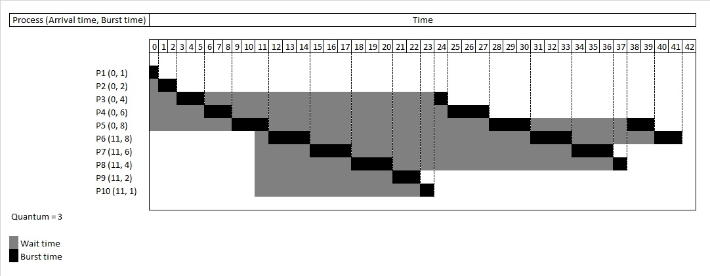
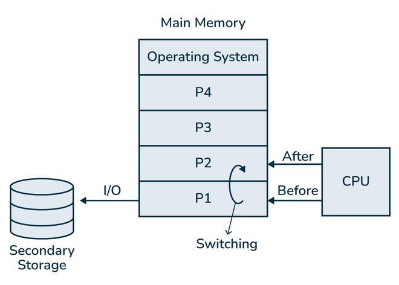
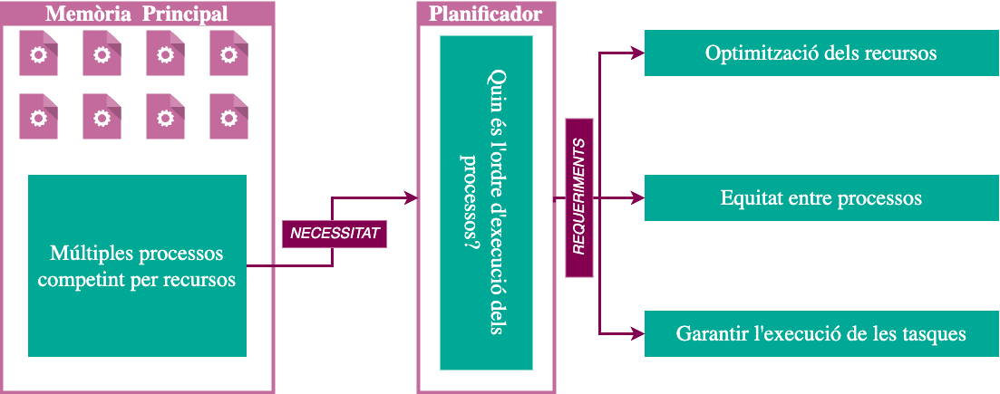
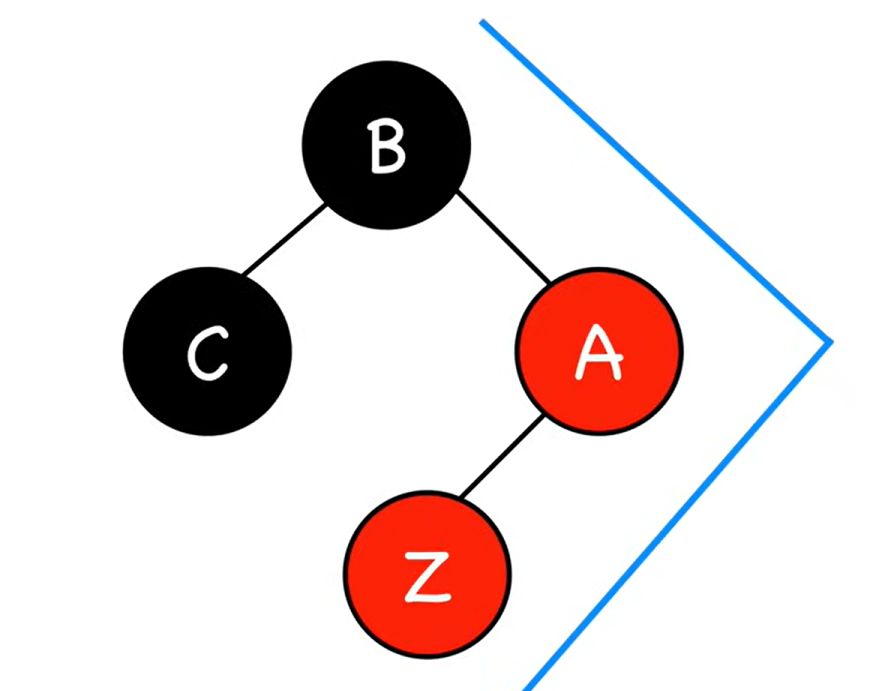
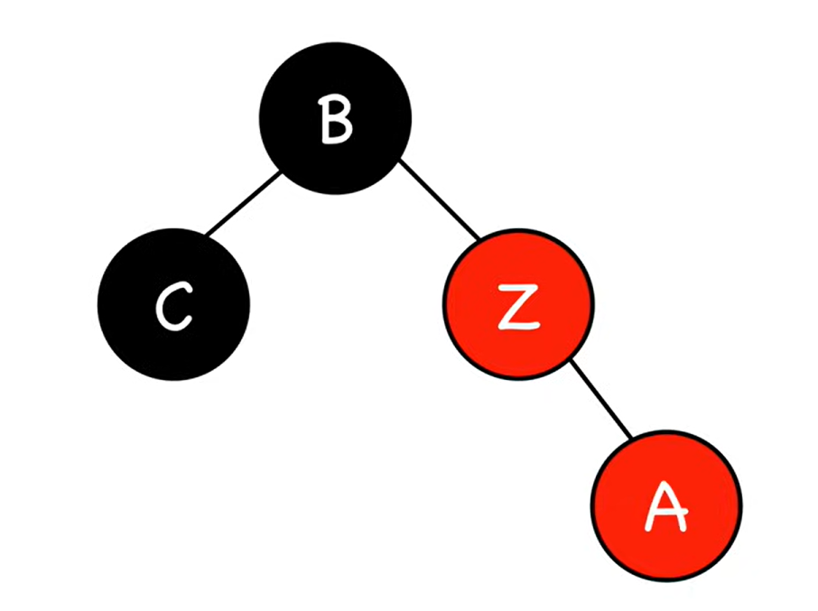
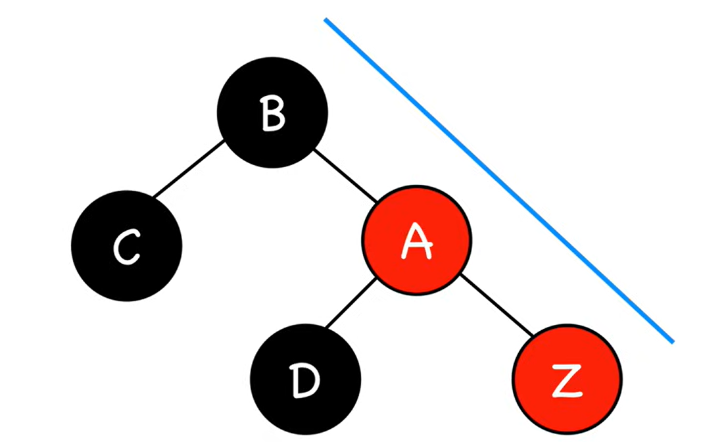
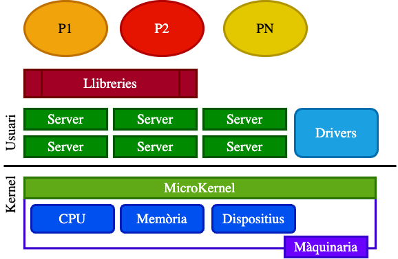

# 🖥️ Apunts de Sistemes Operatius - TEMA 4

## 📋 Índex
- [Tema 4- Planificació de processos](##🎯 TEMA 4 - Planificació de Processos )
- [Exemples Pràctics](#exemples-pràctics)
- [Dubtes i Preguntes](#dubtes-i-preguntes)
- [Reflexions Personals](#reflexions-personals)

---

## 🎯 TEMA 4 - Planificació de Processos 

### Conceptes bàsics
Cicles de burst:

Alterna entre períodes d'activtat intensiva d'ús del processador (CPU) i períodes d'activtat d'entrada/sortida (E/S)

Situació 1:


* 1: El SO carrega el procés a memòria principal
* 2: El planificador selecciona el procés
* 3: El despatxa a la CPU
* 4: L'usuari interactua amb l'aplicació.

Execució concurrent:

Definció segons la IA: La ejecución concurrente ocurre cuando múltiples procesos/tareas (APP1 y APP2) comparten el mismo procesador y avanzan en su ejecución de forma aparentemente simultánea, aunque en realidad el procesador va alternando rápidamente entre ellos.

Si s'hagués de posar passos al igual que abans:

* 1: El SO carrega les dues aplicacions a memòria principal
* 2: El planificador decideix quan executar cada app
* 3: El procesador executa fragments de APP1, després d'APP2, després APP1 , ... fins a n
* 4 Canvi ràpid de context: El SO guarda l'estat d'una APP i carrega l'estat de l'altre.
* 5 L'usuari interactua amb les aplicacions.

### Monoprogramat vs Multiprogramació

Monoprogramat: Només un procés a la memòria. APP2 ha d'esperar que APP1 acabi.

Multiprogramat: Múltiples processos a la memòria. APP2 pot ser carregat i executat mentre APP1 està en espera o en execució.

#### Objectius del planificador

* Tenim múltiples processos carregats a memòria principal que competeixen per recursos. Després el planificador ha de seleccioanr quin d'aquests processos s'ha de seleccionar primer tal que cumpleixi aquests tres requeriments(IA):

* 1.Optimización de los recursos ⚙️:
    * El planificador debe maximizar el uso del procesador
    * Evitar que el CPU esté idle (sin hacer nada)
    * Gestionar eficientemente la memoria principal donde residen los procesos
* 2.Equidad entre procesos ⚖️
    * Dar tiempo de CPU a todos los procesos de manera justa
    * Evitar que un proceso monopolice el procesador
    * Balancear la atención entre APP1, APP2, etc.
* 3.Garantizar la ejecución de las tareas ✅
    * Asegurar que todos los procesos avancen
    * Cumplir con los requisitos de cada aplicación
    * Mantener el sistema responsive y funcional
#### Funcionament del planificador.


* Process: representación lógica del programa en ejecución. Tiene pid, priority, state (Ready, Running, Waiting, Terminated), y un puntero al PCB.

* PCB (Process Control Block): estructura que almacena el contexto del proceso (registros, puntero de pila, info de memoria, etc.). Tiene saveContext() y loadContext().

* ReadyQueue: cola de procesos listos para ejecutarse. Operaciones típicas: enqueue, dequeue, sortBy (p. ej. prioridad). Tenim diferents processos que esperen a la cua de preparats.(La cua no és res més que un array de processos LIFO)


* Scheduler (Planificador): lógica que selecciona qué proceso ejecutar (selectProcess()), decide preempción, gestiona interrupciones (handleInterrupt()).

* Dispatcher: módulo que toma la decisión del scheduler y realiza el context switch (usa PCB para loadContext() / saveContext()).

* CPU: ejecuta el proceso actual (executeCycle()), puede generar interrupciones o ser interrumpida.

* IODevice: periférico que atiende peticiones I/O (startIO(process)), devuelve completeIO(eventId) cuando termina.

* Interrupción: eventos (TIMER, IO_COMPLETION, SYSCALL, ERROR) que despiertan al scheduler o provocan acciones inmediatas.
Planificació: algorisme que selecciona una d'entre un conjunt de tasques d'una llista. Poden haver-hi diferents planificadors en un sistema, planificador de la CPU ( més important) i dels diferents dispositius d'E/S.

##### Quan s’ha de planificar (Estats dels processos) ?


* Paso 1: Proceso en Ejecución → Evento Ocurre:El proceso running encuentra un evento:
```c
if evento == "Petició E/S":
    va_a_estado_waiting()
elif evento == "Expiració del temps":
    va_a_estado_ready()
elif evento == "Finalització":
    proceso_termina()
```
* Paso 2: El Planificador Decide:
CPU queda libre → Planificador elige próximo proceso de "Cua de Preparats"
* Paso 3: Despacho (Dispatch)
"Procés Despatxat" = Proceso seleccionado pasa de Ready → Running
* Paso 4: Nueva Ejecución
text: Proceso elegido ocupa el CPU y ejecuta

### Apropació.


El SO decideix cuantes unitats de temps ha d'estar cada procés al planificador. Com a consqüencia hi ha més canvis de context. Si tenim major cost d'apropiació, impliquen més interrupcions periodiques. Afavorim a que els procés amb més prioritat tinguin més justicía i equitat.

### Criteri / Algorismes de planificació (Generals)

* Justícia: Accés equitatiu als recursos per a tots els processos.
* Equilibri: Totes les parts del sistema estiguin utilitzades.
* Priorització: Preferència a processos amb més urgència.

És impossible tenir els tres a la vegada, ho associo amb aquesta imatge:


### Criteris a l'hora d'escoliir un algorisme

* Utilització de la CPU: % de temps d’ocupació.
* Productivitat: Nº de processos completats per unitat de temps.
* Temps de retorn: Temps total des que un procés s’envia fins que es completa, incloent temps d’espera i execució.

* Temps d’espera: Temps que un procés roman a la cua de preparats.
* Temps de resposta: Temps entre una sol·licitud de l’usuari i la primera resposta

### Criteris de planificació (Temps real)
* Predictibilitat: Capacitat del sistema per complir els requisits temporals de manera sistemàtica.
* Deadline: Capacitat de garantir que els processos finalitzin abans d’un temps límit establert.

### Objectius dels criteris de planificació

* Minimitzar el temps de resposta 
* Maximitzar el rendiment
* Justícia ( Compartir la CPU entre els usuaris de manera equitativa)
* Planificació òptima

### Algorismes de planificaió. Definicions

* FIFO (First In First Out): el primer procés en entrar (en la cua de preparats) serà també el primer procés en ser despatxat. Sol utilitzar-se en sistemes tipus batch. 

* SJF (Shortest Job First): el procés més curt (en temps de CPU) primer. Algorisme òptim. No es pot implementar perquè a priori no es sap el temps de CPU que requerirà un procés. Suposeu per exemple que prenem com índex de rendiment el Temps mig de Retorn d’un conjunt de processos. El temps de retorn total (suma dels temps de retorn de cada procés) és el més petit possible (òptim). Això és així perquè l’ordre d’execució dels processos es realitza segons el temps d’execució que necessiten (com més/menys temps requereixi un procés, més tard/aviat s’executarà). Com que el temps de retorn de cada procés és l’òptim, també ho serà la seva mitja. 

* SRTF: Versió apropiativa de SJF.

* Prioritats: el procés amb més prioritat primer.

* Round-Robin: els processos s’executen durant un Quàntum: temps màxim d’execu- ció ininterrompuda dins de la CPU. Després abandonen la CPU i s’insereixen al final de la cua de preparats (que suposarem FIFO). Serveix per implementar sistemes de temps compartit 

* Cues Multinivell sense retroalimentació: 


La cua de preparats es composa de diferents cues, on cadascuna de les quals pot implementar un algorisme de planificació independent de la resta. Cada procés està assignat a una cua segons la seva prioritat. Primer es tria un procés (si és que n’hi ha algun) de la cua més prioritària (segons l’algoris- me de planificació associat), a continuació es continua per la cua amb prioritat immediatament inferior, i així successivament fins la cua menys prioritària.

* Cues Multinivell amb retroalimentació:  cues multinivell on els processos poden moure’s entre cues. Estan pensades per evitar que els processos (de les cues menys prioritàries) entrin en inanició segons els criteris següents:   
    
    • Quan un procés ha estat despatxat un determinat nombre de cops dins de la CPU, es mou a una cua menys prioritària.

    • Quan un procés ha estat en inanició un determinat temps, es mou a una cua més prioritària.

### Caracteristiques dels algorismes de Planifiació

* FIFO (First In First Out):

    * Simplicitat: Algorisme senzill d’implementar i comprendre.

    * No apropiatiu: Un procés s’executa fins a la seva finalització o bloqueig.

    * Garantia de no inanició: Tots els processos eventualment s’executen (sota la suposició que acaben).

    * Efecte Convoy: Processos curts poden quedar bloquejats per processos llargs, incrementant el temps d’espera mitjà.
* SJF (Shortest Job First)
    * Pot provocar inanició? Sí, qualsevol política que prioritzi una propietat pot provocar inanició.
    * Pot provocar convoy? Sí, qualsevol política no apropiativa pot provocar convoy.
    * Redueix el temps de retorn? Sí, redueix el temps mitjà de finalització si i només si tots els processos arriben alhora.
    * Requereix coneixement previ del temps de burst? Sí, és un dels seus inconvenients principals.

* SRTF
    * SRTF (Shortest Remaining Time First) és una política òptima pel temps de resposta mitjà.
    * Cap altra política pot superar SRTF en aquest criteri.    
    * Es fa servir sovint com a referència de comparació amb altres algorismes.

* Prioritats
    * En cas d’empat, es pot aplicar un altre algorisme (habitualment FIFO).
    * Les prioritats poden ser estàtiques o dinàmiques.
    * L’envelliment és una estratègia utilitzada per abordar el problema d’inanició que pot sorgir en els algorismes de planificació basats en prioritats.

* Round-Robin

    * Cada procés rep un quantum de temps per executar-se.
    * Quan el quantum expira, el procés és interromput i col·locat al final de la cua de preparats.
    * Cap procés pot monopolitzar la CPU durant un temps determinant (q).
    * Utilitza una cua FIFO per gestionar els processos preparats.
    * Utilitza una interrupció de rellotge per implementar el quantum de temps.
    * És un algorisme apropiatiu.
    * A UNIX, per exemple, s’utilitzen diferents quantums per a processos d’usuari i del sistema per equilibrar la resposta i l’eficiència 
    q=100ms per a processos d’usuari.
    q=10ms  per a processos del sistema.
    El overhead del canvi de context és d’aproximadament 0.1ms−1ms
    Aquest valor és petit comparat amb la durada del quantum, però rellevant si els quantum són molt petits.

* Cues Multinivell sense retroalimentació

* Cues Multinivell amb retroalimentació
    * Quantum de Temps Variable: Cada cua de prioritat té un quantum de temps específic i progressivament més llarg en cues de menor prioritat, optimitzant així la gestió de processos de llarga durada.

    * Exemple: Cues Round Robin amb quantums exponencials (1ms, 2ms, 4ms, etc.) per a processos de llarga durada.

    * Moviment Dinàmic entre Cues: Si un procés no finalitza dins del seu quantum assignat, es mou a una cua amb menor prioritat, on rebrà un quantum més llarg però menor prioritat d’execució.

    * Exemple: Els processos amb alta demanda de CPU descendeixen ràpidament de prioritat, evitant que monopolitzin la CPU. Els processos de curta durada i/o intensius en E/S mantenen la prioritat alta, maximitzant el seu accés a la CPU i reduint la latència.

    * Estructura Flexible de Cues: Les cues amb retroalimentació permeten que els processos amb canvis de comportament puguin ajustar la seva posició.

    * Temps de CPU per Cua: Cada cua rep un percentatge del temps de CPU: P. ex., cues interactives reben un percentatge més alt per a reduir el temps de resposta.

    * Inversió de prioritats: Mantenir el programa en una cua de major prioritat per garantir temps de CPU preferent i una resposta ràpida en les decisions del joc.

### Predir el futur?
Sabem que el SRTF seria el millor algorisme de planificació si poguessim conéixer el futur. Però com el pordem predir? I seria de manera exacta?

La resposta es que sí, i es que podem mirar el comportament que ha tingut un procés en el passar per poder predir com es comptará en el futur, per exemple, un editor de text pasa molt de temps esperant a que es premi una tecla E/S, i només utilitza la CPU si s'escriu.

Una estratègia comuna és utilitzar estimacions basades en l'historial de comportament dels processos. Molts programes mostren patrons repetitius en la seva utilització de la CPU i I/O. Si els processos tenen un comportament aleatori, aquesta estratègia no seria útil.
Així podem introduir la següent fórmula:

$t_n = f(t_{n-1}, t_{n-2}, t_{n-3}, \ldots)$

* On: $t_n$ és la durada estimada del següent burst de CPU. $f$ és una funció que utilitza els bursts anteriors per fer la predicció.
* $t_{n-1}, t_{n-2}$ son les duracions reals dels bursts anteriors
* $f$ es una funció de predicció

## 🎯 TEMA 4 - Planificació de Processos · Justícia

### Definició de planifiació justa
Definició: La garantia que tots els processos rebin un tracte equitatiu en l’accés a la CPU, independentment de la seva prioritat o ús anterior.

* Principis:
    * Igualtat de servei: Dos processos idèntics → mateix temps de CPU, mateix rendiment.
    * Work-conserving: La CPU mai resta inactiva si hi ha tasques pendents. (no implica justícia, sinó eficiència)
    * Justícia: Evita la inanició → cap procés queda sense atenció.
* Exemple: Planificació Justa 
<div align="center">
  <em>Quina quantitat de recurs hauria de rebre cada procés per garantir una planificació justa?</em>
</div>

<table>
  <tr>
    <td width="50%">

Tenim una capacitat total de recurs: 
$$
C = 10 \text{ unitats}
$$

Tres processos amb demandes diferents:

- **P₁** → demanda de **8** unitats  
- **P₂** → demanda de **4** unitats  
- **P₃** → demanda de **2** unitats

    </td>
    <td width="50%" valign="top">

**Solució justa:**

- **P₁ = 4 unitats**
- **P₂ = 4 unitats**
- **P₃ = 2 unitats**

    </td>
  </tr>
</table>

### Algorismes que aproximen la planificació justa.

* Max-Min Fairness: Assegura que els recursos es distribueixin de manera que cap procés no rebi més del que necessita.
``` java
import java.util.*;

public class MaxMinFairness {

    /**
     * Aplica el algoritmo de Max-Min Fairness para asignar recursos de forma justa.
     *
     * @param totalCapacity Capacidad total disponible (C)
     * @param demands       Lista de demandas de cada trabajo (D)
     * @return              Lista de asignaciones finales (A)
     */
    public static List<Double> computeMaxMinFair(double totalCapacity, List<Double> demands) {
        int n = demands.size();
        
        // A: vector de asignación (inicializado a 0)
        List<Double> allocation = new ArrayList<>(Collections.nCopies(n, 0.0));
        
        // S: conjunto de índices de trabajos activos
        Set<Integer> activeJobs = new HashSet<>();
        for (int i = 0; i < n; i++) {
            activeJobs.add(i);
        }

        double C = totalCapacity; // capacidad restante

        while (!activeJobs.isEmpty()) {
            int numActive = activeJobs.size();
            double fairShare = C / numActive; // f = C / |S|

            boolean allAboveFair = true;
            List<Integer> toRemove = new ArrayList<>(); // trabajos que se satisfacen y salen de S

            // Buscar trabajos cuya demanda es <= fairShare
            for (int j : activeJobs) {
                if (demands.get(j) < fairShare) {
                    // Satisfacer su demanda completa
                    allocation.set(j, demands.get(j));
                    C -= demands.get(j);
                    toRemove.add(j);
                    allAboveFair = false;
                }
            }

            // Eliminar los trabajos satisfechos del conjunto activo
            activeJobs.removeAll(toRemove);

            // Si todos los trabajos activos demandan >= fairShare, asignar fairShare a cada uno
            if (allAboveFair) {
                for (int j : activeJobs) {
                    allocation.set(j, fairShare);
                }
                break; // ya no quedan recursos ni trabajos pendientes
            }
        }

        return allocation;
    }

    // Ejemplo de uso
    public static void main(String[] args) {
        double C = 10.0;
        List<Double> demands = Arrays.asList(8.0, 4.0, 2.0); // P1=8, P2=4, P3=2

        List<Double> result = computeMaxMinFair(C, demands);

        System.out.println("Asignación final:");
        for (int i = 0; i < result.size(); i++) {
            System.out.printf("P%d = %.1f unidades%n", i + 1, result.get(i));
        }
        // Salida esperada: P1 = 4.0, P2 = 4.0, P3 = 2.0
    }
}
```
Explicació del bucle (IA):
* Calculamos la cuota justa f = C / |S|.
* Identificamos los trabajos que piden menos que f.
* Los satisfacemos completamente, restamos su demanda de C, y los eliminamos de S.
* Si ninguno pide menos que f, entonces todos reciben f y terminamos.


Algorsime Loteria 

1.Cada procés rep un nombre de bitllets.

2.Cada cicle de planificació, es fa un sorteig aleatori.

3.El procés que té el bitllet seleccionat obté temps de CPU.

4.Els processos amb més bitllets tenen més oportunitats, però cap procés queda exclòs.

* Algorsime GPS

**Generalized Processor Sharing (GPS)** és un **model teòric ideal de planificació justa** de la CPU.

📌 Idea clau:  
> La CPU es reparteix **de manera contínua** entre tots els processos actius, **proporcionalment al seu pes**.

- Cada procés \(P_i\) té un **pes** \(w_i\)
- Tots els processos s’executen **simultàniament**
- Cada procés rep una fracció de CPU proporcional al seu pes

---

#### 2. Definició formal

Si hi ha \(n\) processos actius, el percentatge de CPU que rep el procés \(i\) és:

$\text{CPU}_i = \frac{w_i}{\sum_{j=1}^{n} w_j}$

Aquesta expressió defineix una **justícia perfecta**, sense prioritats fixes ni torns.

---

### Caràcteristiques dels Algorismes que aproximen la planificació justa.:
 * Max-Min Fairness: 
    * Si n tasques han de compartir un recurs (CPU) ⇒ cadascun rep, per defecte, una part de 1 / n del recurs.
    * S’utilitza per ajustar la distribució quan un usuari no vol o no pot fer servir tota la seva quota de recurs.
    * Weighted Max-Min Fairness: Els pesos determinen la proporció del recurs disponible que correspon a cada procés en cas de competència.

* Loteria
    * Podem utiltzar la següent fómrula per poder calcular el % de CPU.

    $ \%CPU = \frac{\text{nombre de bitllets del procés}}{\text{nombre total de bitllets}} \times 100 $

| Nº curts | Nº llargs | % CPU curts | % CPU llargs |
|----------|-----------|-------------|--------------|
| 1        | 1         | 91%         | 9%           |
| 0        | 2         | -           | 50%          |

* És possible que els processos cooperin per obtenir més bitllets i, per tant, més temps de CPU? Sí, el procés pot cedir els seus bitllets al servidor , augmenant les seves possibilitats.

* GPS:Teoricament és un algorisme que només funciona en la teoria. Ja que el mateix GPS assumeix dos conceptes:

    * La CPU es pot repartir de forma infinitament fina en el temps. És a dir, que tots els processos avanén alhora, sigui més lent o més ràpid.
    * Pero no podem executar 0.25 cicles de temps, pel que no existeix a la CPU.
    * Assumeix, per tant, que el treball del procés es com un fluid continuu, sense unitats indivisibles.

Però als sistemes reals, els recursos NO son continuus, sino que varien respecte al temps.
 * CPU: Executa una instruccio darrere de l'altre.
 * E/S: Operacions completes, igual que a CPU.
 * XARXES: Es transmiteixen paquets.


Temps Real (Real Time) (En el temps real t, cada procés ha rebut exactament la seva fracció ideal de CPU) no es pot utilitzar directament com a mecanisme de planificació. El WFQ utilitza un Temps de Referència Virtual (Virtual Time) com a reemplaçament del temps real del model GPS.

### Virtual Time
* (V(t)) actua com un Comptador de Rondes (Round Index) en un planificador ideal bit-per-bit Round-Robin. Informalment: Un comptador de “deute” o “crèdit” respecte al GPS ideal.
* El Virtual Time només avança quan hi ha servei

Siguin dos processos a i b.

| Procés | Pes|
|----------|-----------|
| A      | 1         | 
| B       | 2         | 

En el GPS, B hauria d'avançar el doble de ràpid que A.
* 1 unitat de servei per a A
* 2 unitats de servei per a B
Equivalència en justícia.

* Escenari:La CPU executa només un a la vegada. Suposem que el sistema real fa això:

    * Executa A durant 10 ms seguits

    * Després B durant 10 ms
    * Temps real:
        * A: 10 ms
        * B: 10 ms
→ semblen iguals (però NO ho són).

Aqui entra el concepte de VT:
> **Quant ha avançat aquest procés respecte a la velocitat que li tocava?**

Això es calcula mitjançant el **progrés relatiu**:

$
\text{progrés relatiu} = \frac{\text{servei real rebut}}{\text{pes}}
$

### Exemple

Suposem dos processos:

- Procés **A** amb pes 1  
- Procés **B** amb pes 2  

Tots dos han rebut **10 unitats de servei real**.

Càlcul del progrés relatiu:

- **A**:  $\frac{10}{1} = 10 $

- **B**:  $\frac{10}{2} = 5 $

📌 **El procés A ha avançat el doble (relativament) que el procés B.**

👉 Això posa en evidència una injustícia que **no es veu si només mirem el temps real**, ja que el procés B, pel seu pes, hauria d’haver rebut més servei.

### Idea clau

La normalització permet comparar processos amb **pesos diferents** i detectar quin procés ha rebut **més o menys del que li tocava** segons el model de planificació justa (GPS / WFQ).

### Temps de finalització virtual  
Si el sistema fuese GPS ideal, ¿en qué instante virtual terminaría este paquete?

$ F_{i}^{k} = max(F_{i}^{k-1}, V(a_{i}^{k})) + \frac{L_{i}^{k}}{w_{i}} $.

Anem a deduir la fórmula en comptes de memoritzar-la:
* Terme $ max(F_{i}^{k-1}, V(a_{i}^{k})) $: Un flux no pot terminar un paquet abans de terminar l'anterior. Paquet k no comecnça si k -1 no ha acabat.
Sigui $ a_{i}^{k}$ el temps real d'arribada del paquet, llavors $ V(a_{i}^{k})$ és el temps virtual GPS en aquell instant. Per tant el paquet:

    * No pot començar abans de que existeixi

    * Ni abans de l'estat actual del sistema ideal.
* Terme $ \frac{L_{i}^{k}}{w_{i}} $:  Un flux amb pes ${w_{i}}$ rep un servei a velocitat proporcional a {w_{i}}

### LAG
Tenim la següent fórmula:
$Lag_i(t) = \text{Servei Rebut} - \text{Servei Ideal}$

Es inevitable perquè:
* WFQ envia paquets
* GPS reparteix continuament.

A vegades, un flux rep més de cop ( lag +), a vegades menys( lag -).

### Solució al LAG: Temps d'arribada virtual
$S_{i}^{k} = max(S_{i}^{k-1}, V(a_{i}^{k})) $
* On $S_{i}^{k}$ és l'instant virtual que el paquet es torna "escullible".
Recordem que $F_{i}^{k}$ només ordena, pero no impideix que un flux entri massa ràpid, que és la funció del temps d'arribada virtual.

Un paquet només pot ser seleccionat si $ S_{i}^{k}​≤V(t)$, és a dir, si ja hagués arribat el punt en el que aquest paquet pugui començar.

## 🎯 TEMA 4 - Planificació de Processos · Linux

### Versions de Linux

* Linux 1.2: Cua circular + (RR). Tothom passa per torns i tots tenen el mateix dret.
* Linux 2.2: Classes SCHED_*:
    * SCHED_FIFO: Aquest procés es crític. Té prioritat fixa, sense contemplar justicia.
    * SCHED_RR: SCHED_FIFO + quantum. Després passa al final de la cua una vegada s'ha exhaurit el quantum.
* Linux 2.4: Millorar l'experiencia de l'usuari.
    * Epcohs: "Ronda gran" de planifiació
    * Slice: Quanta CPU pot utilitzar un procés dins del mateix epoch.
    * Si el procés dorm i fa E/S i per tant no esgota el slice. Es suma al següent epoch.
    * O(n) ja que el planificador ha de mirar en tots els processos.
* Linux 2.6
    * Aquí Linux diu: “D’acord, vull velocitat.”Com ho fa:
        * Llistes per prioritat (0–139)
        * Sempre sé quin és el següent → O(1)
        * Les prioritats són esglaonades, no contínues. Hem trencat el concepte de justicía.
    * SCHED_NORMAL (Heuristiques: Una regla pràctica basada en l’experiència, no una garantia matemàtica.)
        * Linux introduiex la prioritat estàtica(nice) i la prioritat dinàmica (heurística)
        * Si un procés dorm, problement és interactiu. Linux tracta d'endevinar justícia.
        * Desaventatges:
            * Depèn de la gestió manual d'heurístiques
            * Latència elevada per aplicacions interactives
            * Complexitat creixent quan augmenta nombre de processos

### Completely Fair Scheduler (CFS)
* Objectius: ser just, evitar fam, reduir latència.
* Sistema ideal on tots els procs reben CPU simultàniament.
* Pel tema anterior, sabem que no es possible posar aquell sistema ideal. Fem servir el Virtual Time que ara anomenarem temps vruntime.
* Sempre s'executa el procés amb menys vruntime acumulat.
* Podem definir la següent fórmula per al VirtualTime: 

El `vruntime` (virtual runtime) és una mesura del temps de CPU que ha utilitzat un procés, ajustat pel seu pes (prioritat).

$$ vt_{i}(t) = \int_{0}^{t} \frac{dt}{w_i} $$

on:

-   $vt_i(t)$: temps virtual del procés $i$ en el temps $t$.
-   $w_i$: pes del procés $i$ (derivat de la seva prioritat).
-   $dt$: increment de temps real.

* Exemple (Foto)


No obstant, necessitem una estrcutura de dades on implementar el CFS, tenint en compte els següents objectius:
* Trobar ràpidament quin procés té el menor vruntime (el següent a executar).
* Modificar ràpidament la posició d’un procés dins l’ordre quan canvia el seu vruntime.
* Mantenir ordenats els processos per vruntime de manera eficient si en tenim molts

### Arbre Red-Black (RB)
https://www.youtube.com/watch?v=qvZGUFHWChY&list=PL9xmBV_5YoZNqDI8qfOZgzbqahCUmUEin
- Recordem que es un arbre binari. Sabem que per a cada node de cada arbre binari, tenim que cada node pot tenir dos subarbres. Els valors dels nodes que estan a la dreta son més petits o iguals i els de la dreta més grans o iguals.
- Un arbre red-black és un arbre equilibrat.(Vist a ED), tot arbre red-black compleix:
    - 1.Un node o es negre o és vermell
    - 2.El root i les fulles (NULL) sempre són negres
    - 3.Si un node és vermell, llavors els seus nodes són negres
    - 4.Tots els camins des de la arrel fins a les fulles tenen el mateix nombre de nodes negres
    - 5.La part dreta és sempre més gran que l’esquerra (ordenació per vruntime).

* Exemple:
### Procesos listos para ejecutar

| Proceso | vruntime |
|-------|---------|
| A | 3 |
| B | 7 |
| C | 5 |
| D | 10 |

El árbol RB (ordenado por `vruntime`) quedaría conceptualmente así:
``` c
    C(5)
   /    \
A(3)    B(7)
           \
           D(10)
```
https://www.youtube.com/watch?v=95s3ndZRGbk&list=PL9xmBV_5YoZNqDI8qfOZgzbqahCUmUEin&index=2.
* Rotació
1. Altera l'estructura de l'arbre reordenant els subarbres
2. Amb l'objectiu de decrementar l'altura de l'arbre.
3. No afecta a l'ordre dels elements

Dos tipus de rotació:
* Left:

* Right:

Ambdues rotacions tenen temps O(1).

* Inserció.
S'han de fer amb cura, ja que s'han de complir les condicions d'un arbre RB (root negre,...).
Estratègia: 
    * Insertar Z i pintar-ho de color vermell.
    * Repintar i rotar els nodes per arreglar les violacions (no de segment en aquest cas)
    * Sempre violarem les propietats 2 i 3.
A partir d'aqui tenim 4 escenaris:
0. Z = root --> Colorejem Z de color negre.

1  Z.tiet = red. Suposem un subarbre:


Colorejem tots els nodes de colors distints:


2. Z.tiet = negre en triangle:


Rotem el pare de Z:


3. Z.tiet = negre en linia

Rotem l'aví de z i recolorejem:



En pseudocodi es pot veure tal que:


### Limitacions del CFS

Podem suposar la següent taula de processos:


| Procés | Pes (`nice`) | Comportament                        |     |
|--------|--------------|-------------------------------------|-----|
| A      | 1024         | Tasques curtes, apareix sovint      |     |
| B      | 1024         | Processa grans blocs, no interactiu |     |
| C      | 1024         | Tasques curtes, arriba més tard     |     |

Tenim processos amb molta variació de comportament, però el CFS, per definició, els hauria de tractar igual.

* Exemple:

| Temps   | Procés actiu | Context                                   |
|---------|--------------|-------------------------------------------|
| 0–50ms  | B            | A encara no ha arribat                    |
| 50ms    | A arriba     | A té vruntime=0, B té vruntime alt        |
| 50–60ms | A            | CFS tria A pel vruntime baix              |
| 60ms    | C arriba     | C té vruntime=0, A i B tenen vruntime\>0  |
| 60–70ms | C            | Tria C ara (just, basat en vruntime baix) |
| 70–80ms | A            | Torn a A, però...                         |
| ⋮       | ...          | ...                                       |

-   A i C es beneficien només perquè arriben tard → `vruntime=0`.
-   Els processos interactius que tornen sovint (com A) no són tan prioritzats després.
-   Pot provocar latències no òptimes en sistemes interactius o aplicacions UI.

El CFS considera només el **temps virtual acumulat**, però no té en compte la urgència o deadlines virtuals de les tasques.

### EEVDF (Earliest Eligible Virtual Deadline First).
Surgeix del problema mencionat anteriorment de l'CFS. És a dir, pregunta litermalment al procés:

**Qui hauria d'executar-se abans de complir el que li toca?**

### Caràcteristiques EEVDF

-   Manté la idea de **temps virtual** i **justícia**.
-   Introdueix el concepte de **deadline virtual** per a cada tasca.
-   Prioritza la tasca amb la **deadline virtual més urgent** (i *elegible*).

### Fórmules EEVDF
* Quota d'un procés actiu:
$f_i(t) = \frac{w_i}{\sum_{j \in A(t)} w_j}$

On:

-   $w_i$ = pes del procés $i$ (importància relativa).
-   $A(t)$ = conjunt de processos actius en el temps $t$.

“Si tots els pesos son iguals → tots haurien de rebre el mateix % de CPU.”

* Temps de servei acumulat ideal
$S_i(t_0, t_1) = \int_{t_0}^{t_1} f_i(t) dt$

"En un sistema ideal. Quant de temps de CPU hauría d'haber rebut aquest procés entre t0 i t1"

Bàsicament, el que vol fer auqetsa fórmula es dir, vull acumular tot el que te toque al llarg del temps. Si tenim cuota constant es pot simplificar a:

$Si​=fi​⋅(t1​−t0​)$

Si sistema ideal, llavors per definició podem deduir $ S_i(t_0, t_1) = si​(t0​,t1​)$

* Temps real executat (trivial): $si​(t0​,t1​)$

Si A ejecuta 10 ms --> Sa = 10ms

* Deadline Virtual: $D_i = ve_i + \frac{r_i}{w_i}$

on:

-   $ve_i$ = Temps virtual en què el procés $i$ esdevé elegible.
-   $r_i$ = durada de la sol·licitud de servei.
-   $w_i$ = pes del procés.


## Exemples pràctics.
### Planificació de processos — Qüestion ari

### 🔹 Bloc 1 — Conceptes bàsics i objectius de planificació

- **(V/F)** En un sistema multiprogramat, la concurrència existeix encara que només hi hagi una sola CPU física.
- **(V/F)** Un sistema monoprogramat pot tenir diversos processos a memòria sempre que només un estigui executant-se.
- **(V/F)** La planificació només és necessària quan hi ha més processos que CPUs.
- **(V/F)** Maximitzar el throughput pot empitjorar el temps de resposta percebut per l’usuari.

**(Resposta curta)**  
Per què minimitzar el temps de resposta mitjà pot portar a una planificació injusta?

---

## #🔹 Bloc 2 — Quan i com s’activa el planificador

- **(V/F)** El planificador només s’executa quan un procés acaba.
- **(V/F)** Una interrupció de rellotge pot provocar un canvi de procés encara que el procés actual no estigui bloquejat.
- **(V/F)** La finalització d’una operació d’E/S sempre provoca una replanificació.

**(Resposta curta)**  
Quina diferència conceptual hi ha entre seleccionar un procés i despatxar-lo?

---

### 🔹 Bloc 3 — Apropiació (preempció)

- **(V/F)** Un sistema apropiatiu té, necessàriament, més overhead que un de no apropiatiu.
- **(V/F)** L’apropiació millora la justícia però pot empitjorar el throughput.
- **(V/F)** Sense interrupcions de rellotge no és possible implementar Round Robin.

**(Resposta curta)**  
Per què l’apropiació és gairebé imprescindible en sistemes interactius?

---

### 🔹 Bloc 4 — FCFS (FIFO) amb trampa

- **(V/F)** FCFS garanteix que cap procés pateixi inanició.
- **(V/F)** FCFS és especialment adequat per sistemes interactius amb molts processos curts.
- **(V/F)** L’efecte convoy només es produeix si hi ha processos d’E/S.

**(Resposta curta)**  
Quin tipus de càrrega fa que FCFS sigui raonablement eficient?

---

### 🔹 Bloc 5 — Round Robin (RR)

- **(V/F)** En RR, augmentar el quantum sempre redueix el nombre de canvis de context.
- **(V/F)** Si el quantum és molt gran, RR es comporta com FCFS.
- **(V/F)** Amb RR, un procés pot monopolitzar la CPU si el seu burst és menor que el quantum.
- **(V/F)** Amb molts processos llargs i bursts similars, RR pot tenir pitjor throughput que FCFS.

**(Resposta curta)**  
Per què un quantum massa petit pot reduir el throughput encara que millori la resposta?

---

### 🔹 Bloc 6 — Planificació per prioritats

- **(V/F)** En un sistema de prioritats, l’empat normalment es resol amb FIFO.
- **(V/F)** Les prioritats dinàmiques poden eliminar completament la inanició.
- **(V/F)** Un procés amb prioritat baixa pot no executar-se mai en absència d’envelliment.

**(Resposta curta)**  
Quina és la idea clau de l’envelliment i quin problema resol?

---

### 🔹 Bloc 7 — SJF i SRTF (preguntes fines)

- **(V/F)** SJF minimitza el temps mitjà de retorn en qualsevol escenari.
- **(V/F)** SJF pot provocar tant inanició com efecte convoy.
- **(V/F)** SRTF elimina completament l’efecte convoy.
- **(V/F)** SRTF pot empitjorar el throughput a causa dels canvis de context.

**(Resposta curta)**  
Per què SRTF és considerat òptim pel temps de resposta mitjà però poc realista?

---

### 🔹 Bloc 8 — Preguntes mixtes amb mala llet 😈

- **(V/F)** Un procés que fa molta E/S pot “enganyar” el planificador i semblar interactiu.
- **(V/F)** Afegir més recursos (CPU/memòria) sempre millora les mètriques de planificació.
- **(V/F)** No existeix cap algorisme de planificació que sigui òptim en tots els criteris.

**(Resposta curta)**  
Quin criteri prioritzaries en un sistema de temps real i per què no és el throughput?

---

### Respostes de l’alumne

1. **V.** La concurrència és quan diferents processos comparteixen la mateixa CPU. La CPU afectaria en termes de rendiment, no d'existència.  
2. **F.** Per definició.  
3. **F.**  
4. **F.** Si es maximitza el rendiment, llavors això és millor temps de resposta per definició.  
5. Perquè si minimitzem el temps de resposta, pot ser que hi hagi processos que hagin d'esperar més, produint efecte convoy i una planificació injusta.  
6. **F.** El planificador sempre s'executa si hi ha processos.  
7. **V.**  
8. **F.**  
9. Despatxar-lo té a veure amb l'algorisme de planificació. Seleccionar és triar-lo de la cua de preparats per posar-lo a la CPU.  
10. **F.** L’apropiativitat no té a veure amb els canvis de context.  
11. **V.**  
12. **F.** Per definició.  
13. Perquè pot donar-se efecte convoy o manca de justícia.  
14. **V.**  
15. **F.** Amb processos grans.  
16. **F.** També pot passar a la CPU.  
17. No ho sé.  
18. **F.** Pot haver-hi molts processos amb bursts petits; augmentar el quantum seria indiferent.  
19. **V.** Si tendeix cap a infinit.  
20. **F.**  
21. **V.**  
22. Perquè hi ha més canvis de context.  
23. **V.**  
24. **F.** (No sé què és prioritat dinàmica.)  
25. **F.** Tenir prioritat baixa no implica no executar-se mai.  
26. Pujar la prioritat a processos poc utilitzats. Resol la inanició.  
27. **V.**  
28. **V.**  
29. **F.**  
30. **V.**  
31. Perquè no podem predir el futur.  
32. **V.**  
33. **F.** Afegir CPUs pot deixar-ne alguna idle.  
34. **F.** Seria SRTF si poguéssim conèixer el futur.  
35. La utilització de la CPU, perquè una CPU idle malgasta recursos.

---

## Exemples pràctics

### Anàlisi d'exercici de FIFO (CLASSE)

| Proc | $t_a$ | $t_{cpu}$ |
|:---:|:----:|:--------:|
| 🟢 **P1** | 0 | 20 |
| 🔵 **P2** | 5 | 5 |
| 🟣 **P3** | 6 | 5 |

1. **Efecte Convoy:** P1 (llarg) bloqueja P2 i P3 (curts), incrementant el temps d'espera.  
2. **Sensible a l'ordre d'arribada:** Si P2 o P3 arribessin abans, el seu temps d'espera seria menor.  
3. **No apropiatiu:** P1 ocupa la CPU fins a finalitzar.  
4. **No adequat per sistemes interactius:** Pot provocar retards significatius en la resposta.

### Analisi d'exerici de FIFO (CLASSE)
|  proc  | $t_a$ | $t_{cpu}$ |
|:---------:|:---------:|:-------------:|
| 🟢 **P1** |     0     |      20       |
| 🔵 **P2** |     5     |       5       |
| 🟣 **P3** |     6     |       5       |

1.  **Efecte Convoy:** El procés P1 (llarg) bloqueja els processos P2 i P3 (curts), incrementant el temps d'espera.
2.  **Sensible a l'ordre arribada:** Si P2 o P3 hagués arribat abans que P1, el temps d'espera de P2 hauria estat menor.
3.  **No apropiatiu:** P1 ocupa la CPU fins a la seva finalització, sense donar oportunitat a P2 i P3.
4.  **No és adequat per a sistemes interactius o en temps real:** Els usuaris poden experimentar retards significatius en la resposta del sistema, ja que els processos curts poden quedar bloquejats darrere de processos llargs.

## RR - Diagrama de flux

(Exercicis Resolts del llibre de Lleida)
Enunciat: Donats els processos amb les característiques de la taula 3.1 .
Doneu el diagrama de gantt i el temps mig de retorn i d’espera pels algorismes a curt plaç següents: 
* 1.FIFO
* 2.SJF 
* 3.Prioritats. Valors més alts indiquen prioritats també més altes.
* 4.Round-Robin. Quàntum = 3.


## Dubtes i Preguntes

## Reflexions personals