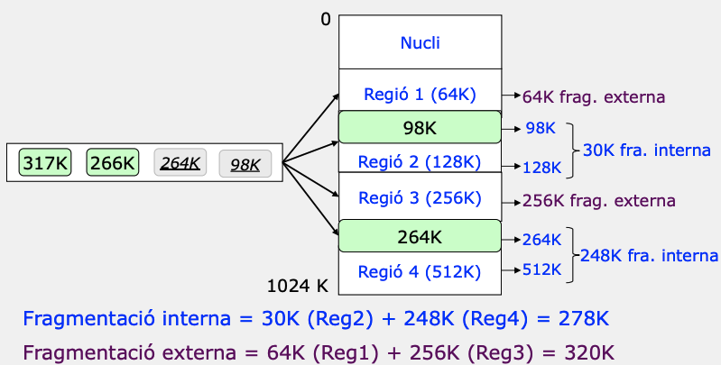
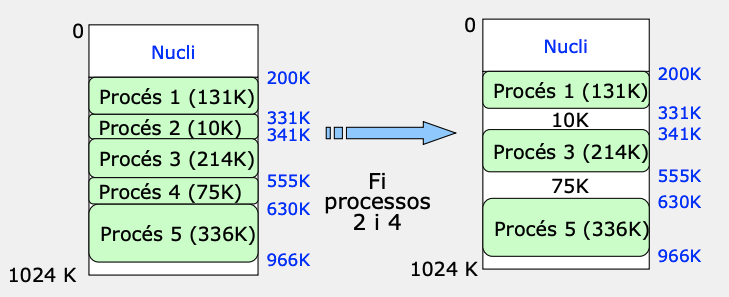
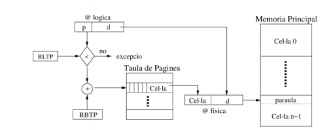
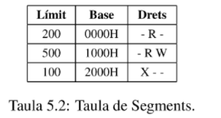
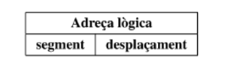
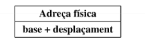
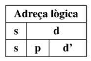
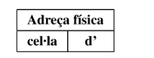
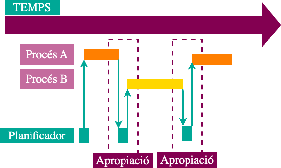
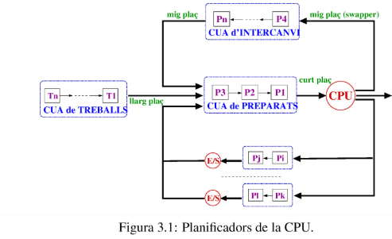

# 🖥️ Apunts de Sistemes Operatius - TEMA 4

## 📋 Índex
- [Setmana 2 - Planificació de processos](#setmana-2--- Planificació de processos)
- [Exemples Pràctics](#exemples-pràctics)
- [Dubtes i Preguntes](#dubtes-i-preguntes)
- [Reflexions Personals](#reflexions-personals)

---

## 🎯 TEMA 4 - Planificació de Processos 

### Conceptes bàsics
Cicles de burst:

Alterna entre períodes d'activtat intensiva d'ús del processador (CPU) i períodes d'activtat d'entrada/sortida (E/S)

Situació 1:


* 1: El SO carrega el procés a memòria principal
* 2: El planificador selecciona el procés
* 3: El despatxa a la CPU
* 4: L'usuari interactua amb l'aplicació.

Execució concurrent:

Definció segons la IA: La ejecución concurrente ocurre cuando múltiples procesos/tareas (APP1 y APP2) comparten el mismo procesador y avanzan en su ejecución de forma aparentemente simultánea, aunque en realidad el procesador va alternando rápidamente entre ellos.

Si s'hagués de posar passos al igual que abans:

* 1: El SO carrega les dues aplicacions a memòria principal
* 2: El planificador decideix quan executar cada app
* 3: El procesador executa fragments de APP1, després d'APP2, després APP1 , ... fins a n
* 4 Canvi ràpid de context: El SO guarda l'estat d'una APP i carrega l'estat de l'altre.
* 5 L'usuari interactua amb les aplicacions.

### Monoprogramat vs Multiprogramació

Monoprogramat: Només un procés a la memòria. APP2 ha d'esperar que APP1 acabi.

Multiprogramat: Múltiples processos a la memòria. APP2 pot ser carregat i executat mentre APP1 està en espera o en execució.

#### Objectius del planificador

* Tenim múltiples processos carregats a memòria principal que competeixen per recursos. Després el planificador ha de seleccioanr quin d'aquests processos s'ha de seleccionar primer tal que cumpleixi aquests tres requeriments(IA):

* 1.Optimización de los recursos ⚙️:
    * El planificador debe maximizar el uso del procesador
    * Evitar que el CPU esté idle (sin hacer nada)
    * Gestionar eficientemente la memoria principal donde residen los procesos
* 2.Equidad entre procesos ⚖️
    * Dar tiempo de CPU a todos los procesos de manera justa
    * Evitar que un proceso monopolice el procesador
    * Balancear la atención entre APP1, APP2, etc.
* 3.Garantizar la ejecución de las tareas ✅
    * Asegurar que todos los procesos avancen
    * Cumplir con los requisitos de cada aplicación
    * Mantener el sistema responsive y funcional
#### Funcionament del planificador.



* Process: representación lógica del programa en ejecución. Tiene pid, priority, state (Ready, Running, Waiting, Terminated), y un puntero al PCB.

* PCB (Process Control Block): estructura que almacena el contexto del proceso (registros, puntero de pila, info de memoria, etc.). Tiene saveContext() y loadContext().

* ReadyQueue: cola de procesos listos para ejecutarse. Operaciones típicas: enqueue, dequeue, sortBy (p. ej. prioridad). Tenim diferents processos que esperen a la cua de preparats.(La cua no és res més que un array de processos LIFO)


* Scheduler (Planificador): lógica que selecciona qué proceso ejecutar (selectProcess()), decide preempción, gestiona interrupciones (handleInterrupt()).

* Dispatcher: módulo que toma la decisión del scheduler y realiza el context switch (usa PCB para loadContext() / saveContext()).

* CPU: ejecuta el proceso actual (executeCycle()), puede generar interrupciones o ser interrumpida.

* IODevice: periférico que atiende peticiones I/O (startIO(process)), devuelve completeIO(eventId) cuando termina.

* Interrupción: eventos (TIMER, IO_COMPLETION, SYSCALL, ERROR) que despiertan al scheduler o provocan acciones inmediatas.
Planificació: algorisme que selecciona una d'entre un conjunt de tasques d'una llista. Poden haver-hi diferents planificadors en un sistema, planificador de la CPU ( més important) i dels diferents dispositius d'E/S.

##### Quan s’ha de planificar (Estats dels processos) ?


* Paso 1: Proceso en Ejecución → Evento Ocurre:El proceso running encuentra un evento:
```c
if evento == "Petició E/S":
    va_a_estado_waiting()
elif evento == "Expiració del temps":
    va_a_estado_ready()
elif evento == "Finalització":
    proceso_termina()
```
* Paso 2: El Planificador Decide:
CPU queda libre → Planificador elige próximo proceso de "Cua de Preparats"
* Paso 3: Despacho (Dispatch)
"Procés Despatxat" = Proceso seleccionado pasa de Ready → Running
* Paso 4: Nueva Ejecución
text: Proceso elegido ocupa el CPU y ejecuta

### Apropació.



El SO decideix cuantes unitats de temps ha d'estar cada procés al planificador. Com a consqüencia hi ha més canvis de context. Si tenim major cost d'apropiació, impliquen més interrupcions periodiques. Afavorim a que els procés amb més prioritat tinguin més justicía i equitat.

### Criteri / Algorismes de planificació (Generals)

* Justícia: Accés equitatiu als recursos per a tots els processos.
* Equilibri: Totes les parts del sistema estiguin utilitzades.
* Priorització: Preferència a processos amb més urgència.

És impossible tenir els tres a la vegada, ho associo amb aquesta imatge:


### Criteris a l'hora d'escoliir un algorisme

* Utilització de la CPU: % de temps d’ocupació.
* Productivitat: Nº de processos completats per unitat de temps.
* Temps de retorn: Temps total des que un procés s’envia fins que es completa, incloent temps d’espera i execució.

* Temps d’espera: Temps que un procés roman a la cua de preparats.
* Temps de resposta: Temps entre una sol·licitud de l’usuari i la primera resposta

### Criteris de planificació (Temps real)
* Predictibilitat: Capacitat del sistema per complir els requisits temporals de manera sistemàtica.
* Deadline: Capacitat de garantir que els processos finalitzin abans d’un temps límit establert.

### Objectius dels criteris de planificació

Te has quedado aquí

### Algorismes de planificaió


## Exemples pràctics
(Exercicis Resolts del llibre de Lleida)
Enunciat: Donats els processos amb les característiques de la taula 3.1 .
Doneu el diagrama de gantt i el temps mig de retorn i d’espera pels algorismes a curt plaç següents: 
* 1.FIFO
* 2.SJF 
* 3.Prioritats. Valors més alts indiquen prioritats també més altes.
* 4.Round-Robin. Quàntum = 3.


## Dubtes i Preguntes

## Reflexions personals