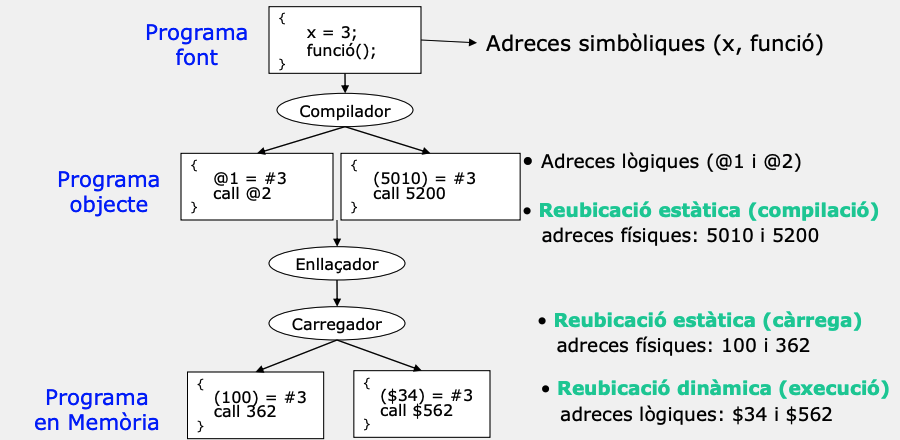
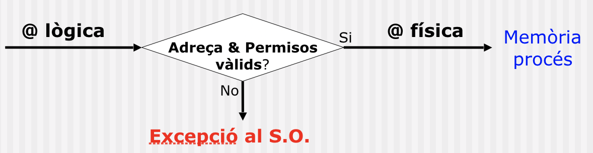
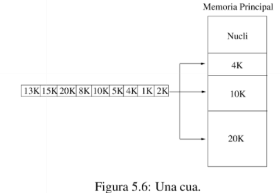
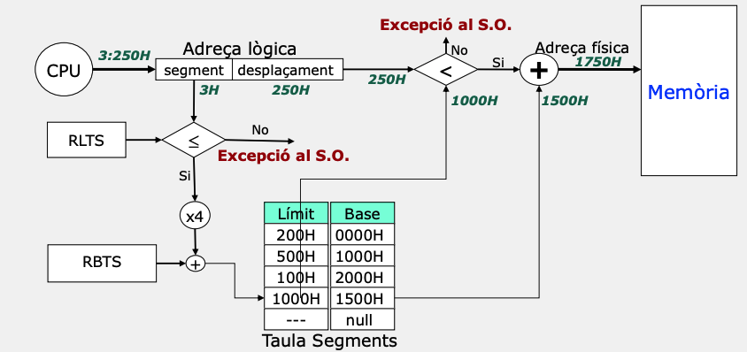

# 🖥️ Apunts de Sistemes Operatius - TEMA 6

## 📋 Índex
- [Tema6 - Introducció](#setmana-6---introducció)
- [Exemples Pràctics](#exemples-pràctics)
- [Dubtes i Preguntes](#dubtes-i-preguntes)
- [Reflexions Personals](#reflexions-personals)

---

## 🎯 TEMA 6 - Gestió de memòria

### Conceptes previs
* Perquè treballem la memòria? Suposem el segÑuent cas:
    * Si el primer programa executa MOV REG1, 1000, i després el segon programa executa MOV REG1, 1000, el contingut de la memòria escrita pel primer programa seria sobreescrit pel segon programa.
    * Això provocaria un comportament erratic i el primer programa no funcionaria correctament.

* Mapa de memòria:Mapa de memòria d'un procés és una representació lógica de com la mmeòria està organitzada per a un programa en execució.
* Regió: Zona contigua de memòria amb un punt inicial i una mida definida
-   **Suport a la regió**: Es guarda el contingut inicial de la regió.
    -   *Fitxer*: Regió guardada en un fitxer.
    -   *Anònima*: Sense suport.
    -   **Ús**: Privat, Compartit entre processos.
    -   **Protecció**: Lectura, Escriptura, Execució.
    -   **Mida**: Fixa o variable.

* Regions del mapa de memòria:
1.  **Codi**: Regió compartida de lectura i execució. Mida fixa. Conté el codi del programa.
2.  **Dades inicialitzades**: Regió privada on cada procés té una còpia pròpia de les variables. Lectura, escriptura i mida fixa. Conté variables globals, estàtiques i inicialitzades.
3.  **Dades no inicialitzades**: Regió privada de lectura i escriptura. Mida fixa.
4.  **Heap**: Regió privada de lectura i escriptura. Mida variable. Aquesta regió creixarà amb l'assignació dinàmica de memòria i decreixerà amb la seva alliberació. Normalment, creix cap a les direccions més altes del mapa.
5.  **Stack**: Regió privada de lectura i escriptura. Mida variable. Aquesta regió creixerà amb les crides a funcions, i decreixerà quan aquestes retornin. Normalment, creix cap a les direccions més baixes del mapa.

* Observacions:

1.Suposem que tenim un programa que realitza la multiplicació de dues matrius. Aquestes matrius s'introdueixen per teclat en temps d'execució, i el programa no pot determinar la mida de les matrius fins que l'usuari les introdueixi. Per tant, necessitem un model de memòria dinàmic.

2.Suposem que el programa necessita emmagatzemar dades d'un fitxer que no es coneix prèviament. En aquest cas, el sistema operatiu pot crear noves regions en el mapa de memòria per aquestes dades a mesura que el procés llegeix el fitxer, **adaptant-se dinàmicament a la demanda**.

3.A més, els SOs utilitzen **biblioteques dinàmiques** que impliquen la creació de regions associades a la mateixa i que contenen les diferents seccions de la biblioteca (codi i dades globals). Per exemple, quan carreguem una biblioteca dinàmica comuna, el sistema operatiu pot crear noves regions en el mapa de memòria del procés per al codi executable i les variables globals de la biblioteca.

4.Els Sistemes Operatius necessiten mantenir una taula de regions per a cada procés.

5. L'stack i la heap "estan lluny" pel que fa a adreçes de memòria.

### Tipus d'adreces 
* Relatives: Adreces de la memòria que contenen el codi, les dades (inicialitzades i no inicialitzades) i la pila del procés. 
* Físiques: Adreces de la memòria on es carrega l’espai lògic del procés. Aquestes adreces són les adreces reals a la memòria física on resideixen el codi, les dades i la pila del procés
* Lògiques: Quan un procés executa codi, la CPU genera adreces virtuals (també anomenades adreces lògiques) per accedir a variables, instruccions o la pila.
* Adreça simbòlica: etiqueta del codi font (funció X, variable Y)

### Reubicació
* Reubicació: concepte que descriu quan es tradueixen les adreces lògiques en adreces físiques d’un programa. N’hi ha de dos tipus: 
    * estàtica: 
        * 1. les adreces físiques es generen en temps de compilació.  Les adreçes que genera el processador (execució) coincideixen amb les @ físiques.El lloc on el procés s’executarà és conegut i fix.El codi conté adreces físiques directes.
        * 2. les adreces físiques es generen en temps de càrrega del programa.El carregador farà la traducció @ lògiques a físiques.El loader substitueix les adreces lògiques per adreces físiques, segons on decideixi ubicar el procés.La traducció es fa una sola vegada en carregar el programa.Durant l’execució, la CPU utilitza adreces ja reubicades.El procés no pot canviar de posició un cop carregat.

    * dinàmica: les adreces físiques es generen en l’execució de cada instrucció del programa.Permet que els processos es puguin moure d’un lloc de Memòria a un altre. Facilita el swapping i la compactació. Alenteix la execució i complica el màquinari.

    La CPU genera sempre adreces virtuals. La traducció a adreces físiques es fa cada vegada que hi ha un accés a memòria, per hardware:

        * Amb un règim simple: registre base + registre límit.

        * O amb una MMU: paginació, segmentació, TLB, proteccions.  

### Mecanismes de protecció
* El sistema de gestió de memòria ha de garantir la protecció del codi i les dades dels processos contra accessos accidentals o malintencionats d’altres processos.
* Es requereix la verificació en temps d’execució de totes les referències a la memòria generades per un procés.

* Protecció a nivell de pàgina: Cada pàgina del procés té associats diversos bits de protecció dins la seva Page Table Entry (PTE):

    -   R (Read) — permet lectura
    -   W (Write) — permet escriptura
    -   X (Execute) — permet execució de codi
    -   U/S (User/Supervisor) — indica si la pàgina és accessible des de mode usuari
    -   A (Accessed) — marcat quan s’ha accedit
    -   D (Dirty) — marcat quan s’ha modificat

### Page Fault (Tractar l'excepció)

Quan la CPU accedeix a una adreça virtual:

-   La MMU (Memory Management Unit) busca la PTE (Page Table Entry) corresponent.
-   Si l’accés no compleix els permisos (p. ex. escriure en una pàgina R/X), o la pàgina no està present, la MMU genera una page fault exception.
-   El control passa al sistema operatiu:
    -   Si és un page-in (pàgina no present), el SO la carrega de disc i actualitza la PTE.
    -   Si és un accés il·legal (violació W, X, U/S…), el SO termina el procés (segmentation fault).
### Nucli VS usuari.
- Mode usuari (ring 3):
    - Només pot accedir a pàgines marcades com User (U).
    - No pot accedir a memòria del kernel ni modificar taules de pàgines.
- Mode nucli (ring 0):
    - Pot accedir a qualsevol pàgina etiquetada com Supervisor (S).
    - Gestiona PTEs, TLB flush, interrupcions, drivers...
### Mecanismes de compartició

-   Hi ha blocs de programes (ja sigui codi o dades) que poden ser compartits entre processos per reduir els requisits de memòria.
-   Per permetre la compartició d'un bloc de memòria entre processos, és necessari establir mecanismes de comunicació i sincronització, garantint que diversos processos puguin accedir-hi de manera segura i coherent.

### I si no protegim la memòria?
* Exemple SuperMario Land2: El glitch es produeix perquè l’adreçament directe a la memòria no està subjecte a cap traducció o verificació en temps d’execució, i el motor del joc tracta adreces fora del rang del nivell com a accessibles, interpretant-les erròniament com a dades vàlides.

### Sistemes de la gestió de la memòria

-   (a) El SO es pot ubicar a la part baixa de la memòria en forma de RAM (Random Access Memory).

-   (b) El SO es pot ubicar a la part alta de la memòria en forma de ROM (Read Only Memory).

-  (c) El SO es pot ubicar a la part baixa en forma de RAM i els drivers a la part alta en forma de ROM.

* Monoprogramació:
---
#### Màquina Nua

-   No existeix un sistema de gestió de la Memòria definit.
-   L'usuari té control complet de tot l'espai de Memòria.
-   L'espai d'adreces lògiques és identic al espai d'adreçament físic.

#### Monitor Resident
- Un àrea de memòria específica pel monitor resident (Nucli) del S.O. Es pot ubicar indistintament en la zona baixa/alta de la Memòria. 

• Una zona per l’usuari. En aquesta àrea sol es pot ubicar simultàniament un únic procés d’usuari. El procés d’usuari sol pot utilitzar adreces de Memòria que pertanyin a l’Àrea d’Usuari.

---
* Multiprogramació

#### Particions múltiples
-   La memòria es troba dividida en regions.
-   Cada partició pot contenir un procés en execució.
-   Quan un procés acaba la seva execució allibera la partició, que pot ser utilitzada per un altre procés de la cua de treballs.

-   La memòria es troba dividida en regions.
-   Cada partició pot contenir un procés en execució.
-   Quan un procés acaba la seva execució allibera la partició, que pot ser utilitzada per un altre procés de la cua de treballs.

- Es poden distingir 2 grans grups:
    - 1. Particions múltiples de mida fixa. Les mides de cadascuna de les regions són fixes.
    - 2. Particions múltiples de mida variable. Les mides de les regions són variables.
#### Particions múltiples de Mida Fixa (PMMF)
- L’àrea d’usuari es divideix en diverses regions iguals o diferents en mida.

* Hi ha dos algorismes de planificació de treballs:
    - 1. Cada regió té assignada una cua FIFO de treballs de mida més petita o igual que la partició.
    
    - 2. Una sola cua per totes les regions. En aquest cas hi ha diferents polítiques de planificació:
        * First-Fit. Seleccionem la primera partició disponible amb espai suficient pel procés.
        * Best-fit-only. Seleccionem la partició que millor s’ajusta a la mida del procés. Si esta ocupada, esperem.
        * Best-available-fit. Seleccionem la partició que desaprofita menys espai de Memòria.
    

### Fragmentació de memòria
* Fragmentació: espai de memòria que no es fa servir. Normalment, aquest desaprofitament de memòria és degut a un mal ús de MP per part del sistema de gestió de memòria. N’hi ha de dos tipus: 
    - interna: espai de memòria assignada als processos que no es fa servir   
    - externa: espai de memòria lliure (no està assignada a cap procés) que no es fa servir

### Particions múltiples de mida variable (PMMV)
A diferència de les particions de mida fixa, les particions de mida variable permeten que la mida de la partició s'adapti a les necessitats del procés.

-   No hi ha fragmentació interna.
-   Millor aprofitament de la Memòria.
-   Incrementa el nombre de processos que poden estar en Memòria.

- Degut al caràcter dinàmic dels processos, les Particions Múltiples de Mida Variable també tenen fragmentació externa. Si per exemple arribés un procés de mida 80K, aquest no el podríem carregar en Memòria Principal degut al sistema de gestió de memòria perquè no es disposa d’una regió lliure on es pu- gui encabir. Per tant, PMMV té fragmentació externa.

### Paginació

- Implica que el mapa de Memòria es divideix en pàgines i la Memòria principal es divideix en un marc de pàgines.
- Un marc de pàgina conté en un moment determinat una pàgina en memòria d’un procés
- Aquesta estructura de dades que relaciona pàgines amb marcs es coneix com a taula de pàgines i s’utilitza en la traducció.
Com funciona?
- 1.L’adreça lògica es descompon en número de pàgina (p) i desplaçament (d) dins de la pàgina.
- 2.Amb el número de pàgina s’indexa en la taula de la pàgina del procés.
- 3.Aquest està ubicat a partir de l’adreça guardada al registre base de taula de pàgines (RBTP).
- 4.Es realitzen els controls d’accessos a la pàgina.
- 5.Es calculen les adreces físiques (a partir de l’índex de la cel·la física multiplica per la mida de pàgina més el desplaçament).

### Exemple d'exercici de paginació (Posar foto)

### Característiques de la paginació

La paginació és una tècnica de gestió de memòria que presenta certes característiques:

1.  **Eliminació de la Fragmentació Externa:** Cada pàgina pot ser assignada independentment, permetent a les pàgines ser ubicades en qualsevol ordre a la memòria física. Això elimina la dependència de tenir àrees contigües per allotjar processos.

2.  **Fragmentació Interna:** Tot i que elimina la fragmentació externa, la paginació pot introduir fragmentació interna, ja que l'última pàgina pot no estar plena. Aquest espai no utilitzat dins de l'última pàgina indueix a fragmentació interna.

3.  **Transparència a l'Usuari:** Aquest esquema de gestió de memòria és totalment transparent a l'usuari. L'usuari no necessita saber res sobre la paginació.

4.  **Taula de Pàgines per Procés:** Es necessita mantenir una taula de pàgines per a cada procés per gestionar la traducció d'adreces lògiques a adreces físiques.

### Segmentació
La segmentació divideix l’espai lògic d’un procés en unitats lògiques denominades segments (de mides diferents). Aquest esquema de gestió coincideix amb la visió que té l’usuari de la Memòria.

* Cada procés té associat una Taula de Segments on es descriuen les característiques dels diferents segments del procés.

* L'adreça lògica es desglossa en segment i desplaçament dins del segment:

L'adreça física es forma sumant la Base i el desplaçament de l'adreça lògica.

Hi ha un multiplicador per 4 (x4) perquè el Límit més la Base de cada entrada en la Taula de Segments ocupen 4 Bytes.

* Problemes de la segmentació:
    * Fragmentació Externa. L’espai de memòria física d’un segment ha de ser contigu en memòria i pot provocar fragmentació externa. 
    * Requereix mètodes de compactació de la Memòria
    * Polítiques de selecció per ubicar els segments en Memòria física
* Aventatges:
    * Absència de Fragmentació interna
    * Flexibilitat per compartir i protegir segments

### Segmentació páginada

La Segmentació Paginada vol reduir la fragmentació externa associada a la segmenta- ció i millorar l’eficiència de gestió de Memòria. Cadascun dels segments estan pagi- nats, d’aquesta forma, la memòria física associada a un segment no té que ser contigua. L’adreça lògica es desglossa en nombre de segment (s) i desplaçament dins del segment (d). A més, d es desglossa en nombre de pàgina (p) i desplaçament dins la pàgina (d’).

La Segmentació Paginada vol reduir la fragmentació externa associada a la segmenta- ció i millorar l’eficiència de gestió de Memòria. Cadascun dels segments estan pagi- nats, d’aquesta forma, la memòria física associada a un segment no té que ser contigua.

L’adreça lògica es desglossa en nombre de segment (s) i desplaçament dins del segment (d). A més, d es desglossa en nombre de pàgina (p) i desplaçament dins la pàgina (d’).

### Exemple de segmentació páginada
